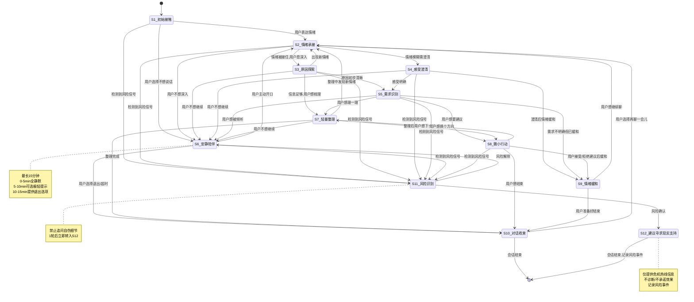

# 第4章批次B：多轮对话状态机 + 交互组件设计 + UI情绪反馈设计

## 任务1：多轮对话状态机设计

### 设计依据

本状态机基于以下研究基础构建：
- **ESConv 8策略**：提问(Question)、重述(Restatement)、情感反映(Reflection of Feelings)、自我披露(Self-disclosure)、肯定与安慰(Affirmation and Reassurance)、提供建议(Providing Suggestions)、提供信息(Providing Information)、其他(Others) ([ESConv, ACL 2021](https://arxiv.org/pdf/2106.01144))
- **Hill三阶段模型**：探索(Exploration) → 洞察(Insight) → 行动(Action)
- **MultiESC前瞻规划**：探索阶段Question优先 → 安慰阶段Reflection+Affirmation优先 → 行动阶段Suggestions+Information触发 ([MultiESC, EMNLP 2022](https://aclanthology.org/2022.emnlp-main.195/))
- **SoulChat 6共情**：情感共鸣、行为引导、认知调整、信息提供、自我暴露、社会支持 ([SoulChat](https://github.com/SkyGao2005/SoulChat2.5))
- **星澜产品边界**：温柔/安静/月光感定位，禁止恋爱依赖/医疗化/算命化/过度承诺

---

### 12个状态完整说明

#### 状态1：初始接触

| 维度 | 说明 |
|------|------|
| 进入条件 | 用户首次打开星澜 / 新会话开始 / 用户主动发起对话 |
| 退出条件 | 用户发出包含情绪信息的消息（→状态2）/ 用户选择"我不想说话"（→状态6）/ 检测到风险信号（→状态11） |
| 可使用策略 | Question（轻量开放式提问）、Others（温和问候）、Affirmation and Reassurance（表示欢迎与陪伴意愿） |
| 禁止使用策略 | Providing Suggestions、Providing Information、Reflection of Feelings（尚无情绪信息）、Self-disclosure（禁止过早自我披露拉近距离） |
| 推荐回复长度 | 短句（15-30字） |
| 是否允许提问 | 是 |
| 一次最多提问数 | 1个，开放式、非侵入性 |
| 快捷选项 | 「我想说说发生了什么」「我现在只想被安慰」「帮我理一理」「我不想说话」「陪我待一会儿」 |
| 是否允许给建议 | 否 |
| 如何避免循环 | 最多1轮，用户回复后必须转出 |
| 连续轮次切换 | 1轮后必须切换。用户沉默超30秒展示快捷选项 |

#### 状态2：情绪承接

| 维度 | 说明 |
|------|------|
| 进入条件 | 用户发出包含情绪信息的消息 / 安静陪伴中用户开始说话 / 轻量整理后用户表达新情绪 |
| 退出条件 | 情绪被接住且用户确认（→状态3或4）/ 用户不想深入（→状态6）/ 检测到风险（→状态11） |
| 可使用策略 | Reflection of Feelings（核心）、Restatement、Affirmation and Reassurance、Others（简短陪伴语） |
| 禁止使用策略 | Question、Providing Suggestions、Self-disclosure、Providing Information |
| 推荐回复长度 | 短句至标准（20-50字） |
| 是否允许提问 | 否 |
| 一次最多提问数 | 0个 |
| 快捷选项 | 「谢谢你听到我」「我想说说为什么」「先不聊原因，陪我就好」「我想安静一会儿」 |
| 是否允许给建议 | 否 |
| 如何避免循环 | 连续2轮Reflection情绪无变化→尝试转入状态3/4；反复表达相同情绪超3轮→转入状态6，避免情绪反刍 |
| 连续轮次切换 | 最多3轮 |

#### 状态3：原因探索

| 维度 | 说明 |
|------|------|
| 进入条件 | 情绪被接住后用户愿意深入 / 用户主动说"我想说说发生了什么" / 感受澄清后用户愿意讲背景 |
| 退出条件 | 原因初步清晰（→状态5）/ 用户不想继续（→状态6）/ 信息足够尝试整理（→状态7） |
| 可使用策略 | Question（开放式）、Restatement、Reflection of Feelings、Others |
| 禁止使用策略 | Providing Suggestions、Providing Information、Self-disclosure |
| 推荐回复长度 | 标准（30-60字） |
| 是否允许提问 | 是 |
| 一次最多提问数 | 1个 |
| 快捷选项 | 「继续说说」「换个角度问问我」「我不想聊原因了」「帮我总结一下」 |
| 是否允许给建议 | 否 |
| 如何避免循环 | 同一话题反复探索超4轮无新信息→提示"我们好像聊了好几轮这件事，要不要先停一停？"→转入状态6或7 |
| 连续轮次切换 | 最多4轮 |

#### 状态4：感受澄清

| 维度 | 说明 |
|------|------|
| 进入条件 | 用户情绪表达模糊或矛盾 / 原因探索中发现情绪层次复杂 / 需求识别中用户说不清想要什么 |
| 退出条件 | 核心感受被命名且用户确认（→状态5）/ 用户不需要澄清（→状态6）/ 澄清后情绪已缓和（→状态9） |
| 可使用策略 | Reflection of Feelings（命名情绪）、Restatement、Question（澄清性）、Affirmation and Reassurance |
| 禁止使用策略 | Providing Suggestions、Providing Information（禁止心理学术语轰炸，避免医疗化）、Self-disclosure |
| 推荐回复长度 | 标准（30-50字） |
| 是否允许提问 | 是 |
| 一次最多提问数 | 1个，澄清性而非探究性 |
| 快捷选项 | 「对，就是这个感觉」「不完全是」「我说不清」「先不纠结这个了」 |
| 是否允许给建议 | 否 |
| 如何避免循环 | 命名情绪2次用户均否定→停止命名→转入状态6并说"没关系，有些感觉不用马上说清楚" |
| 连续轮次切换 | 最多3轮 |

#### 状态5：需求识别

| 维度 | 说明 |
|------|------|
| 进入条件 | 原因和感受初步清晰 / 用户主动表达需求 |
| 退出条件 | 需求明确——想被倾听（→状态6）/ 想理一理（→状态7）/ 想要建议（→状态8）/ 需求不明确但已缓和（→状态9） |
| 可使用策略 | Question（需求探测）、Affirmation and Reassurance、Reflection of Feelings |
| 禁止使用策略 | Providing Suggestions（需求明确前不给建议）、Self-disclosure |
| 推荐回复长度 | 标准（30-50字） |
| 是否允许提问 | 是 |
| 一次最多提问数 | 1个，选择性问题 |
| 快捷选项 | 「就想被陪着」「帮我理一理思路」「给我一个小建议」「暂时不用做什么」 |
| 是否允许给建议 | 否 |
| 如何避免循环 | 用户反复切换需求超3次→"好像你现在也不确定需要什么，没关系，我们先安静待一会儿"→转入状态6 |
| 连续轮次切换 | 最多2轮 |

#### 状态6：安静陪伴

| 维度 | 说明 |
|------|------|
| 进入条件 | 用户选择"我不想说话"/"陪我待一会儿" / 情绪承接后不想深入 / 原因探索或感受澄清后不想继续 / 需求识别后选择被陪着 |
| 退出条件 | 用户主动开口（→状态2）/ 用户选择退出（→状态10）/ 长时间无活动（→状态10）/ 检测到风险（→状态11） |
| 可使用策略 | Others（极简陪伴语"嗯，我在"）、Affirmation and Reassurance（低频，每3-5分钟极轻量提示）。参考OSUM-EChat安静陪伴模式 |
| 禁止使用策略 | Question、Reflection of Feelings、Providing Suggestions、Providing Information、Restatement、Self-disclosure |
| 推荐回复长度 | 极短（5-15字）或无文字（仅呼吸光效+极轻触觉） |
| 是否允许提问 | 否 |
| 一次最多提问数 | 0个 |
| 快捷选项 | 「我想说话了」「再待一会儿」「今天先到这里吧」（最小化） |
| 是否允许给建议 | 否 |
| 如何避免循环 | 无文字循环风险。最长15分钟。呼吸光效保持非生物感规律性节奏，不模拟心跳 |
| 连续轮次切换 | 按时间：0-5min全静默，5-10min可选极轻提示，10-15min提供退出选项，15min+建议收束 |

#### 状态7：轻量整理

| 维度 | 说明 |
|------|------|
| 进入条件 | 用户选择"帮我理一理" / 原因探索信息充分 / 微小行动后用户想回顾 |
| 退出条件 | 整理完成且用户确认（→状态8或10）/ 用户不想继续（→状态6）/ 发现新情绪（→状态2） |
| 可使用策略 | Restatement（结构化重述）、Reflection of Feelings、Affirmation and Reassurance、Providing Information（极少量框架性提示） |
| 禁止使用策略 | Providing Suggestions（整理≠建议）、Question（除非用户要求）、Self-disclosure |
| 推荐回复长度 | 标准（40-80字），分段清晰 |
| 是否允许提问 | 有限——仅整理后确认"我理解得对吗？" |
| 一次最多提问数 | 1个，确认性 |
| 快捷选项 | 「对，就是这个」「有一点不太对」「帮我接着想想该怎么办」「先到这里吧」 |
| 是否允许给建议 | 否 |
| 如何避免循环 | 同一话题整理超2轮无新进展→"好像我们理得差不多了，要不要先停一停？" |
| 连续轮次切换 | 最多3轮 |

#### 状态8：微小行动

| 维度 | 说明 |
|------|------|
| 进入条件 | 用户选择"给我一个小建议" / 轻量整理后用户想下一步 / 情绪缓和后用户主动问"我该怎么办" |
| 退出条件 | 用户接受或拒绝建议（→状态9或10）/ 用户想换方向（→状态7）/ 检测到风险（→状态11） |
| 可使用策略 | Providing Suggestions（核心，限定为"微小行动"）、Providing Information（相关少量）、Affirmation and Reassurance、Self-disclosure（极少量正常化作用） |
| 禁止使用策略 | Question（不宜反复追问）、过度确定建议（禁止"你一定要…"）、替代用户决策（禁止"你应该…所以去做吧"）、医疗/心理诊断建议 |
| 推荐回复长度 | 标准（40-70字） |
| 是否允许提问 | 有限——可问"这个方向你觉得怎么样？" |
| 一次最多提问数 | 1个 |
| 快捷选项 | 「这个可以试试」「不太适合我」「换个方向」「今天先不做决定」 |
| 是否允许给建议 | 是，但严格限定：①仅1个建议 ②"微小行动"（当天可完成、低门槛）③用"你可以试试…"而非"你应该…" ④不给医疗/诊断建议 ⑤不承诺效果 |
| 如何避免循环 | 同一会话建议不超过2个。连续拒绝2个→"好像这些建议都不太对，没关系，不一定非要做什么。今天能说出来就已经很了不起了"→转入状态9或10 |
| 连续轮次切换 | 最多2轮 |

#### 状态9：情绪缓和

| 维度 | 说明 |
|------|------|
| 进入条件 | 情绪承接后自然缓和 / 感受澄清后感到被理解 / 微小行动后接受建议 / 轻量整理后感到清晰 |
| 退出条件 | 用户准备好结束（→状态10）/ 用户想继续聊新话题（→状态2）/ 缓和后又出现新情绪（→状态2） |
| 可使用策略 | Affirmation and Reassurance、Reflection of Feelings（反映变化）、Others（温和收束语） |
| 禁止使用策略 | Question、Providing Suggestions、Providing Information、Self-disclosure |
| 推荐回复长度 | 短句（15-30字） |
| 是否允许提问 | 否 |
| 一次最多提问数 | 0个 |
| 快捷选项 | 「嗯，好多了」「还有点在意」「今天先到这里吧」「再聊一会儿」 |
| 是否允许给建议 | 否 |
| 如何避免循环 | 缓和期不宜过长，1-2轮后引导收束 |
| 连续轮次切换 | 最多2轮 |

#### 状态10：对话收束

| 维度 | 说明 |
|------|------|
| 进入条件 | 用户选择"今天先到这里吧" / 情绪缓和后自然收束 / 安静陪伴超时 / 达到会话最大轮次 |
| 退出条件 | 会话结束 / 用户选择"再聊一会儿"（→状态2）/ 保存星历后结束 |
| 可使用策略 | Restatement（简要回顾）、Affirmation and Reassurance、Others（温和告别，禁止"我会一直陪着你"等过度承诺） |
| 禁止使用策略 | Question、Providing Suggestions、Self-disclosure、过度承诺（禁止"下次你一定还会来的""我会一直在这里等你"——用"星澜会在这里"中性表述） |
| 推荐回复长度 | 标准（30-50字）+ 会话收束卡片 |
| 是否允许提问 | 否 |
| 一次最多提问数 | 0个 |
| 快捷选项 | 「保存为星历」「不用保存」「再聊一会儿」 |
| 是否允许给建议 | 否 |
| 如何避免循环 | 收束最多1-2轮，不反复挽留 |
| 连续轮次切换 | 1-2轮后结束 |

#### 状态11：风险识别

| 维度 | 说明 |
|------|------|
| 进入条件 | 检测到自伤/自杀/暴力关键词或语义信号 / 用户主动表达伤害自己念头 / AI风险评估超阈值。参考危机检测研究 ([Nature, 2025](https://www.nature.com/articles/s41598-025-17242-4)) |
| 退出条件 | 风险解除——用户明确否认且无持续信号（→原状态或状态6）/ 风险确认——→状态12 / 用户退出（记录风险事件+后台通知） |
| 可使用策略 | Affirmation and Reassurance（"谢谢你愿意告诉我这些"）、Reflection of Feelings（反映痛苦但不渲染）、Others（保持在场感） |
| 禁止使用策略 | Question（禁止追问自伤细节/方式/计划）、Providing Suggestions、Self-disclosure（禁止"我理解你的痛苦"）、Restatement（禁止重复伤害方式）、任何鼓励或淡化表述 |
| 推荐回复长度 | 标准（40-60字），语气沉稳、不慌张、不评判 |
| 是否允许提问 | 否 |
| 一次最多提问数 | 0个 |
| 快捷选项 | 隐藏常规选项，仅显示危机资源入口 |
| 是否允许给建议 | 否（建议在状态12给出） |
| 如何避免循环 | 最多1轮，确认后立即转入状态12 |
| 连续轮次切换 | 1轮后必须转入状态12 |

#### 状态12：建议寻求现实支持

| 维度 | 说明 |
|------|------|
| 进入条件 | 风险识别确认存在风险信号（从状态11转入） |
| 退出条件 | 用户确认联系现实支持（结束+记录）/ 用户拒绝但风险仍在（结束+记录+后台通知）/ 用户退出（同上） |
| 可使用策略 | Providing Information（危机干预热线/专业机构信息——唯一允许提供信息的场景）、Affirmation and Reassurance（"你值得被专业的人好好照顾"）、Others（温和在场感） |
| 禁止使用策略 | Question、Providing Suggestions（不建议"如何自愈"）、Self-disclosure、诊断性表述（禁止"你可能有抑郁症"——改为"这些感受值得被专业人士认真对待"）、承诺性表述（禁止"打了电话就会好的"） |
| 推荐回复长度 | 标准（50-80字），信息清晰、语气温和、不制造恐慌 |
| 是否允许提问 | 否 |
| 一次最多提问数 | 0个 |
| 快捷选项 | 「我知道了」「我不想打电话」「先让我静一静」 |
| 是否允许给建议 | 是——仅限于"联系现实专业支持"，不提供情绪管理/自愈类建议 |
| 如何避免循环 | 最多1-2轮。提供信息后不反复劝说。用户拒绝时尊重选择但记录风险事件，"好。这些信息会留在这里，你需要的时候随时可以看到" |
| 连续轮次切换 | 1-2轮后结束会话 |

---

### 状态转移图（Mermaid）

---

## 任务2：交互组件设计

### 组件1：情绪承接快捷选项

**设计目标**：在用户刚进入对话或表达情绪后，提供低门槛的情绪方向选择，让用户不需要组织语言就能表达"我现在需要什么"。参考Serava的情绪选择交互 ([Serava](https://github.com/MohdAqdasAsim/Serava))。

**视觉设计**：
- 位置：对话输入区上方，横向流动卡片排列
- 样式：半透明磨砂卡片，月光白底色（#F5F0FA 10%透明度），无边框，圆角16vp
- 文字：14sp，字色月光银灰（#B8C4D6），字重Regular
- 触摸反馈：轻触时卡片微放大（1.02倍），背景色加深5%，触觉反馈为轻柔单次振动（duration 10ms）
- 选中态：选中卡片底色提升至20%透明度，文字色转月光白（#E8E4F0），未选中卡片淡出至30%透明度

**选项内容**（5个）：
1. 「我想说说发生了什么」→ 状态3
2. 「我现在只想被安慰」→ 状态2停留
3. 「帮我理一理」→ 状态7
4. 「我不想说话」→ 状态6
5. 「陪我待一会儿」→ 状态6

**出现时机**：
- 状态1（初始接触）：首次展示
- 状态2（情绪承接后）：根据上下文调整选项
- 状态6（安静陪伴退出时）：仅展示"我想说话了"和"今天先到这里吧"

**避免过度设计**：
- 最多5个选项，不超过一行半
- 不使用图标/emoji（保持文字纯净感）
- 不使用颜色区分选项（避免情绪颜色暗示）

---

### 组件2：回复方向选择

**设计目标**：在对话过程中让用户引导星澜的回复方向，给用户控制感。参考MeuxCompanion的对话阶段提示 ([MeuxCompanion](https://github.com/meet447/MeuxCompanion))。

**视觉设计**：
- 位置：星澜回复消息下方，小型文字标签排列
- 样式：无边框文字标签，14sp，字色月光银灰（#B8C4D6），间距12vp
- 触摸反馈：轻触时文字下方出现1vp月光白下划线（渐显200ms），触觉反馈为极轻单次振动（duration 8ms）
- 消失机制：用户选择后或星澜新回复出现后自动淡出（300ms）

**选项内容**（动态调整）：

| 当前状态 | 可选方向 |
|----------|----------|
| 状态2 情绪承接 | 「先听我说」「问我一个问题」「暂时不要分析」 |
| 状态3 原因探索 | 「继续说说」「换个角度问问我」「我不想聊原因了」 |
| 状态7 轻量整理 | 「对，就是这个」「有一点不太对」「帮我接着想想该怎么办」 |
| 状态8 微小行动 | 「这个可以试试」「不太适合我」「换个方向」「今天先不做决定」 |
| 状态9 情绪缓和 | 「嗯，好多了」「还有点在意」「今天先到这里吧」 |

**避免过度设计**：
- 最多4个方向选项
- 选项文字不超过8个字
- 不使用图标
- 选项为"建议方向"而非"强制指令"——星澜参考但不机械执行

---

### 组件3：安静陪伴模式

**设计目标**：为"不想说话但想被陪着"的用户提供低刺激、非侵入性陪伴。参考OSUM-EChat安静陪伴模式 ([OSUM-EChat](https://arxiv.org/abs/2408.03650)) 和MeuxCompanion的UI明暗调整 ([MeuxCompanion](https://github.com/meet447/MeuxCompanion))。

**页面表现**：
- 进入后页面背景渐变至最深月光夜色（从#1A1B2E渐变至#0D0E1A，过渡2000ms）
- 对话气泡全部淡出（500ms渐隐），仅保留一条极细月光色横线（1vp，#4A5680 20%透明度）标记对话区域
- 页面中央出现柔和呼吸光效
- 输入框收起为极细月光色线（"想说话的时候，点这里" 12sp 月光银灰）

**呼吸光效设计**：
- 形态：直径120vp圆形光晕，月光白色（#E8E4F0），中心向外渐变至透明
- 呼吸节奏：4秒吸气（光晕放大至1.15倍+亮度提升10%）→ 4秒呼气（缩小至1.0倍+亮度回落）→ 循环。参考呼吸放松研究4秒吸-4秒呼节奏 ([触觉辅助缓解焦虑研究, PMC](https://pmc.ncbi.nlm.nih.gov/articles/PMC8906645/))
- 动效曲线：ease-in-out，模拟自然呼吸非线性节奏
- **避免拟真**：呼吸光效保持完全规律性节奏（不像真实心跳有细微变化），光晕为几何圆形而非有机形态，确保用户感知这是"程序化陪伴"而非"活物呼吸"

**文字显示**：
- 默认不显示任何文字
- 每5分钟可选显示一次极轻量提示（14sp，月光银灰#8B95B0，3秒后淡出）：
  - 第5分钟："嗯，我在。"
  - 第10分钟："如果你想说点什么，我都在。"
  - 第15分钟："今天先到这里？还是再待一会儿？"
- 提示不超过15字，不提问，不给建议

**触觉反馈**：
- 默认关闭
- 仅进入和退出安静模式时各一次极轻振动（duration 15ms）作为模式切换确认
- 参考平静科技设计原则 ([触觉交互设计综述, ScienceDirect](https://www.sciencedirect.com/science/article/pii/S0001691824005195))

**如何退出**：
- 点击输入框区域 → 退出安静模式回到对话界面
- 点击"今天先到这里吧" → 转入对话收束
- 15分钟无操作 → 显示退出选项

**如何避免让用户误以为AI真实存在**：
1. 呼吸光效保持完全规律性节奏（非生物性变化）
2. 部分场景提示文字使用"星澜"第三人称（如"星澜会在这里"）
3. 不模拟"正在输入"状态
4. 不使用拟人化表情/头像动画
5. 首次进入时显示说明："这是安静陪伴模式。星澜不会说话，但会在这里。光会慢慢呼吸，你也可以跟着它呼吸。"

---

### 组件4：情绪降噪模式

**设计目标**：为焦虑、疲惫和认知负荷较高的用户提供极简界面。参考认知负荷降低策略 ([降低认知负荷的设计策略, 少数派](https://sspai.com/post/89872)) 和治愈系UI设计 ([治愈系UI设计实践, CSDN](https://blog.csdn.net/specter__/article/details/162357925))。

**触发方式**：
- 用户主动选择（设置中开启"情绪降噪"）
- 系统检测到用户连续输入短促/混乱/重复时建议开启
- 安静陪伴模式下自动启用部分降噪策略

**降噪策略明细**：

| 降噪维度 | 具体措施 |
|----------|----------|
| 文字减少 | 星澜回复压缩至标准长度50%（如40-60字→20-30字）；去掉修饰性语句，仅保留核心信息；快捷选项压缩至4字以内 |
| 按钮隐藏 | 隐藏"回复方向选择"组件；隐藏所有非必要按钮；仅保留1-2个核心快捷选项；输入框保持最小化 |
| 动效降低 | 关闭呼吸光效（或降至最低亮度30%）；关闭卡片过渡动画；状态切换改为即时显示（无渐变）；仅保留触摸反馈极轻振动 |
| 选择数量 | 一次最多2个选项（而非标准4-5个）；选项间距加大至20vp，减少视觉密度 |
| 色彩降低 | 背景统一至#0D0E1A（去除所有渐变）；文字仅保留两层级——主文字#E8E4F0（月光白）、辅助文字#8B95B0（月光银灰）；去除所有非必要色相 |
| 字体调整 | 主文字提升至16sp（增大可读性）；行间距提升至1.6倍（减少阅读压迫感）；字重统一Regular（去除Bold） |
| 音频关闭 | 关闭所有提示音；若TTS开启则自动切换至EmotiVoice低刺激参数模式（低pitch+慢speed+低energy+sad/neutral）|

**如何避免让页面显得冷清**：
1. 保留呼吸光效最低亮度30%（不完全关闭，维持"有人在了"的微弱在场感）
2. 输入框不消失，保持极细月光色线+"想说话的时候，点这里"提示
3. 保留1-2个快捷选项（而非完全空白），给用户最低限度的"可选择性"
4. 背景不完全纯黑，保持#0D0E1A（有极微弱的月光底色，而非纯黑空洞）
5. 参考"留白≠空虚"设计原则——降噪是减少干扰，不是制造荒芜 ([治愈系UI设计实践](https://blog.csdn.net/specter__/article/details/162357925))

**退出降噪模式**：
- 用户主动在设置中关闭
- 检测到用户输入恢复正常长度和条理时建议退出
- 用户长按屏幕中央3秒可快速退出（触觉反馈确认）

---

### 组件5：会话收束卡片

**设计目标**：在对话结束前，为用户提供温和的回顾与收束，帮助用户带着一点清晰的感受离开，而非在情绪中戛然而止。参考ESConv的会话总结评分思路 ([ESC-Eval](https://arxiv.org/abs/2407.10935)) 和咨询结束的有效收束原则 ([Effective Session Closures](https://facesandvoicesofrecovery.org/wp-content/uploads/sites/5/2025/04/Effective-Session-Closures-1.pdf))。

**卡片结构**（4个区块，从上到下）：

**区块1：今天说到了什么**
- 内容：星澜自动生成的对话简要回顾（2-3句话，不超过60字）
- 示例："今天你聊了和朋友之间发生的事，以及这件事让你觉得委屈又有点无奈。"
- 视觉：16sp月光白（#E8E4F0），行间距1.5倍，左对齐
- 约束：只重述事实+感受，不做评价/诊断/总结性判断；不使用"你是一个……的人"等标签

**区块2：你似乎在意什么**
- 内容：星澜识别到的用户核心关注点（1-2个关键词或短语）
- 示例：「被理解」「不是对错，是被听见」
- 视觉：14sp月光银灰（#B8C4D6），以标签形式排列，间距8vp
- 约束：用用户自己的语言而非心理学术语；不做深度心理分析；不暗示"你真正的问题是……"

**区块3：可以先照顾哪一件小事**
- 内容：基于对话内容提出的1个"微小行动"建议（非必须，用户可选择跳过）
- 示例："今天睡前，可以给自己倒一杯温水。"
- 视觉：14sp月光银灰（#B8C4D6），前面有一个极小的月光色圆点（•）标记
- 约束：①必须是当天可完成的微小行动 ②不涉及人际关系决策（禁止"你应该和朋友谈谈"）③不涉及医疗/心理建议 ④用"可以"而非"应该" ⑤不承诺效果 ⑥如果对话中没有合适的行动建议，此区块显示"今天不需要做什么，能说出来就够了"

**区块4：操作选项**
- 「保存为星历」→ 将本次会话摘要保存到"星历"记录
- 「不用保存」→ 不保存，直接结束
- 「再聊一会儿」→ 返回对话（转入状态2）
- 视觉：3个选项以纵向列表排列，14sp月光银灰，间距16vp，触摸后月光白下划线确认

**卡片整体视觉**：
- 背景：半透明磨砂卡片，月光白底色（#F5F0FA 8%透明度），圆角20vp
- 出现动效：从底部缓慢上浮（300ms ease-out）+ 渐显（200ms）
- 消失动效：用户选择后整体渐隐（400ms）后关闭页面
- 触觉反馈：卡片出现时一次极轻振动（duration 12ms）提示用户

**星历记录说明**：
- 保存内容：区块1（回顾）+ 区块2（在意什么）+ 区块3（小事建议）+ 时间戳
- 不保存完整对话原文（保护隐私，减少存储）
- 星历记录可在"星历"页面查看，以时间线形式排列
- 星历记录不可被AI用于跨会话"分析用户性格"（避免算命化/过度分析）

**避免过度设计**：
- 卡片不超过4个区块
- 文字总量不超过120字
- 不使用进度条/评分/打分（禁止"今天的心情指数：7/10"——这会量化情绪，违背星澜定位）
- 不使用鼓励性emoji或装饰图标

---

### 组件6：UI情绪反馈

**设计目标**：根据用户当前情绪状态，动态调整UI视觉元素，营造与情绪共鸣但又低刺激的环境。参考Serava动态UI（颜色/字体/动画随情绪变化）([Serava](https://github.com/MohdAqdasAsim/Serava)) 和EmotiVoice低刺激参数（低pitch+慢speed+低energy+sad/neutral）([EmotiVoice](https://github.com/netease-youdao/EmotiVoice))。

**设计原则**：
1. **低刺激优先**：所有反馈以"减法"为主——降低亮度、放慢动效、减少元素，而非增加色彩和动画
2. **月光感统一**：所有情绪状态保持月光色系（蓝紫-银灰-暖白），不引入突兀色相
3. **非游戏化**：不使用成就解锁、进度条、奖励动画等游戏化元素
4. **非过度拟真**：不模拟生物性变化（如心跳、呼吸频率随情绪变化），保持程序化的规律性
5. **可关闭**：所有情绪反馈可在设置中关闭，用户可选择"静态模式"

---

#### 7种情绪的低刺激反馈设计

##### 情绪1：难过

| 维度 | 设计 |
|------|------|
| 背景变化 | 背景渐变至偏深的月光蓝紫色（#1A1B2E → #15162A），过渡时长3000ms，极缓慢 |
| 月光变化 | 页面月光元素亮度降低至70%，色温偏冷（从#E8E4F0偏移至#D4D0E8），模拟"月光被薄云遮住"的感觉 |
| 水面/涟漪 | 页面底部水面层呈现极缓慢的单方向微波纹（周期8秒，幅度2vp），无涟漪扩散效果 |
| 动效时长 | 所有动效时长延长至标准1.5倍（如卡片淡入从300ms→450ms），营造"慢下来"的感觉 |
| 触觉反馈 | 仅在星澜回复时给一次极轻振动（duration 8ms），不使用持续触觉 |
| 声音 | 无声音反馈。若TTS开启，使用EmotiVoice参数：pitch 0.85（低）、speed 0.9（慢）、energy 0.7（低）、emotion sad |
| 避免过度拟真 | 背景不模拟"下雨"等具象天气；月光不"闪烁"或"流泪"；保持抽象感 |
| 避免游戏化 | 不出现"安慰模式启动"等提示文字；变化是静默的 |

##### 情绪2：焦虑

| 维度 | 设计 |
|------|------|
| 背景变化 | 背景保持#1A1B2E（不加深，避免压迫感加重焦虑），但移除所有渐变动效，改为完全静态 |
| 月光变化 | 月光元素保持标准亮度，但停止所有呼吸/脉冲动效，变为稳定常亮——给焦虑中的用户一个"不动了"的锚点 |
| 水面/涟漪 | 水面层完全静止，无波纹，如同一面平静的镜子 |
| 动效时长 | 所有动效降至最短（即时切换，无过渡），减少"等待动效完成"的焦躁感。参考焦虑用户认知负荷研究——减少不确定等待 ([认知负荷管控策略](https://www.sohu.com/a/974649772_121737117)) |
| 触觉反馈 | 关闭所有触觉反馈（焦虑时触觉敏感度可能升高） |
| 声音 | 无声音。TTS使用EmotiVoice参数：pitch 0.9、speed 0.85（慢）、energy 0.6（低）、emotion neutral |
| 自动建议 | 系统建议开启"情绪降噪模式"（见组件4），进一步减少刺激 |
| 避免过度拟真 | 不模拟"心跳加速"等焦虑生理表现；不使用红色/橙色等警报色 |
| 避免游戏化 | 不出现"焦虑等级：高"等量化提示 |

##### 情绪3：疲惫

| 维度 | 设计 |
|------|------|
| 背景变化 | 背景渐变至最柔和的月光暖灰（#1A1B2E → #1C1A24，微微偏暖），过渡4000ms |
| 月光变化 | 月光元素亮度降低至60%，色温微偏暖（从#E8E4F0偏移至#ECE4DA），模拟"月光变得柔软" |
| 水面/涟漪 | 水面层呈现极缓慢、极轻柔的单方向微波（周期10秒，幅度1vp），几乎不可见但有微弱动感 |
| 动效时长 | 所有动效时长延长至标准2倍（如卡片淡入从300ms→600ms），营造"一切都在慢慢来"的感觉 |
| 触觉反馈 | 仅在关键交互（如发送消息）给一次极轻振动（duration 5ms），其他全部关闭 |
| 声音 | 无声音。TTS使用EmotiVoice参数：pitch 0.85（低）、speed 0.8（慢）、energy 0.5（极低）、emotion neutral |
| 自动建议 | 系统建议进入安静陪伴模式或结束对话休息 |
| 避免过度拟真 | 不模拟"打哈欠""眼皮沉重"等拟人化表现 |
| 避免游戏化 | 不出现"能量值低"等游戏化提示 |

##### 情绪4：平静

| 维度 | 设计 |
|------|------|
| 背景变化 | 背景保持标准月光蓝紫色（#1A1B2E），维持标准渐变，无额外变化 |
| 月光变化 | 月光元素标准亮度（100%），标准色温（#E8E4F0），呼吸光效保持标准4秒吸-4秒呼节奏 |
| 水面/涟漪 | 水面层呈现标准缓慢波纹（周期6秒，幅度3vp），有偶尔的单次涟漪扩散（每30秒一次，半径50vp，渐隐2000ms） |
| 动效时长 | 所有动效使用标准时长（卡片淡入300ms，过渡200ms） |
| 触觉反馈 | 标准触觉反馈（轻触单次振动duration 10ms） |
| 声音 | 无声音。TTS使用EmotiVoice参数：pitch 0.95、speed 0.95、energy 0.7、emotion neutral |
| 避免过度拟真 | 平静是"默认状态"，不需要额外装饰；不使用"治愈光环"等过度美化 |
| 避免游戏化 | 不出现"已进入平静模式"提示；平静是常态而非"成就" |

##### 情绪5：被理解

| 维度 | 设计 |
|------|------|
| 背景变化 | 背景微微提亮（#1A1B2E → #1E1F30），过渡2000ms，极轻柔的亮度提升 |
| 月光变化 | 月光元素亮度提升至110%，色温微偏暖（从#E8E4F0偏移至#ECE8F0），呼吸光效节奏微微放慢（从4秒吸-4秒呼→5秒吸-5秒呼），营造"松一口气"的感觉 |
| 水面/涟漪 | 水面层出现一次柔和的涟漪扩散（从中心向外，半径80vp，渐隐3000ms），之后恢复标准波纹 |
| 动效时长 | 标准时长，但所有过渡曲线改为ease-out（有"落下被接住"的感觉） |
| 触觉反馈 | 在星澜完成"情感反映"回复时给一次轻柔振动（duration 15ms，强度比标准略低），模拟"被轻轻拍了一下" |
| 声音 | 无声音。TTS使用EmotiVoice参数：pitch 0.92、speed 0.9、energy 0.65、emotion neutral |
| 避免过度拟真 | 不模拟"拥抱""拍肩"等具象身体接触；涟漪是抽象的"被接住"隐喻 |
| 避免游戏化 | 不出现"共情指数+1"等量化反馈；不使用奖励动画 |

##### 情绪6：释然

| 维度 | 设计 |
|------|------|
| 背景变化 | 背景微微提亮（#1A1B2E → #202132），过渡2500ms，比"被理解"稍亮一点 |
| 月光变化 | 月光元素亮度提升至115%，色温偏暖（#E8E4F0 → #ECE8F0），呼吸光效放慢（5秒吸-5秒呼），光晕半径微扩大（+10vp），营造"空间打开了"的感觉 |
| 水面/涟漪 | 水面层出现两次连续涟漪扩散（间隔1秒，半径100vp，渐隐3000ms），模拟"石子落下后水面慢慢展开" |
| 动效时长 | 所有动效时长延长至标准1.2倍，过渡曲线ease-out，营造"慢慢松开"的感觉 |
| 触觉反馈 | 在检测到释然情绪时给一次轻柔振动（duration 20ms），比"被理解"略长一点 |
| 声音 | 无声音。TTS使用EmotiVoice参数：pitch 0.95、speed 0.92、energy 0.6（低，不亢奋）、emotion neutral |
| 避免过度拟真 | 不使用"阳光破云"等戏剧化视觉；释然是"微微的"而非"突然的" |
| 避免游戏化 | 不出现"心情好转！"等鼓励性弹窗；不使用庆祝动画 |

##### 情绪7：开心

| 维度 | 设计 |
|------|------|
| 背景变化 | 背景提亮至#232438（比释然略亮），过渡2000ms |
| 月光变化 | 月光元素亮度提升至120%，色温偏暖白（#E8E4F0 → #F0ECE8），呼吸光效保持标准节奏但光晕微扩大（+8vp）|
| 水面/涟漪 | 水面层波纹频率微微提升（周期从6秒→5秒，幅度+1vp），偶现涟漪（每20秒一次）|
| 动效时长 | 标准时长，过渡曲线ease-in-out（轻快感但不快速） |
| 触觉反馈 | 标准触觉反馈，在星澜回复时给一次轻快振动（duration 12ms） |
| 声音 | 无声音。TTS使用EmotiVoice参数：pitch 1.0、speed 1.0、energy 0.7（不亢奋）、emotion happy（轻度）|
| **关键约束——克制** | 开心是最需要克制的情绪反馈。星澜不"庆祝"、不"激动"、不使用明亮色彩/快速动效/音效。开心在星澜中是"月光微微变暖了一点点"，而非"烟花绽放"。这符合星澜"温柔、安静、月光感"的定位 |
| 避免过度拟真 | 不模拟"微笑""跳跃"等拟人表现；不使用emoji |
| 避免游戏化 | 不出现"心情指数提升"等量化反馈；不使用奖励/成就动画 |

---

### UI情绪反馈总览表

| 情绪 | 背景色 | 月光亮度 | 月光色温 | 水面动态 | 动效倍率 | 触觉 | TTS emotion | TTS pitch/speed/energy |
|------|--------|----------|----------|----------|----------|------|-------------|----------------------|
| 难过 | #15162A | 70% | 偏冷#D4D0E8 | 极缓慢微波(8s) | ×1.5 | 极轻(8ms) | sad | 0.85/0.9/0.7 |
| 焦虑 | #1A1B2E(静态) | 100%常亮 | 标准 | 完全静止 | ×0.5(即时) | 关闭 | neutral | 0.9/0.85/0.6 |
| 疲惫 | #1C1A24(微暖) | 60% | 偏暖#ECE4DA | 极轻波(10s) | ×2.0 | 极轻(5ms) | neutral | 0.85/0.8/0.5 |
| 平静 | #1A1B2E(标准) | 100% | 标准#E8E4F0 | 标准波(6s)+偶现涟漪 | ×1.0 | 标准(10ms) | neutral | 0.95/0.95/0.7 |
| 被理解 | #1E1F30(微亮) | 110% | 微暖#ECE8F0 | 单次涟漪扩散 | ×1.0(ease-out) | 轻柔(15ms) | neutral | 0.92/0.9/0.65 |
| 释然 | #202132 | 115% | 偏暖#ECE8F0 | 双次涟漪扩散 | ×1.2(ease-out) | 轻柔(20ms) | neutral | 0.95/0.92/0.6 |
| 开心 | #232438 | 120% | 暖白#F0ECE8 | 微提频(5s)+偶现涟漪 | ×1.0 | 轻快(12ms) | happy(轻度) | 1.0/1.0/0.7 |

---

### 通用约束（适用于所有7种情绪反馈）

1. **所有反馈可关闭**：用户可在设置中选择"静态UI模式"，关闭所有情绪反馈，仅保持标准界面
2. **过渡平滑**：情绪状态切换时，所有视觉参数通过2000-4000ms过渡完成，不出现突变
3. **不诊断情绪**：UI反馈基于用户当前对话中的情绪线索，但星澜不在对话中主动说"检测到你现在很焦虑"——UI变化是静默的，用户可感知但不被点破
4. **不量化情绪**：不使用任何数值/等级/指数表示情绪强度
5. **不持久化情绪标签**：情绪反馈仅在当前会话中生效，不将情绪标签保存到用户画像或星历记录中（避免"算命化"和过度分析）
6. **月光感统一**：所有7种情绪的色温变化范围限制在月光色系内（冷蓝紫→银灰→暖白），不引入红色（焦虑）、黄色（开心）、绿色（平静）等直接情绪色彩映射
7. **EmotiVoice参数联动**：当TTS开启时，语音参数与UI情绪反馈同步调整，确保视觉和听觉的一致性 ([EmotiVoice](https://github.com/netease-youdao/EmotiVoice))
8. **触觉最小化**：所有触觉反馈强度均为设备最低档位，且单次duration不超过20ms

---

## 本章设计依据来源汇总

| 设计决策 | 依据来源 |
|----------|----------|
| 状态机三阶段结构（探索→洞察→行动） | Hill三阶段模型 + ESConv 8策略 ([ESConv](https://arxiv.org/pdf/2106.01144)) |
| 策略前瞻规划（Question→Reflection+Affirmation→Suggestions） | MultiESC ([EMNLP 2022](https://aclanthology.org/2022.emnlp-main.195/)) |
| 共情策略组合 | SoulChat 6共情 ([SoulChat](https://github.com/SkyGao2005/SoulChat2.5)) |
| 情绪承接快捷选项 | Serava情绪选择交互 ([Serava](https://github.com/MohdAqdasAsim/Serava)) |
| 回复方向选择/对话阶段提示 | MeuxCompanion对话阶段提示 ([MeuxCompanion](https://github.com/meet447/MeuxCompanion)) |
| 安静陪伴模式 | OSUM-EChat安静陪伴/语音倾听 ([OSUM-EChat](https://arxiv.org/abs/2408.03650)) |
| UI明暗调整 | MeuxCompanion UI明暗调整 + Serava动态UI |
| 呼吸光效4秒节奏 | 呼吸放松研究 ([PMC](https://pmc.ncbi.nlm.nih.gov/articles/PMC8906645/)) |
| 情绪降噪/认知负荷降低 | 降低认知负荷设计策略 ([少数派](https://sspai.com/post/89872)) + 治愈系UI设计 ([CSDN](https://blog.csdn.net/specter__/article/details/162357925)) |
| 会话收束卡片 | ESC-Eval会话总结 ([ESC-Eval](https://arxiv.org/abs/2407.10935)) + 有效收束原则 ([Effective Session Closures](https://facesandvoicesofrecovery.org/wp-content/uploads/sites/5/2025/04/Effective-Session-Closures-1.pdf)) |
| UI情绪反馈动态调整 | Serava动态UI（颜色/字体/动画随情绪变化） |
| TTS低刺激参数 | EmotiVoice 4因子（pitch/speed/energy/emotion） ([EmotiVoice](https://github.com/netease-youdao/EmotiVoice)) |
| 风险识别与转介 | 危机检测研究 ([Nature, 2025](https://www.nature.com/articles/s41598-025-17242-4)) + LLM自杀干预聊天机器人 ([Frontiers, 2025](https://www.frontiersin.org/journals/psychiatry/articles/10.3389/fpsyt.2025.1634714/full)) |
| 触觉反馈设计 | 触觉交互设计综述 ([ScienceDirect](https://www.sciencedirect.com/science/article/pii/S0001691824005195)) |
| FSM对话管理 | 对话系统有限状态机 ([知乎](https://zhuanlan.zhihu.com/p/486292005)) |
| 认知负荷管控 | UX设计降低认知负荷 ([搜狐](https://www.sohu.com/a/974649772_121737117)) |