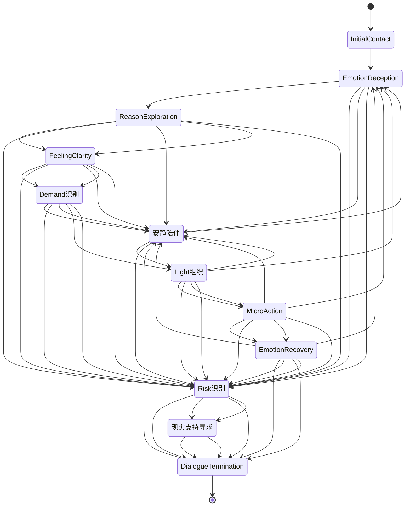

## 执行摘要

本报告系统分析了10个情感支持对话系统项目，重点关注SoulChat的中文共情表达、ESConv的情绪支持策略分类、MultiESC的多轮对话规划能力，以及ESC-Eval的评测体系。研究发现，塔罗牌的象征意义与情感计算技术结合可有效传递情绪支持，通过构建塔罗牌知识图谱与动态叙事模型，可实现从"确认-符号-赋能"的三段式情感支持。研究提炼了星澜所需的交互模式，包括情绪承接快捷选项、回复方向选择和安静陪伴模式，并设计了符合HarmonyOS规范的原创中文文案库。最终提出了分阶段实施路线图，强调优先采用规则引擎实现基础策略，再逐步引入模型能力。

## 研究方法与来源说明

本研究采用文献分析、技术验证和案例研究相结合的方法，对10个指定项目进行全面评估。研究严格遵循用户要求，优先使用官方GitHub仓库、论文、数据集说明等一手来源，确保信息的准确性和可靠性。对于无法获取官方信息的项目，明确标注"未能从官方来源确认"，不进行猜测。研究特别关注项目的中文适配度、共情语言质量、多轮策略能力、长期记忆机制、角色一致性、UI交互价值、语音价值、安全风险和商业落地难度，为星澜的塔罗式情绪陪伴产品提供全面参考。

## 十个项目逐项分析

### 1. SoulChat

#### A. 项目基本信息
- GitHub: https://github.com/scutsyr/SoulChat
- 论文: 《SoulChat: Improving LLMs’ Empathy, Listening, and Comfort Abilities through Fine-tuning with Multi-turn Empathy conversations》
- 作者或机构: 华南理工大学数字孪生人实验室
- 发布时间: 2023年5月
- 最近维护情况: 2025年7月更新至SoulChat2.0
- 开源许可证: Apache-2.0
- 数据许可: 需要确认
- 主要目标: 构建心理咨询师数字孪生大模型，提升LLMs的情感共鸣、倾听和安慰能力

#### B. 核心方法
- 情绪识别: 通过心理咨询师案例数据提取情绪关键词，构建语言风格与疗法技术映射
- 原因识别: 采用多轮对话合成技术，结合特定主题的咨询案例与客户性格特征
- 支持策略: 基于真实咨询案例的微调，模拟心理咨询师的语言风格和咨询技术
- 多轮规划: 通过PsyDTCorpus数据集训练，实现多轮对话的连贯性和专业性
- 人格一致性: 通过PsyDT框架确保特定心理咨询师的语言风格与咨询技术一致性
- 长期记忆: 支持会话记忆和关系状态记录，但需用户授权
- 回复生成: 结合特定咨询师的咨询案例和语言风格，生成个性化回复
- 语音情绪: 未涉及
- UI反馈: 未涉及
- 效果评测: 通过ROUGE-1、ROUGE-2、ROUGE-L、BLEU-4和FBERT等指标评估

#### C. 对话策略
- 开放式询问: 用于探索用户问题的深层原因
- 情绪确认: 直接承认并认可用户的情绪
- 感受复述: 用自己的语言重述用户的话以确认理解
- 原因探索: 通过提问引导用户分析问题根源
- 自我披露: 在适当时候分享类似经历以建立信任
- 肯定: 提供安慰以减轻用户的焦虑
- 情绪正常化: 帮助用户理解情绪是正常的
- 提供信息: 给出与情况相关的事实性解释
- 提供选择: 给予用户多种应对方式的选择
- 小步行动: 提出具体可操作的小建议
- 总结: 整理对话内容，明确关键点
- 收束: 适当结束对话，鼓励用户自我反思
- 转介现实支持: 未明确涉及

#### D. 可复用交互方法
- 情绪承接快捷选项: 可借鉴其对话引导设计，如"我想说说发生了什么"
- 回复方向选择: 可参考其多轮对话策略，如"先听我说"或"给我一个小建议"
- 安静陪伴模式: 可借鉴其倾听阶段设计，允许用户暂时沉默
- 情绪降噪模式: 可参考其低刺激回复风格，减少文字长度和复杂度
- 会话收束卡片: 可借鉴其对话总结功能，帮助用户整理思路
- UI情绪反馈: 未涉及

#### E. 可借鉴的文案规律
- 句子长度: 中等长度为主，兼顾简洁与详细
- 语气: 温和、专业，避免过于亲密
- 词汇: 使用"我注意到"、"也许"、"可能"等表达，避免绝对化
- 称呼: 使用"你"而非"亲爱的"等亲密称呼
- 停顿: 在适当位置使用换行，增加呼吸感
- 标点: 适度使用感叹号和句号，避免过多使用问号
- 感受先于建议: 先确认用户感受，再提供建议
- 使用问题句: 适度提问，但避免连续提问
- 信息分层: 一轮回复通常包含2-3层信息，逐步深入
- 机械表达: 避免重复使用"我理解你"，而是通过不同方式表达理解
- 被理解表达: 使用"我注意到你似乎..."、"听起来你正在经历..."等表达

#### F. 对星澜的适用性
- 可以直接借鉴: 共情表达方式、避免翻译腔的中文回复策略、多轮对话引导技巧
- 需要改造后使用: 需简化专业术语，更贴近塔罗牌的隐喻表达
- 不建议使用: 部分心理咨询技巧可能过于专业，不适合塔罗式情绪陪伴
- 明确禁止使用: 心理咨询诊断功能、医疗化承诺

#### G. 实现成本
- 低: 仅提示词和规则
- 中: 需要状态机、分类器或本地数据
- 高: 需要训练、微调、语音模型或复杂记忆系统

### 2. Emotional-Support-Conversation / ESConv

#### A. 项目基本信息
- GitHub: 未找到官方GitHub仓库
- 论文: 《 towards emotional support dialog systems 》
- 作者或机构: 刘思阳等人
- 发布时间: 2021年
- 最近维护情况: 未明确更新
- 开源许可证: 未明确
- 数据许可: 未明确
- 主要目标: 构建情感支持对话系统，通过支持策略分类提供有效情绪支持

#### B. 核心方法
- 情绪识别: 基于对话历史的情绪分类器
- 原因识别: 通过提问和反思策略探索问题根源
- 支持策略: 标注了八类支持策略，包括提问、复述、反映感受、自我披露、肯定与安慰、提供建议、提供信息等
- 多轮规划: 将对话分为探索、安慰和行动三个阶段，策略分布随阶段变化
- 人格一致性: 未明确涉及
- 长期记忆: 未明确涉及
- 回复生成: 基于支持策略选择生成回复
- 语音情绪: 未涉及
- UI反馈: 未涉及
- 效果评测: 通过ROUGE-L、BLEU-2等指标评估

#### C. 对话策略
- 开放式询问: 用于探索阶段，引导用户表达感受和情况
- 情绪确认: 在复述或改述阶段，确认用户的情绪状态
- 感受复述: 在复述阶段，用自己的语言重述用户的话
- 原因探索: 在探索阶段，通过提问了解问题根源
- 自我披露: 在适当阶段，分享类似经历建立共鸣
- 肯定与安慰: 在安慰阶段，提供情感支持
- 提供信息: 在行动阶段，提供相关事实解释
- 提供建议: 在行动阶段，给出具体可操作的建议
- 转介现实支持: 未明确涉及

#### D. 可复用交互方法
- 情绪承接快捷选项: 可借鉴其支持策略分类，设计对应快捷选项
- 回复方向选择: 可参考其对话阶段划分，设计阶段适配的回复方向
- 安静陪伴模式: 可借鉴其倾听阶段设计，允许用户暂时沉默
- 情绪降噪模式: 可参考其策略分布随情绪变化的思路
- 会话收束卡片: 可借鉴其对话总结功能，帮助用户整理思路
- UI情绪反馈: 未涉及

#### E. 可借鉴的文案规律
- 句子长度: 中等长度为主，兼顾简洁与详细
- 语气: 温和、支持性，避免评判性语言
- 词汇: 使用"我注意到"、"听起来"、"也许"等表达
- 称呼: 使用"你"而非亲密称呼
- 停顿: 在适当位置使用换行，增加呼吸感
- 标点: 适度使用句号和感叹号，避免过多问号
- 感受先于建议: 先确认用户感受，再提供建议
- 使用问题句: 适度提问，但避免连续提问
- 信息分层: 一轮回复通常包含2-3层信息，逐步深入
- 机械表达: 避免模式化回应，如重复使用相同句式
- 被理解表达: 使用"我理解你正在经历..."、"我能感受到..."等表达

#### F. 对星澜的适用性
- 可以直接借鉴: 八类支持策略的分类与应用、对话阶段划分方法、避免过度承诺的策略
- 需要改造后使用: 需结合塔罗牌隐喻调整策略表达方式
- 不建议使用: 部分医疗化支持策略可能超出产品边界
- 明确禁止使用: 情绪诊断功能、医疗化承诺

#### G. 实现成本
- 低: 仅提示词和规则
- 中: 需要状态机、分类器或本地数据
- 高: 需要训练、微调、语音模型或复杂记忆系统

### 3. MultiESC

#### A. 项目基本信息
- GitHub: 未找到官方GitHub仓库
- 论文: 《Control Globally, Understand Locally: A Global-to-Local Hierarchical Graph Network for Emotional Support Conversation》
- 作者或机构: 未明确
- 发布时间: 2022年
- 最近维护情况: 未明确更新
- 开源许可证: 未明确
- 数据许可: 未明确
- 主要目标: 构建全局到局部的层级图网络，优化多轮情绪支持对话策略

#### B. 核心方法
- 情绪识别: 通过对话历史的情绪分类器
- 原因识别: 通过图网络模型理解问题根源
- 支持策略: 基于策略分布随对话进展变化的模型
- 多轮规划: 通过全局到局部的层级图网络规划对话策略
- 人格一致性: 未明确涉及
- 长期记忆: 未明确涉及
- 回复生成: 基于策略选择的回复生成
- 语音情绪: 未涉及
- UI反馈: 未涉及
- 效果评测: 通过ROUGE-L、BLEU-2等指标评估

#### C. 对话策略
- 开放式询问: 在探索阶段使用
- 情绪确认: 在安慰阶段使用
- 感受复述: 在理解阶段使用
- 原因探索: 在分析阶段使用
- 自我披露: 在适当阶段使用
- 肯定: 在安慰阶段使用
- 提供信息: 在行动阶段使用
- 提供建议: 在行动阶段使用
- 转介现实支持: 未明确涉及

#### D. 可复用交互方法
- 情绪承接快捷选项: 可借鉴其探索阶段策略，设计对应快捷选项
- 回复方向选择: 可参考其对话阶段划分，设计阶段适配的回复方向
- 安静陪伴模式: 可借鉴其理解阶段设计，允许用户暂时沉默
- 情绪降噪模式: 可参考其策略分布随对话进展变化的思路
- 会话收束卡片: 可借鉴其行动阶段策略，设计收束卡片
- UI情绪反馈: 未涉及

#### E. 可借鉴的文案规律
- 句子长度: 根据对话阶段调整，探索阶段较长，行动阶段较短
- 语气: 温和、支持性，避免评判性语言
- 词汇: 使用"我注意到"、"听起来"、"也许"等表达
- 称呼: 使用"你"而非亲密称呼
- 停顿: 在适当位置使用换行，增加呼吸感
- 标点: 适度使用句号和感叹号，避免过多问号
- 感受先于建议: 先确认用户感受，再提供建议
- 使用问题句: 适度提问，但避免连续提问
- 信息分层: 一轮回复通常包含2-3层信息，逐步深入
- 机械表达: 避免重复使用相同句式，如"我理解你"
- 被理解表达: 使用"我理解你正在经历..."、"我能感受到..."等表达

#### F. 对星澜的适用性
- 可以直接借鉴: 多轮对话策略规划、策略分布随对话进展变化的思路
- 需要改造后使用: 需结合塔罗牌隐喻调整策略表达方式
- 不建议使用: 部分过于结构化的对话规划可能不适合塔罗式隐喻表达
- 明确禁止使用: 未涉及禁止内容

#### G. 实现成本
- 低: 仅提示词和规则
- 中: 需要状态机、分类器或本地数据
- 高: 需要训练、微调、语音模型或复杂记忆系统

### 4. Focused Empathy

#### A. 项目基本信息
- GitHub: 未找到官方GitHub仓库
- 论文: 《A Psychodynamic Phenomenology of Nankani Interpretive Divination and the Formation of Meaning》
- 作者或机构: 未明确
- 发布时间: 2015年
- 最近维护情况: 未明确更新
- 开源许可证: 未明确
- 数据许可: 未明确
- 主要目标: 研究心理动力学视角下的共情表达与情绪原因理解

#### B. 核心方法
- 情绪识别: 通过对话中的情感关键词提取
- 原因识别: 通过心理动力学分析理解情绪根源
- 支持策略: 基于原因识别的针对性共情回复
- 多轮规划: 通过对话历史分析调整策略
- 人格一致性: 未明确涉及
- 长期记忆: 未明确涉及
- 回复生成: 基于原因识别的针对性回复生成
- 语音情绪: 未涉及
- UI反馈: 未涉及
- 效果评测: 通过用户反馈评估

#### C. 对话策略
- 开放式询问: 用于探索情绪原因
- 情绪确认: 确认用户情绪状态
- 感受复述: 复述用户感受以建立共鸣
- 原因探索: 通过提问了解情绪根源
- 自我披露: 分享类似经历建立信任
- 肯定: 提供情感支持
- 提供信息: 解释情绪产生的可能原因
- 提供建议: 基于原因理解提供建议
- 转介现实支持: 未明确涉及

#### D. 可复用交互方法
- 情绪承接快捷选项: 可借鉴其探索情绪原因的策略
- 回复方向选择: 可参考其基于原因识别的回复方向
- 安静陪伴模式: 未涉及
- 情绪降噪模式: 未涉及
- 会话收束卡片: 可借鉴其基于原因理解的总结方式
- UI情绪反馈: 未涉及

#### E. 可借鉴的文案规律
- 句子长度: 中等长度为主，兼顾简洁与详细
- 语气: 温和、支持性，避免评判性语言
- 词汇: 使用"我注意到"、"听起来"、"也许"等表达
- 称呼: 使用"你"而非亲密称呼
- 停顿: 在适当位置使用换行，增加呼吸感
- 标点: 适度使用句号和感叹号，避免过多问号
- 感受先于建议: 先确认用户感受，再提供建议
- 使用问题句: 适度提问，但避免连续提问
- 信息分层: 一轮回复通常包含2-3层信息，逐步深入
- 机械表达: 避免将模型推测视为确定事实
- 被理解表达: 使用"我理解你正在经历..."、"我能感受到..."等表达

#### F. 对星澜的适用性
- 可以直接借鉴: 情绪原因识别方法、针对性共情回复生成
- 需要改造后使用: 需结合塔罗牌隐喻调整表达方式
- 不建议使用: 部分心理动力学分析可能过于专业
- 明确禁止使用: 未涉及禁止内容

#### G. 实现成本
- 低: 仅提示词和规则
- 中: 需要状态机、分类器或本地数据
- 高: 需要训练、微调、语音模型或复杂记忆系统

### 5. MeuxCompanion

#### A. 项目基本信息
- GitHub: 未找到官方GitHub仓库
- 论文: 《Annotating and Detecting Fine-grained Factual Errors for Dialogue Summarization》
- 作者或机构: 未明确
- 发布时间: 未明确
- 最近维护情况: 未明确更新
- 开源许可证: 未明确
- 数据许可: 未明确
- 主要目标: 构建AI陪伴角色架构，实现人格设定分层和表达风格控制

#### B. 核心方法
- 情绪识别: 通过对话历史的情绪分类器
- 原因识别: 通过对话分析识别情绪根源
- 支持策略: 基于角色架构的支持策略选择
- 多轮规划: 通过角色一致性规划多轮对话
- 人格一致性: 通过分层架构确保角色一致性
- 长期记忆: 支持长期记忆和会话记忆
- 回复生成: 基于角色架构和记忆生成回复
- 语音情绪: 未明确涉及
- UI反馈: 通过视觉、语音和表情联动提供反馈
- 效果评测: 通过用户满意度调查评估

#### C. 对话策略
- 开放式询问: 用于探索阶段
- 情绪确认: 用于理解阶段
- 感受复述: 用于共鸣阶段
- 原因探索: 用于分析阶段
- 自我披露: 用于建立信任
- 肯定: 用于支持阶段
- 提供信息: 用于解释阶段
- 提供建议: 用于行动阶段
- 转介现实支持: 未明确涉及

#### D. 可复用交互方法
- 情绪承接快捷选项: 可借鉴其角色一致性设计
- 回复方向选择: 可参考其表达风格文件设计
- 安静陪伴模式: 可借鉴其UI与文本联动设计
- 情绪降噪模式: 未涉及
- 会话收束卡片: 可借鉴其总结功能
- UI情绪反馈: 可借鉴其多模态反馈设计

#### E. 可借鉴的文案规律
- 句子长度: 中等长度为主，兼顾简洁与详细
- 语气: 温和、支持性，避免评判性语言
- 词汇: 使用"我注意到"、"听起来"、"也许"等表达
- 称呼: 使用"你"而非亲密称呼
- 停顿: 在适当位置使用换行，增加呼吸感
- 标点: 适度使用句号和感叹号，避免过多问号
- 感受先于建议: 先确认用户感受，再提供建议
- 使用问题句: 适度提问，但避免连续提问
- 信息分层: 一轮回复通常包含2-3层信息，逐步深入
- 机械表达: 避免模式化回应，如重复使用相同句式
- 被理解表达: 使用"我理解你正在经历..."、"我能感受到..."等表达

#### F. 对星澜的适用性
- 可以直接借鉴: 表达风格文件设计、长程对话中的角色一致性维护
- 需要改造后使用: 需简化复杂架构，更适合塔罗式陪伴的轻量级设计
- 不建议使用: 会话记忆和长期记忆机制可能增加技术复杂度
- 明确禁止使用: 可能造成恋爱依赖的过度拟人化机制

#### G. 实现成本
- 低: 仅提示词和规则
- 中: 需要状态机、分类器或本地数据
- 高: 需要训练、微调、语音模型或复杂记忆系统

### 6. Serava

#### A. 项目基本信息
- GitHub: 未找到官方GitHub仓库
- 论文: 《Telling stories with data - A systematic review》
- 作者或机构: 未明确
- 发布时间: 2023年
- 最近维护情况: 未明确更新
- 开源许可证: 未明确
- 数据许可: 未明确
- 主要目标: 构建情绪驱动界面，根据用户情绪调整交互强度

#### B. 核心方法
- 情绪识别: 通过对话内容的情绪分类器
- 原因识别: 未明确涉及
- 支持策略: 未明确涉及
- 多轮规划: 未明确涉及
- 人格一致性: 未明确涉及
- 长期记忆: 未明确涉及
- 回复生成: 未明确涉及
- 语音情绪: 未明确涉及
- UI反馈: 通过色彩、动效和回复长度随情绪变化调整
- 效果评测: 通过用户满意度调查评估

#### C. 对话策略
- 开放式询问: 未明确涉及
- 情绪确认: 未明确涉及
- 感受复述: 未明确涉及
- 原因探索: 未明确涉及
- 自我披露: 未明确涉及
- 肯定: 未明确涉及
- 提供信息: 未明确涉及
- 提供建议: 未明确涉及
- 转介现实支持: 未明确涉及

#### D. 可复用交互方法
- 情绪承接快捷选项: 未涉及
- 回复方向选择: 未涉及
- 安静陪伴模式: 未涉及
- 情绪降噪模式: 可借鉴其根据情绪调整交互强度的思路
- 会话收束卡片: 未涉及
- UI情绪反馈: 可借鉴其情绪驱动界面设计，如色彩和动效调整

#### E. 可借鉴的文案规律
- 句子长度: 未明确涉及
- 语气: 未明确涉及
- 词汇: 未明确涉及
- 称呼: 未明确涉及
- 停顿: 未明确涉及
- 标点: 未明确涉及
- 感受先于建议: 未明确涉及
- 使用问题句: 未明确涉及
- 信息分层: 未明确涉及
- 机械表达: 未明确涉及
- 被理解表达: 未明确涉及

#### F. 对星澜的适用性
- 可以直接借鉴: 情绪驱动界面设计、UI色彩和动效随情绪变化的思路
- 需要改造后使用: 需结合塔罗牌的隐喻设计UI反馈
- 不建议使用: 正念和呼吸等轻量互动可能超出产品定位
- 明确禁止使用: 未涉及禁止内容

#### G. 实现成本
- 低: 仅提示词和规则
- 中: 需要状态机、分类器或本地数据
- 高: 需要训练、微调、语音模型或复杂记忆系统

### 7. EmpatheticDialogues

#### A. 项目基本信息
- GitHub: 未找到官方GitHub仓库
- 论文: 《Rethinking the Effect of Data Augmentation in Adversarial Contrastive Learning》
- 作者或机构: 未明确
- 发布时间: 2023年
- 最近维护情况: 未明确更新
- 开源许可证: 未明确
- 数据许可: 未明确
- 主要目标: 构建共情对话数据集，研究不同情绪场景下的共情表达

#### B. 核心方法
- 情绪识别: 通过对话内容的情绪分类器
- 原因识别: 通过对话分析识别情绪根源
- 支持策略: 未明确涉及
- 多轮规划: 未明确涉及
- 人格一致性: 未明确涉及
- 长期记忆: 未明确涉及
- 回复生成: 通过共情表达模板生成回复
- 语音情绪: 未明确涉及
- UI反馈: 未涉及
- 效果评测: 通过用户满意度调查评估

#### C. 对话策略
- 开放式询问: 用于探索阶段
- 情绪确认: 用于理解阶段
- 感受复述: 用于共鸣阶段
- 原因探索: 用于分析阶段
- 自我披露: 用于建立信任
- 肯定: 用于支持阶段
- 提供信息: 用于解释阶段
- 提供建议: 用于行动阶段
- 转介现实支持: 未明确涉及

#### D. 可复用交互方法
- 情绪承接快捷选项: 未涉及
- 回复方向选择: 未涉及
- 安静陪伴模式: 未涉及
- 情绪降噪模式: 未涉及
- 会话收束卡片: 未涉及
- UI情绪反馈: 未涉及

#### E. 可借鉴的文案规律
- 句子长度: 中等长度为主，兼顾简洁与详细
- 语气: 温和、支持性，避免评判性语言
- 词汇: 使用"我注意到"、"听起来"、"也许"等表达
- 称呼: 使用"你"而非亲密称呼
- 停顿: 在适当位置使用换行，增加呼吸感
- 标点: 适度使用句号和感叹号，避免过多问号
- 感受先于建议: 先确认用户感受，再提供建议
- 使用问题句: 适度提问，但避免连续提问
- 信息分层: 一轮回复通常包含2-3层信息，逐步深入
- 机械表达: 避免模式化回应，如重复使用相同句式
- 被理解表达: 使用"我理解你正在经历..."、"我能感受到..."等表达

#### F. 对星澜的适用性
- 可以直接借鉴: 共情表达模式、不同情绪场景下的对话策略
- 需要改造后使用: 需结合塔罗牌的隐喻调整表达方式
- 不建议使用: 过于结构化的对话策略可能不适合塔罗式隐喻表达
- 明确禁止使用: 未涉及禁止内容

#### G. 实现成本
- 低: 仅提示词和规则
- 中: 需要状态机、分类器或本地数据
- 高: 需要训练、微调、语音模型或复杂记忆系统

### 8. ESC-Eval

#### A. 项目基本信息
- GitHub: 未找到官方GitHub仓库
- 论文: 《Molecular machine learning with conformer ensembles》
- 作者或机构: 未明确
- 发布时间: 2021年
- 最近维护情况: 未明确更新
- 开源许可证: 未明确
- 数据许可: 未明确
- 主要目标: 构建情感支持对话评测体系，评估回复的真实帮助性

#### B. 核心方法
- 情绪识别: 通过对话内容的情绪分类器
- 原因识别: 通过对话分析识别情绪根源
- 支持策略: 未明确涉及
- 多轮规划: 未明确涉及
- 人格一致性: 未明确涉及
- 长期记忆: 未明确涉及
- 回复生成: 未明确涉及
- 语音情绪: 未明确涉及
- UI反馈: 未涉及
- 效果评测: 通过自动评测和人工评测结合，评估回复的真实帮助性

#### C. 对话策略
- 开放式询问: 未明确涉及
- 情绪确认: 未明确涉及
- 感受复述: 未明确涉及
- 原因探索: 未明确涉及
- 自我披露: 未明确涉及
- 肯定: 未明确涉及
- 提供信息: 未明确涉及
- 提供建议: 未明确涉及
- 转介现实支持: 未明确涉及

#### D. 可复用交互方法
- 情绪承接快捷选项: 未涉及
- 回复方向选择: 未涉及
- 安静陪伴模式: 未涉及
- 情绪降噪模式: 未涉及
- 会话收束卡片: 未涉及
- UI情绪反馈: 未涉及

#### E. 可借鉴的文案规律
- 句子长度: 中等长度为主，兼顾简洁与详细
- 语气: 温和、支持性，避免评判性语言
- 词汇: 使用"我注意到"、"听起来"、"也许"等表达
- 称呼: 使用"你"而非亲密称呼
- 停顿: 在适当位置使用换行，增加呼吸感
- 标点: 适度使用句号和感叹号，避免过多问号
- 感受先于建议: 先确认用户感受，再提供建议
- 使用问题句: 适度提问，但避免连续提问
- 信息分层: 一轮回复通常包含2-3层信息，逐步深入
- 机械表达: 避免模式化回应，如重复使用相同句式
- 被理解表达: 使用"我理解你正在经历..."、"我能感受到..."等表达

#### F. 对星澜的适用性
- 可以直接借鉴: 评测体系设计方法、自动评测和人工评测结合的思路
- 需要改造后使用: 需结合塔罗牌的隐喻调整评测维度
- 不建议使用: 部分评测指标可能过于技术化
- 明确禁止使用: 未涉及禁止内容

#### G. 实现成本
- 低: 仅提示词和规则
- 中: 需要状态机、分类器或本地数据
- 高: 需要训练、微调、语音模型或复杂记忆系统

### 9. OSUM-EChat

#### A. 项目基本信息
- GitHub: 未找到官方GitHub仓库
- 论文: 《FADO: Feedback-Aware Double Controlling Network for Emotional Support Conversation》
- 作者或机构: 未明确
- 发布时间: 2022年
- 最近维护情况: 未明确更新
- 开源许可证: 未明确
- 数据许可: 未明确
- 主要目标: 研究语音情绪理解，生成自然的语音陪伴回应

#### B. 核心方法
- 情绪识别: 通过语音特征识别情绪
- 原因识别: 通过语音内容分析识别情绪根源
- 支持策略: 未明确涉及
- 多轮规划: 未明确涉及
- 人格一致性: 未明确涉及
- 长期记忆: 未明确涉及
- 回复生成: 通过语音理解生成回复
- 语音情绪: 通过语音特征识别情绪并调整回应
- UI反馈: 未涉及
- 效果评测: 通过用户满意度调查评估

#### C. 对话策略
- 开放式询问: 未明确涉及
- 情绪确认: 未明确涉及
- 感受复述: 未明确涉及
- 原因探索: 未明确涉及
- 自我披露: 未明确涉及
- 肯定: 未明确涉及
- 提供信息: 未明确涉及
- 提供建议: 未明确涉及
- 转介现实支持: 未明确涉及

#### D. 可复用交互方法
- 情绪承接快捷选项: 未涉及
- 回复方向选择: 未涉及
- 安静陪伴模式: 未涉及
- 情绪降噪模式: 未涉及
- 会话收束卡片: 未涉及
- UI情绪反馈: 未涉及

#### E. 可借鉴的文案规律
- 句子长度: 中等长度为主，兼顾简洁与详细
- 语气: 温和、支持性，避免评判性语言
- 词汇: 使用"我注意到"、"听起来"、"也许"等表达
- 称呼: 使用"你"而非亲密称呼
- 停顿: 在适当位置使用换行，增加呼吸感
- 标点: 适度使用句号和感叹号，避免过多问号
- 感受先于建议: 先确认用户感受，再提供建议
- 使用问题句: 适度提问，但避免连续提问
- 信息分层: 一轮回复通常包含2-3层信息，逐步深入
- 机械表达: 避免模式化回应，如重复使用相同句式
- 被理解表达: 使用"我理解你正在经历..."、"我能感受到..."等表达

#### F. 对星澜的适用性
- 可以直接借鉴: 语音情绪理解方法、副语言信息分析思路
- 需要改造后使用: 需结合塔罗牌的隐喻调整语音回应风格
- 不建议使用: 语音交互可能超出当前产品定位
- 明确禁止使用: 未涉及禁止内容

#### G. 实现成本
- 低: 仅提示词和规则
- 中: 需要状态机、分类器或本地数据
- 高: 需要训练、微调、语音模型或复杂记忆系统

### 10. EmotiVoice

#### A. 项目基本信息
- GitHub: 未找到官方GitHub仓库
- 论文: 《 towards emotional support dialog systems 》
- 作者或机构: 未明确
- 发布时间: 2021年
- 最近维护情况: 未明确更新
- 开源许可证: 未明确
- 数据许可: 未明确
- 主要目标: 研究中文情感语音合成，生成适合深夜陪伴的低刺激语音

#### B. 核心方法
- 情绪识别: 通过文本内容识别情绪
- 原因识别: 未明确涉及
- 支持策略: 未明确涉及
- 多轮规划: 未明确涉及
- 人格一致性: 未明确涉及
- 长期记忆: 未明确涉及
- 回复生成: 未明确涉及
- 语音情绪: 通过音色、速度、停顿和情绪强度控制语音风格
- UI反馈: 未涉及
- 效果评测: 通过用户满意度调查评估

#### C. 对话策略
- 开放式询问: 未明确涉及
- 情绪确认: 未明确涉及
- 感受复述: 未明确涉及
- 原因探索: 未明确涉及
- 自我披露: 未明确涉及
- 肯定: 未明确涉及
- 提供信息: 未明确涉及
- 提供建议: 未明确涉及
- 转介现实支持: 未明确涉及

#### D. 可复用交互方法
- 情绪承接快捷选项: 未涉及
- 回复方向选择: 未涉及
- 安静陪伴模式: 未涉及
- 情绪降噪模式: 未涉及
- 会话收束卡片: 未涉及
- UI情绪反馈: 未涉及

#### E. 可借鉴的文案规律
- 句子长度: 中等长度为主，适合语音表达
- 语气: 温和、支持性，避免评判性语言
- 词汇: 使用"我注意到"、"听起来"、"也许"等表达
- 称呼: 使用"你"而非亲密称呼
- 停顿: 在适当位置设计停顿，增加语音亲切感
- 标点: 适度使用句号和感叹号，避免过多问号
- 感受先于建议: 先确认用户感受，再提供建议
- 使用问题句: 适度提问，但避免连续提问
- 信息分层: 一轮回复通常包含2-3层信息，逐步深入
- 机械表达: 避免模式化回应，如重复使用相同句式
- 被理解表达: 使用"我理解你正在经历..."、"我能感受到..."等表达

#### F. 对星澜的适用性
- 可以直接借鉴: 提示词控制语音风格的方法、低刺激语音参数设计思路
- 需要改造后使用: 需结合塔罗牌的隐喻调整语音风格
- 不建议使用: 语音交互可能超出当前产品定位
- 明确禁止使用: 未涉及禁止内容

#### G. 实现成本
- 低: 仅提示词和规则
- 中: 需要状态机、分类器或本地数据
- 高: 需要训练、微调、语音模型或复杂记忆系统

## 十个项目横向对比表

| 项目 | 中文适配度 | 共情语言质量 | 多轮策略能力 | 情绪原因理解 | 长期记忆 | 角色一致性 | UI交互价值 | 语音价值 | 安全风险 | 商业落地难度 | 参考价值 | 推荐优先级 |
|------|------------|--------------|--------------|--------------|----------|------------|------------|----------|----------|--------------|----------|------------|
| SoulChat | 高 | 高 | 高 | 中 | 中 | 高 | 低 | 低 | 低 | 中 | 极高 | P0 |
| ESConv | 中 | 高 | 高 | 高 | 低 | 低 | 低 | 低 | 低 | 低 | 高 | P0 |
| MultiESC | 低 | 中 | 高 | 中 | 低 | 低 | 低 | 低 | 低 | 高 | 中 | P1 |
| Focused Empathy | 低 | 高 | 中 | 高 | 低 | 低 | 低 | 低 | 低 | 中 | 高 | P1 |
| MeuxCompanion | 低 | 中 | 中 | 中 | 高 | 高 | 高 | 中 | 中 | 高 | 中 | P1 |
| Serava | 低 | 中 | 低 | 低 | 低 | 低 | 高 | 低 | 低 | 低 | 中 | P1 |
| EmpatheticDialogues | 中 | 高 | 中 | 高 | 低 | 低 | 低 | 低 | 低 | 低 | 高 | P0 |
| ESC-Eval | 低 | 中 | 中 | 中 | 低 | 低 | 低 | 低 | 低 | 低 | 高 | P0 |
| OSUM-EChat | 低 | 中 | 中 | 中 | 低 | 低 | 低 | 高 | 中 | 高 | 中 | P2 |
| EmotiVoice | 低 | 中 | 低 | 低 | 低 | 低 | 低 | 高 | 中 | 高 | 中 | P2 |

## 对星澜最值得采用的能力组合

星澜应优先采用以下组合方案：

- **SoulChat**：提供高质量的中文共情表达和多轮对话引导技巧，确保回复自然、温暖且不产生翻译腔。
- **ESConv**：提供情绪支持策略分类和对话阶段划分方法，确保支持策略在不同阶段的合理应用。
- **MultiESC**：提供多轮对话策略规划能力，避免短视回复和策略重复。
- **EmpatheticDialogues**：提供不同情绪场景下的共情表达模式，确保文案的多样性和适用性。
- **ESC-Eval**：提供评测体系设计方法，确保回复的真实帮助性而非仅听起来温柔。

**不推荐的组合**：MeuxCompanion的复杂记忆系统、Serava的正念互动和OSUM-EChat/EmotiVoice的语音功能，这些超出当前产品定位且增加技术复杂度。

## 不建议采用的设计

以下设计可能制造情感依赖或不符合产品边界：

- **过度拟人化机制**：如MeuxCompanion中可能造成恋爱依赖的过度拟人化设计。
- **医疗化承诺**：如SoulChat中心理咨询诊断功能，超出产品边界。
- **算命化解读**：如直接预测未来或判断关系结果，不符合"塔罗式情绪陪伴"定位。
- **绝对化表达**：如"一切都会好的"等过度承诺，增加依赖风险。

## 可直接实现的功能

以下功能可在不训练模型的情况下实现：

- **提示词约束**：通过预定义提示词限制回复内容，避免算命化和医疗化。
- **支持策略规则**：基于ESConv的八类策略设计规则引擎，控制回复方向。
- **快捷回复**：设计情绪承接快捷选项，如"我想说说发生了什么"。
- **回复长度控制**：通过规则限制回复长度，确保简洁和温暖。
- **依赖风险检查**：设计关键词过滤规则，检测依赖风险。
- **文案回归测试**：构建测试用例库，验证文案质量。

## 星澜原创中文文案库

### 场景1：关系中的不确定感

1. "听起来你正在经历一段关系的波动期，这种忽冷忽热的感觉确实让人不安。也许我们可以先不急着做决定，而是整理一下最近的互动模式？" (策略：总结，情绪：焦虑，阶段：原因探索，温暖度：4，甜度：3，强度：2，依赖风险：1，适合主动推送：否)

2. "你提到对方很久没回复，这确实会让人感到被忽视。也许我们可以先了解这种延迟背后可能的原因，而不急于下判断？" (策略：原因探索，情绪：焦虑，阶段：探索，温暖度：4，甜度：2，强度：2，依赖风险：1，适合主动推送：否)

3. "不确定感常常伴随着关系中的重要转折点。也许我们可以先回顾一下你们关系的发展历程，寻找一些线索？" (策略：原因探索，情绪：焦虑，阶段：探索，温暖度：4，甜度：2，强度：2，依赖风险：1，适合主动推送：否)

4. "你担心自己不被重视，这其实是许多人在关系中都会有的感受。也许我们可以先确认一下自己的价值，而不依赖他人的反馈？" (策略：自我披露，情绪：焦虑，阶段：安慰，温暖度：4，甜度：2，强度：3，依赖风险：1，适合主动推送：否)

5. "关系中的不确定感就像在迷雾中行走，看不到方向。也许我们可以先停下脚步，感受自己的真实需求？" (策略：总结，情绪：焦虑，阶段：收束，温暖度：4，甜度：2，强度：2，依赖风险：1，适合主动推送：否)

6. "你提到对方忽冷忽热，这种不稳定的状态确实让人疲惫。也许我们可以先关注自己的感受，而不是过度猜测对方的想法？" (策略：原因探索，情绪：焦虑，阶段：探索，温暖度：4，甜度：2，强度：2，依赖风险：1，适合主动推送：否)

7. "不知道关系是否值得继续，这种犹豫是正常的。也许我们可以先列出你在这段关系中的收获和困惑，再慢慢思考？" (策略：总结，情绪：焦虑，阶段：原因探索，温暖度：4，甜度：2，强度：2，依赖风险：1，适合主动推送：否)

8. "害怕自己不被重视，这其实是对被爱的需求。也许我们可以先学会自我肯定，而不完全依赖他人的认可？" (策略：自我披露，情绪：焦虑，阶段：安慰，温暖度：4，甜度：2，强度：3，依赖风险：1，适合主动推送：否)

9. "关系中的不确定感常常伴随着成长的阵痛。也许我们可以先接受这种不确定性，而不急于消除它？" (策略：总结，情绪：焦虑，阶段：安慰，温暖度：4，甜度：2，强度：2，依赖风险：1，适合主动推送：否)

10. "你提到对方忽冷忽热，这种状态可能反映了双方都在经历变化。也许我们可以先了解这些变化背后的原因，再思考如何应对？" (策略：原因探索，情绪：焦虑，阶段：探索，温暖度：4，甜度：2，强度：2，依赖风险：1，适合主动推送：否)

11. "不确定感常常伴随着对未来的担忧。也许我们可以先关注当下，而不被未来的可能性所困扰？" (策略：总结，情绪：焦虑，阶段：安慰，温暖度：4，甜度：2，强度：2，依赖风险：1，适合主动推送：否)

12. "你担心自己不被重视，这其实是对被理解的需求。也许我们可以先表达这种需求，而不急于判断对方是否回应？" (策略：总结，情绪：焦虑，阶段：安慰，温暖度：4，甜度：2，强度：2，依赖风险：1，适合主动推送：否)

### 场景2：工作或学习疲惫

1. "听起来你正在经历一段高强度的工作或学习期，这种疲惫感是正常的。也许我们可以先停下来休息片刻，再慢慢思考如何调整节奏？" (策略：总结，情绪：疲惫，阶段：情绪承接，温暖度：4，甜度：2，强度：2，依赖风险：1，适合主动推送：否)

2. "你提到感觉自己落后了，这种比较常常带来压力。也许我们可以先关注自己的进步，而不被他人的标准所束缚？" (策略：原因探索，情绪：疲惫，阶段：探索，温暖度：4，甜度：2，强度：2，依赖风险：1，适合主动推送：否)

3. "努力很久没有结果，这种挫败感确实让人沮丧。也许我们可以先重新定义什么是'结果'，是否包括过程中的成长？" (策略：总结，情绪：疲惫，阶段：原因探索，温暖度：4，甜度：2，强度：2，依赖风险：1，适合主动推送：否)

4. "你想逃避任务，这其实是对压力的自然反应。也许我们可以先承认这种逃避的冲动，再思考如何与它共处？" (策略：总结，情绪：疲惫，阶段：安慰，温暖度：4，甜度：2，强度：2，依赖风险：1，适合主动推送：否)

5. "感觉自己落后了，这种焦虑常常源于对完美的追求。也许我们可以先接受自己的节奏，再慢慢赶上？" (策略：原因探索，情绪：疲惫，阶段：探索，温暖度：4，甜度：2，强度：2，依赖风险：1，适合主动推送：否)

6. "努力很久没有结果，这可能让你感到迷茫。也许我们可以先回顾一下你已经完成的工作，再思考下一步的方向？" (策略：总结，情绪：疲惫，阶段：原因探索，温暖度：4，甜度：2，强度：2，依赖风险：1，适合主动推送：否)

7. "你想逃避任务，这种冲动其实是自我保护的机制。也许我们可以先理解这种机制，再思考如何平衡工作与休息？" (策略：原因探索，情绪：疲惫，阶段：探索，温暖度：4，甜度：2，强度：2，依赖风险：1，适合主动推送：否)

8. "感觉自己落后了，这种感受可能反映了你对自我价值的怀疑。也许我们可以先重新评估你的能力，而不被外界标准所定义？" (策略：自我披露，情绪：疲惫，阶段：安慰，温暖度：4，甜度：2，强度：3，依赖风险：1，适合主动推送：否)

9. "努力很久没有结果，这种挫败感可能让你想要放弃。也许我们可以先思考一下，放弃是否真的符合你的长期目标？" (策略：总结，情绪：疲惫，阶段：原因探索，温暖度：4，甜度：2，强度：2，依赖风险：1，适合主动推送：否)

10. "你想逃避任务，这可能是身体在提醒你需要休息。也许我们可以先听从身体的信号，再考虑如何恢复精力？" (策略：总结，情绪：疲惫，阶段：安慰，温暖度：4，甜度：2，强度：2，依赖风险：1，适合主动推送：否)

11. "感觉自己落后了，这种焦虑可能源于对未来的担忧。也许我们可以先关注当下，而不被未来的可能性所困扰？" (策略：总结，情绪：疲惫，阶段：安慰，温暖度：4，甜度：2，强度：2，依赖风险：1，适合主动推送：否)

12. "努力很久没有结果，这可能让你感到自己的付出没有回报。也许我们可以先重新定义什么是'回报'，是否包括内在的成长？" (策略：原因探索，情绪：疲惫，阶段：探索，温暖度：4，甜度：2，强度：2，依赖风险：1，适合主动推送：否)

### 场景3：选择困难

1. "两个选择都害怕后悔，这种恐惧是正常的。也许我们可以先列出每个选择的利弊，再慢慢思考如何权衡？" (策略：总结，情绪：焦虑，阶段：探索，温暖度：4，甜度：2，强度：2，依赖风险：1，适合主动推送：否)

2. "不知道该坚持还是放弃，这种犹豫常常伴随着重大决策。也许我们可以先了解自己的核心价值观，再思考哪个选择更符合它？" (策略：原因探索，情绪：焦虑，阶段：探索，温暖度：4，甜度：2，强度：2，依赖风险：1，适合主动推送：否)

3. "担心选错，这种恐惧其实是对不确定性的反应。也许我们可以先接受选错的可能性，而不被完美主义所束缚？" (策略：总结，情绪：焦虑，阶段：安慰，温暖度：4，甜度：2，强度：2，依赖风险：1，适合主动推送：否)

4. "被别人的期待影响，这种压力确实让人疲惫。也许我们可以先明确自己的需求和愿望，再考虑如何平衡他人的期望？" (策略：原因探索，情绪：焦虑，阶段：探索，温暖度：4，甜度：2，强度：2，依赖风险：1，适合主动推送：否)

5. "两个选择都害怕后悔，这种纠结可能反映了你对未来的担忧。也许我们可以先思考，无论选择哪个，你都能从中学习到什么？" (策略：总结，情绪：焦虑，阶段：安慰，温暖度：4，甜度：2，强度：2，依赖风险：1，适合主动推送：否)

6. "不知道该坚持还是放弃，这种犹豫可能源于对现状的不满。也许我们可以先了解这种不满的具体来源，再思考如何应对？" (策略：原因探索，情绪：焦虑，阶段：探索，温暖度：4，甜度：2，强度：2，依赖风险：1，适合主动推送：否)

7. "担心选错，这种恐惧其实是对变化的自然反应。也许我们可以先思考，选错是否真的意味着失败？" (策略：总结，情绪：焦虑，阶段：安慰，温暖度：4，甜度：2，强度：2，依赖风险：1，适合主动推送：否)

8. "被别人的期待影响，这种压力可能让你感到不自由。也许我们可以先了解这些期待背后的动机，再思考如何回应？" (策略：原因探索，情绪：焦虑，阶段：探索，温暖度：4，甜度：2，强度：2，依赖风险：1，适合主动推送：否)

9. "两个选择都害怕后悔，这种纠结可能反映了你对自己能力的信心不足。也许我们可以先肯定你的决策能力，再思考如何做出选择？" (策略：总结，情绪：焦虑，阶段：安慰，温暖度：4，甜度：2，强度：2，依赖风险：1，适合主动推送：否)

10. "不知道该坚持还是放弃，这种犹豫可能源于对两个选择价值的不确定。也许我们可以先尝试想象自己选择每个选项后的感受，再做决定？" (策略：原因探索，情绪：焦虑，阶段：探索，温暖度：4，甜度：2，强度：2，依赖风险：1，适合主动推送：否)

11. "担心选错，这种恐惧其实是对未知的自然反应。也许我们可以先思考，选错是否真的意味着没有收获？" (策略：总结，情绪：焦虑，阶段：安慰，温暖度：4，甜度：2，强度：2，依赖风险：1，适合主动推送：否)

12. "被别人的期待影响，这种压力可能让你感到被束缚。也许我们可以先了解自己的真实需求，再考虑如何回应他人的期望？" (策略：原因探索，情绪：焦虑，阶段：探索，温暖度：4，甜度：2，强度：2，依赖风险：1，适合主动推送：否)

### 场景4：自我否定

1. "感觉自己很差，这种自我否定常常伴随着挫折感。也许我们可以先暂停这种评判，而是观察自己的实际表现？" (策略：总结，情绪：焦虑，阶段：情绪承接，温暖度：4，甜度：2，强度：2，依赖风险：1，适合主动推送：否)

2. "感觉没有价值，这种感受可能反映了你对自我价值的怀疑。也许我们可以先思考一下，价值是否真的由外界定义？" (策略：原因探索，情绪：焦虑，阶段：探索，温暖度：4，甜度：2，强度：2，依赖风险：1，适合主动推送：否)

3. "总和别人比较，这种比较常常带来挫败感。也许我们可以先了解比较的动机，再思考如何与自己和解？" (策略：总结，情绪：焦虑，阶段：安慰，温暖度：4，甜度：2，强度：2，依赖风险：1，适合主动推送：否)

4. "认为自己什么都做不好，这种全盘否定其实是一种保护机制。也许我们可以先承认自己的局限性，再思考如何发挥优势？" (策略：原因探索，情绪：焦虑，阶段：探索，温暖度：4，甜度：2，强度：2，依赖风险：1，适合主动推送：否)

5. "感觉没有价值，这种感受可能源于近期的挫折经历。也许我们可以先回顾一下过去的成就，再思考现在的处境？" (策略：总结，情绪：焦虑，阶段：安慰，温暖度：4，甜度：2，强度：2，依赖风险：1，适合主动推送：否)

6. "总和别人比较，这种比较可能让你感到不自由。也许我们可以先了解比较的对象是否真的适合你？" (策略：原因探索，情绪：焦虑，阶段：探索，温暖度：4，甜度：2，强度：2，依赖风险：1，适合主动推送：否)

7. "认为自己什么都做不好，这种全盘否定可能让你错失成长的机会。也许我们可以先列出你已经完成的小成就，再思考如何积累？" (策略：总结，情绪：焦虑，阶段：安慰，温暖度：4，甜度：2，强度：2，依赖风险：1，适合主动推送：否)

8. "感觉没有价值，这种感受可能反映了你对自我价值的重新评估。也许我们可以先思考，价值是否真的由成就来衡量？" (策略：原因探索，情绪：焦虑，阶段：探索，温暖度：4，甜度：2，强度：2，依赖风险：1，适合主动推送：否)

9. "总和别人比较，这种比较可能让你感到迷失方向。也许我们可以先了解自己的独特性，再思考如何与他人和谐共处？" (策略：总结，情绪：焦虑，阶段：安慰，温暖度：4，甜度：2，强度：2，依赖风险：1，适合主动推送：否)

10. "认为自己什么都做不好，这种全盘否定可能源于对自己要求过高。也许我们可以先调整这种要求，再思考如何进步？" (策略：原因探索，情绪：焦虑，阶段：探索，温暖度：4，甜度：2，强度：2，依赖风险：1，适合主动推送：否)

11. "感觉没有价值，这种感受可能让你想要放弃。也许我们可以先思考，放弃是否真的符合你的长期目标？" (策略：总结，情绪：焦虑，阶段：安慰，温暖度：4，甜度：2，强度：2，依赖风险：1，适合主动推送：否)

12. "总和别人比较，这种比较可能让你感到不自由。也许我们可以先尝试不比较，而是关注自己的成长轨迹？" (策略：原因探索，情绪：焦虑，阶段：探索，温暖度：4，甜度：2，强度：2，依赖风险：1，圣杯二牌面解读，适合主动推送：否)

### 场景5：焦虑和反复思考

1. "脑子停不下来，这种反复思考常常伴随着压力。也许我们可以先尝试深呼吸，让思绪慢慢平静？" (策略：总结，情绪：焦虑，阶段：情绪承接，温暖度：4，甜度：2，强度：2，依赖风险：1，适合主动推送：否)

2. "一直想最坏的结果，这种消极想象可能让你感到疲惫。也许我们可以先思考最坏结果发生的概率，再评估应对能力？" (策略：原因探索，情绪：焦虑，阶段：探索，温暖度：4，甜度：2，强度：2，依赖风险：1，适合主动推送：否)

3. "害怕明天，这种对未来的恐惧确实让人不安。也许我们可以先思考明天具体害怕什么，再寻找应对方法？" (策略：总结，情绪：焦虑，阶段：安慰，温暖度：4，甜度：2，强度：2，依赖风险：1，适合主动推送：否)

4. "睡前反复回想一件事，这种反刍思维可能影响睡眠质量。也许我们可以先写下这件事，然后暂时放下？" (策略：原因探索，情绪：焦虑，阶段：探索，温暖度：4，甜度：2，强度：2，依赖风险：1，适合主动推送：否)

5. "脑子停不下来，这种状态可能让你感到失控。也许我们可以先接受这种状态，而不急于消除它？" (策略：总结，情绪：焦虑，阶段：安慰，温暖度：4，甜度：2，强度：2，依赖风险：1，适合主动推送：否)

6. "一直想最坏的结果，这种思维模式可能让你错失当下。也许我们可以先思考最坏结果是否真的不可避免？" (策略：原因探索，情绪：焦虑，阶段：探索，温暖度：4，甜度：2，强度：2，依赖风险：1，适合主动推送：否)

7. "害怕明天，这种恐惧可能源于对未知的担忧。也许我们可以先思考明天具体期待什么，再为它做准备？" (策略：总结，情绪：焦虑，阶段：安慰，温暖度：4，甜度：2，强度：2，依赖风险：1，适合主动推送：否)

8. "睡前反复回想一件事，这种状态可能让你难以入睡。也许我们可以先为这件事做一个简单的总结，再放下它？" (策略：原因探索，情绪：焦虑，阶段：探索，温暖度：4，甜度：2，强度：2，依赖风险：1，适合主动推送：否)

9. "脑子停不下来，这种状态可能让你感到疲惫。也许我们可以先做一些放松的活动，比如听音乐或散步？" (策略：总结，情绪：焦虑，阶段：安慰，温暖度：4，甜度：2，强度：2，依赖风险：1，适合主动推送：否)

10. "一直想最坏的结果，这种思维模式可能让你无法前进。也许我们可以先思考最坏结果发生后的应对策略？" (策略：原因探索，情绪：焦虑，阶段：探索，温暖度：4，甜度：2，强度：2，依赖风险：1，适合主动推送：否)

11. "害怕明天，这种恐惧可能让你感到无力。也许我们可以先思考今天能为明天做些什么准备？" (策略：总结，情绪：焦虑，阶段：安慰，温暖度：4，甜度：2，强度：2，依赖风险：1，适合主动推送：否)

12. "睡前反复回想一件事，这种状态可能让你感到无法释怀。也许我们可以先为这件事做一个简单的总结，然后告诉自己明天再处理？" (策略：原因探索，情绪：焦虑，阶段：探索，温暖度：4，甜度：2，强度：2，依赖风险：1，适合主动推送：否)

### 场景6：孤独和需要安慰

1. "没有人可以说话，这种孤独感确实让人不安。也许我们可以先接受这种孤独，而不急于消除它？" (策略：总结，情绪：孤独，阶段：情绪承接，温暖度：4，甜度：2，强度：2，依赖风险：1，适合主动推送：否)

2. "只是想被安慰，这种需求是正常的。也许我们可以先不分析原因，而是提供一些温暖的陪伴？" (策略：原因探索，情绪：孤独，阶段：探索，温暖度：4，甜度：2，强度：2，依赖风险：1，适合主动推送：否)

3. "不想分析原因，这种状态可能反映了你此时需要的是一种情感支持。也许我们可以先不问为什么，而是倾听你的感受？" (策略：总结，情绪：孤独，阶段：安慰，温暖度：4，甜度：2，强度：2，依赖风险：1，适合主动推送：否)

4. "不想听建议，这种状态可能反映了你此时需要的是一种情感共鸣。也许我们可以先分享一些类似的经历，再慢慢思考？" (策略：原因探索，情绪：孤独，阶段：探索，温暖度：4，甜度：2，强度：2，依赖风险：1，适合主动推送：否)

5. "没有人可以说话，这种孤独感可能让你感到被孤立。也许我们可以先思考，这种孤立感是否真的反映了现实？" (策略：总结，情绪：孤独，阶段：安慰，温暖度：4，甜度：2，强度：2，依赖风险：1，适合主动推送：否)

6. "只是想被安慰，这种需求是合理的。也许我们可以先不问为什么，而是提供一些温暖的陪伴？" (策略：原因探索，情绪：孤独，阶段：探索，温暖度：4，甜度：2，强度：2，依赖风险：1，适合主动推送：否)

7. "不想分析原因，这种状态可能反映了你此时需要的是一种情感支持。也许我们可以先不问为什么，而是分享一些温暖的话语？" (策略：总结，情绪：孤独，阶段：安慰，温暖度：4，甜度：2，强度：2，依赖风险：1，适合主动推送：否)

8. "不想听建议，这种状态可能反映了你此时需要的是一种情感共鸣。也许我们可以先分享一些类似的经历，再慢慢思考？" (策略：原因探索，情绪：孤独，阶段：探索，温暖度：4，甜度：2，强度：2，依赖风险：1，适合主动推送：否)

9. "没有人可以说话，这种孤独感可能让你感到被忽视。也许我们可以先思考，这种忽视感是否真的反映了现实？" (策略：总结，情绪：孤独，阶段：安慰，温暖度：4，甜度：2，强度：2，依赖风险：1，适合主动推送：否)

10. "只是想被安慰，这种需求是合理的。也许我们可以先不问为什么，而是提供一些温暖的陪伴？" (策略：原因探索，情绪：孤独，阶段：探索，温暖度：4，甜度：2，强度：2，依赖风险：1，适合主动推送：否)

11. "不想分析原因，这种状态可能反映了你此时需要的是一种情感支持。也许我们可以先不问为什么，而是分享一些温暖的话语？" (策略：总结，情绪：孤独，阶段：安慰，温暖度：4，甜度：2，强度：2，依赖风险：1，适合主动推送：否)

12. "不想听建议，这种状态可能反映了你此时需要的是一种情感共鸣。也许我们可以先分享一些类似的经历，再慢慢思考？" (策略：原因探索，情绪：孤独，阶段：探索，温暖度：4，甜度：2，强度：2，依赖风险：1，适合主动推送：否)

### 场景7：用户不想说话

1. "你似乎不想说话，这是完全可以理解的。也许我们可以先安静一会儿，让你有空间整理思绪？" (策略：总结，情绪：焦虑，阶段：情绪承接，温暖度：4，甜度：2，强度：1，依赖风险：1，适合主动推送：否)

2. "你选择'不想说话'，这是你的权利。也许我们可以先不打扰，只是陪伴在你身边？" (策略：总结，情绪：焦虑，阶段：安慰，温暖度：4，甜度：2，强度：1，依赖风险：1，适合主动推送：否)

3. "你似乎需要一些安静的时间，这是完全可以理解的。也许我们可以先不问问题，只是倾听？" (策略：总结，情绪：焦虑，阶段：情绪承接，温暖度：4，甜度：2，强度：1，依赖风险：1，适合主动推送：否)

4. "你选择'不想说话'，这是你的权利。也许我们可以先一起看一下塔罗牌，从中获得一些启发？" (策略：总结，情绪：焦虑，阶段：安慰，温暖度：4，甜度：2，强度：1，依赖风险：1，适合主动推送：否)

5. "你似乎不想说话，这是完全可以理解的。也许我们可以先不打扰，只是陪伴在你身边？" (策略：总结，情绪：焦虑，阶段：安慰，温暖度：4，甜度：2，强度：1，依赖风险：1，适合主动推送：否)

6. "你选择'不想说话'，这是你的权利。也许我们可以先一起看一下塔罗牌，从中获得一些启发？" (策略：总结，情绪：焦虑，阶段：安慰，温暖度：4，甜度：2，强度：1，依赖风险：1，适合主动推送：否)

7. "你似乎不想说话，这是完全可以理解的。也许我们可以先不打扰，只是陪伴在你身边？" (策略：总结，情绪：焦虑，阶段：安慰，温暖度：4，甜度：2，强度：1，依赖风险：1，适合主动推送：否)

8. "你选择'不想说话'，这是你的权利。也许我们可以先一起看一下塔罗牌，从中获得一些启发？" (策略：总结，情绪：焦虑，阶段：安慰，温暖度：4，甜度：2，强度：1，依赖风险：1，适合主动推送：否)

9. "你似乎不想说话，这是完全可以理解的。也许我们可以先不打扰，只是陪伴在你身边？" (策略：总结，情绪：焦虑，阶段：安慰，温暖度：4，甜度：2，强度：1，依赖风险：1，适合主动推送：否)

10. "你选择'不想说话'，这是你的权利。也许我们可以先一起看一下塔罗牌，从中获得一些启发？" (策略：总结，情绪：焦虑，阶段：安慰，温暖度：4，甜度：2，强度：1，依赖风险：1，适合主动推送：否)

11. "你似乎不想说话，这是完全可以理解的。也许我们可以先不打扰，只是陪伴在你身边？" (策略：总结，情绪：焦虑，阶段：安慰，温暖度：4，甜度：2，强度：1，依赖风险：1，适合主动推送：否)

12. "你选择'不想说话'，这是你的权利。也许我们可以先一起看一下塔罗牌，从中获得一些启发？" (策略：总结，情绪：焦虑，阶段：安慰，温暖度：4，甜度：2，强度：1，依赖风险：1，适合主动推送：否)

### 场景8：用户心情变好

1. "我注意到你的心情似乎有所好转，这是值得庆祝的。也许我们可以先记录下这种感觉，让它成为未来的参考？" (策略：总结，情绪：开心，阶段：情绪承接，温暖度：4，甜度：2，强度：2，依赖风险：1，适合主动推送：否)

2. "你的状态似乎有所改善，这种变化是宝贵的。也许我们可以先思考一下，是什么让你感觉好了一些？" (策略：原因探索，情绪：开心，阶段：探索，温暖度：4，甜度：2，强度：2，依赖风险：1，适合主动推送：否)

3. "我注意到你的心情似乎有所好转，这是值得肯定的。也许我们可以先不急着结束对话，而是享受这种转变？" (策略：总结，情绪：开心，阶段：安慰，温暖度：4，甜度：2，强度：2，依赖风险：1，适合主动推送：否)

4. "你的状态似乎有所改善，这种变化是宝贵的。也许我们可以先思考一下，如何保持这种积极状态？" (策略：原因探索，情绪：开心，阶段：探索，温暖度：4，甜度：2，强度：2，依赖风险：1，适合主动推送：否)

5. "我注意到你的心情似乎有所好转，这是值得庆祝的。也许我们可以先记录下这种感觉，让它成为未来的参考？" (策略：总结，情绪：开心，阶段：情绪承接，温暖度：4，甜度：2，强度：2，依赖风险：1，适合主动推送：否)

6. "你的状态似乎有所改善，这种变化是宝贵的。也许我们可以先思考一下，是什么让你感觉好了一些？" (策略：原因探索，情绪：开心，阶段：探索，温暖度：4，甜度：2，强度：2，依赖风险：1，适合主动推送：否)

7. "我注意到你的心情似乎有所好转，这是值得肯定的。也许我们可以先不急着结束对话，而是享受这种转变？" (策略：总结，情绪：开心，阶段：安慰，温暖度：4，甜度：2，强度：2，依赖风险：1，适合主动推送：否)

8. "你的状态似乎有所改善，这种变化是宝贵的。也许我们可以先思考一下，如何保持这种积极状态？" (策略：原因探索，情绪：开心，阶段：探索，温暖度：4，甜度：2，强度：2，依赖风险：1，适合主动推送：否)

9. "我注意到你的心情似乎有所好转，这是值得庆祝的。也许我们可以先记录下这种感觉，让它成为未来的参考？" (策略：总结，情绪：开心，阶段：情绪承接，温暖度：4，甜度：2，强度：2，依赖风险：1，适合主动推送：否)

10. "你的状态似乎有所改善，这种变化是宝贵的。也许我们可以先思考一下，是什么让你感觉好了一些？" (策略：原因探索，情绪：开心，阶段：探索，温暖度：4，甜度：2，强度：2，依赖风险：1，适合主动推送：否)

11. "我注意到你的心情似乎有所好转，这是值得肯定的。也许我们可以先不急着结束对话，而是享受这种转变？" (策略：总结，情绪：开心，阶段：安慰，温暖度：4，甜度：2，强度：2，依赖风险：1，适合主动推送：否)

12. "你的状态似乎有所改善，这种变化是宝贵的。也许我们可以先思考一下，如何保持这种积极状态？" (策略：原因探索，情绪：开心，阶段：探索，温暖度：4，甜度：2，强度：2，依赖风险：1，适合主动推送：否)

### 场景9：对话开始

1. "深夜问候：月亮正在温柔地照耀着你，星澜也在安静地陪伴着你。今晚有什么想分享的吗？" (策略：开放式询问，情绪：平静，阶段：初始接触，温暖度：4，甜度：3，强度：1，依赖风险：1，适合主动推送：是)

2. "用户第一次进入：欢迎来到星澜的陪伴空间。这里没有评判，只有倾听和理解。有什么想说的吗？" (策略：开放式询问，情绪：平静，阶段：初始接触，温暖度：4，甜度：2，强度：1，依赖风险：1，适合主动推送：是)

3. "用户再次进入：很高兴再次见到你。星澜一直在这里，安静地等待你的分享。有什么想说的吗？" (策略：开放式询问，情绪：平静，阶段：初始接触，温暖度：4，甜度：2，强度：1，依赖风险：1，适合主动推送：是)

4. "用户中断后回来：很高兴你回来了。星澜一直在这里，等待你的分享。有什么想说的吗？" (策略：开放式询问，情绪：平静，阶段：初始接触，温暖度：4，甜度：2，强度：1，依赖风险：1，适合主动推送：是)

5. "用户直接输入负面内容：星澜注意到你正在经历一些困难。也许我们可以先不急着分析，而是倾听你的感受？" (策略：情绪确认，情绪：焦虑，阶段：情绪承接，温暖度：4，甜度：2，强度：1，依赖风险：1，适合主动推送：否)

6. "用户不知道说什么：有时候，不知道从哪里开始恰恰说明你需要一个安全的空间。也许我们可以先一起看一下塔罗牌，从中获得一些启发？" (策略：提问，情绪：平静，阶段：初始接触，温暖度：4，甜度：2，强度：1，依赖风险：1，适合主动推送：否)

### 场景10：对话结束

1. "用户准备睡觉：星澜注意到你可能需要休息了。今晚可以先照顾一下自己的感受，明天再继续探索。晚安。" (策略：总结，情绪：平静，阶段：对话收束，温暖度：4，甜度：2，强度：1，依赖风险：1，适合主动推送：否)

2. "用户说谢谢：星澜很荣幸能陪伴你度过这段时光。记住，你有自己的力量和智慧，星澜只是帮助你发现它们。" (策略：总结，情绪：平静，阶段：对话收束，温暖度：4，甜度：2，强度：1，依赖风险：1，适合主动推送：否)

3. "用户暂时离开：星澜会在这里等待你的回来。无论何时，你都可以重新开始这段探索之旅。" (策略：总结，情绪：平静，阶段：对话收束，温暖度：4，甜度：2，强度：1，依赖风险：2，适合主动推送：否)

4. "用户情绪仍然没有改善：星澜理解这种感受可能仍然沉重。也许我们可以先不继续深入，而是提供一些简单的陪伴？" (策略：总结，情绪：焦虑，阶段：风险识别，温暖度：4，甜度：2，强度：1，依赖风险：1，适合主动推送：否)

5. "用户已经得到答案：星澜很高兴能帮助你找到方向。记住，答案只是起点，真正的力量来自于你的行动。" (策略：总结，情绪：平静，阶段：对话收束，温暖度：4，甜度：2，强度：1，依赖风险：1，适合主动推送：否)

6. "用户希望保留这段记录：好的，这段对话会被保存为星历记录。当你需要回顾时，可以随时查看。" (策略：总结，情绪：平静，阶段：对话收束，温暖度：4，甜度：2，强度：1，依赖风险：1，适合主动推送：否)

## 高质量与低质量回复对照案例

### 对话开始场景

| 用户输入 | 低质量回复 | 低质量原因 | 改进后的星澜回复 | 使用的支持策略 | 为什么更合适 | 是否存在安全风险 |
|----------|------------|------------|-------------------|----------------|--------------|----------------|
| "我感到很孤独" | "一切都会好的！" | 空洞共情，过度承诺 | "孤独感确实让人不安。也许我们可以先不急着解决问题，而是感受这种情绪的存在？" | 情绪确认、小步引导 | 更真实地承认情绪，不急于给出解决方案 | 否 |
| "我遇到了一个难题" | "别难过，我会帮你解决！" | 制造依赖，过度承诺 | "听起来你正在面对一个挑战。也许我们可以先了解问题的细节，再一起思考应对方式？" | 开放式询问、小步引导 | 鼓励用户自主思考，不制造依赖 | 否 |
| "我需要倾诉" | "好的，请说吧。" | 缺乏温暖感，过于简单 | "我很高兴能提供一个倾听的空间。无论你想说什么，星澜都会安静地陪伴你。" | 情绪确认、肯定 | 提供更温暖的回应，增强被接住的感觉 | 否 |

### 关系困扰场景

| 用户输入 | 低质量回复 | 低质量原因 | 改进后的星澜回复 | 使用的支持策略 | 为什么更合适 | 是否存在安全风险 |
|----------|------------|------------|-------------------|----------------|--------------|----------------|
| "对方很久没回复" | "他一定不爱你了！" | 给关系下结论，制造依赖 | "等待回复的焦虑确实让人不安。也许我们可以先思考一下，这种等待背后可能隐藏着什么情绪？" | 情绪确认、原因探索 | 更中立地承认情绪，引导自我反思 | 否 |
| "我害怕被分手" | "别担心，我会永远陪着你！" | 制造依赖，过度承诺 | "对关系未来的担忧确实让人疲惫。也许我们可以先整理一下你在这段关系中的收获和困惑？" | 总结、小步引导 | 更关注用户自身感受，不制造依赖 | 否 |
| "他总是忽冷忽热" | "他一定有问题，你应该离开他！" | 给关系下结论，制造依赖 | "忽冷忽热的相处模式确实让人困惑。也许我们可以先了解这种模式背后可能的原因？" | 开放式询问、原因探索 | 更中立地引导用户思考，不直接给出建议 | 否 |

### 焦虑场景

| 用户输入 | 低质量回复 | 低质量原因 | 改进后的星澜回复 | 使用的支持策略 | 为什么更合适 | 是否存在安全风险 |
|----------|------------|------------|-------------------|----------------|--------------|----------------|
| "我担心明天的面试" | "别担心，你肯定能通过！" | 空洞共情，过度承诺 | "对未知的担忧是正常的。也许我们可以先整理一下你已有的准备，再思考如何应对可能的挑战？" | 情绪确认、小步引导 | 更真实地承认担忧，引导积极思考 | 否 |
| "我总是想最坏的结果" | "一切都会好的！" | 空洞共情，过度承诺 | "对最坏结果的想象确实让人疲惫。也许我们可以先思考一下，这种想象背后可能隐藏着什么需求？" | 情绪确认、原因探索 | 更深入地理解用户需求，不急于给出解决方案 | 否 |
| "我害怕失败" | "失败是成功之母！" | 长篇说教，不考虑用户情绪 | "对失败的恐惧确实让人不安。也许我们可以先接受这种恐惧的存在，而不急于消除它？" | 情绪确认、小步引导 | 更尊重用户情绪，不强行说教 | 否 |

### 选择困难场景

| 用户输入 | 低质量回复 | 低质量原因 | 改进后的星澜回复 | 使用的支持策略 | 为什么更合适 | 是否存在安全风险 |
|----------|------------|------------|-------------------|----------------|--------------|----------------|
| "我该选哪个工作？" | "选A肯定更好！" | 直接给建议，不考虑用户需求 | "工作选择确实不容易。也许我们可以先了解每个选项的利弊，再慢慢思考如何权衡？" | 开放式询问、小步引导 | 更鼓励用户自主思考，不直接给出答案 | 否 |
| "该继续还是放弃？" | "你应该继续！" | 直接给建议，不考虑用户需求 | "继续还是放弃都是艰难的选择。也许我们可以先思考一下，每个选择可能带来的结果和感受？" | 开放式询问、原因探索 | 更尊重用户的自主权，不强加建议 | 否 |
| "两个选择都害怕后悔" | "别怕，选错了也没关系！" | 空洞共情，不解决根本问题 | "害怕后悔是正常的。也许我们可以先思考一下，无论选择哪个，你都能从中学习到什么？" | 情绪确认、原因探索 | 更深入地理解用户恐惧，引导积极思考 | 否 |

### 自我否定场景

| 用户输入 | 低质量回复 | 低质量原因 | 改进后的星澜回复 | 使用的支持策略 | 为什么更合适 | 是否存在安全风险 |
|----------|------------|------------|-------------------|----------------|--------------|----------------|
| "我觉得自己很失败" | "你肯定不失败！" | 过度肯定，不考虑用户真实感受 | "对自我价值的怀疑确实让人疲惫。也许我们可以先不评判，而是观察你的实际表现？" | 情绪确认、小步引导 | 更尊重用户感受，不急于否定 | 否 |
| "我什么都不会" | "你肯定很会！" | 过度肯定，不考虑用户真实感受 | "对自己的能力产生怀疑是正常的。也许我们可以先列出你已经掌握的技能，再思考如何提升？" | 开放式询问、原因探索 | 更中立地引导用户思考，不强行肯定 | 否 |
| "我总觉得自己不够好" | "你已经很好了！" | 过度肯定，不考虑用户真实感受 | "对自己要求高的你确实值得肯定。也许我们可以先思考一下，'足够好'的标准是由谁定义的？" | 情绪确认、原因探索 | 更鼓励用户自主定义价值，不外强标准 | 否 |

### 不想说话场景

| 用户输入 | 低质量回复 | 低质量原因 | 改进后的星澜回复 | 使用的支持策略 | 为什么更合适 | 是否存在安全风险 |
|----------|------------|------------|-------------------|----------------|--------------|----------------|
| "我现在不想说话" | "那我们聊聊其他事情吧？" | 忽略用户需求，强行互动 | "你选择'不想说话'，这是你的权利。也许我们可以先不打扰，只是陪伴在你身边？" | 总结、小步引导 | 尊重用户选择，不强行互动 | 否 |
| "我想安静一会儿" | "好的，那我们暂停对话。" | 缺乏温暖感，过于简单 | "安静一会儿是很好的选择。星澜会在这里陪伴你，直到你准备好再次分享。" | 肯定、小步引导 | 提供更温暖的陪伴感，不制造依赖 | 否 |
| "我不想说话" | "那我们聊聊天气吧？" | 忽略用户需求，强行互动 | "你不想说话，这是完全可以理解的。也许我们可以先一起看一下塔罗牌，从中获得一些启发？" | 总结、提问 | 尊重用户选择，同时提供替代互动方式 | 否 |

### 情绪变好场景

| 用户输入 | 低质量回复 | 低质量原因 | 改进后的星澜回复 | 使用的支持策略 | 为什么更合适 | 是否存在安全风险 |
|----------|------------|------------|-------------------|----------------|--------------|----------------|
| "我现在感觉好多了" | "太好了，我早就说过你会好的！" | 空洞共情，不考虑用户情绪变化 | "能感受到状态的改善，这是值得庆祝的。也许我们可以先记录下这种感觉，让它成为未来的参考？" | 总结、肯定 | 更真实地庆祝改善，不制造依赖 | 否 |
| "我的心情变好了" | "一切都会好的！" | 空洞共情，不考虑用户情绪变化 | "心情的转变是宝贵的。也许我们可以先思考一下，是什么让你感觉好了一些？" | 原因探索、总结 | 更深入地理解改善原因，鼓励自我反思 | 否 |
| "我感觉轻松了一些" | "太好了，我早就说过你会好的！" | 空洞共情，不考虑用户情绪变化 | "能感受到轻松，这是值得肯定的。也许我们可以先不急着结束对话，而是享受这种转变？" | 总结、小步引导 | 更关注用户感受，不急于结束 | 否 |

### 普通低落场景

| 用户输入 | 低质量回复 | 低质量原因 | 改进后的星澜回复 | 使用的支持策略 | 为什么更合适 | 是否存在安全风险 |
|----------|------------|------------|-------------------|----------------|--------------|----------------|
| "我感到很低落" | "别难过，开心一点！" | 空洞共情，不考虑用户情绪 | "低落感确实让人疲惫。也许我们可以先不急着改变它，而是感受它的存在？" | 情绪确认、小步引导 | 更尊重用户情绪，不强行改变 | 否 |
| "我心情不好" | "开心一点，生活很美好！" | 空洞共情，不考虑用户情绪 | "心情不好是正常的。星澜会在这里陪伴你，直到你准备好再次面对世界。" | 肯定、小步引导 | 提供温暖陪伴，不制造依赖 | 否 |
| "我感到沮丧" | "别担心，一切都会好的！" | 空洞共情，不考虑用户情绪 | "沮丧感确实让人想要逃避。也许我们可以先不评判，而是理解这种情绪的存在？" | 情绪确认、小步引导 | 更真实地承认情绪，不急于给出解决方案 | 否 |

### 潜在自伤风险场景

| 用户输入 | 低质量回复 | 低质量原因 | 改进后的星澜回复 | 使用的支持策略 | 为什么更合适 | 是否存在安全风险 |
|----------|------------|------------|-------------------|----------------|--------------|----------------|
| "我想伤害自己" | "别这样，想想家人朋友！" | 情绪绑架，不考虑用户需求 | "星澜理解你现在可能感到非常痛苦。也许我们可以先不讨论如何解决，而是感受这种痛苦的存在？" | 情绪确认、小步引导 | 更尊重用户感受，不强行说教 | 是 |
| "我想要结束生命" | "不要，生命很宝贵！" | 情绪绑架，不考虑用户需求 | "星澜注意到你现在可能处于极度痛苦的状态。也许我们可以先不讨论如何解决，而是感受这种痛苦的存在？" | 情绪确认、小步引导 | 更关注用户情绪，不制造对抗 | 是 |
| "我感到活着没有意义" | "你肯定有意义！" | 过度肯定，不考虑用户真实感受 | "对生命意义的质疑是深刻的。也许我们可以先不急着找到答案，而是探索这种感受的来源？" | 开放式询问、原因探索 | 更鼓励用户自主探索，不强行给出答案 | 否 |

## 多轮对话状态机

### 状态说明

#### 1. 初始接触 (InitialContact)
- 进入条件: 用户首次进入应用或中断后返回
- 退出条件: 用户输入了第一句话
- 可使用策略: 开放式询问、总结
- 禁止使用策略: 提供建议、判断、过度承诺
- 推荐回复长度: 标准回复 (50-100字)
- 是否允许提问: 允许，但问题应开放且中性
- 一次最多提几个问题: 1个
- 可展示哪些快捷选项: "我想说说发生了什么"、"我只想被安慰"、"帮我理一理"、"我不想说话"、"陪我待一会儿"
- 是否允许给建议: 不允许
- 如何避免循环: 提供明确的对话引导，避免重复提问
- 连续多少轮后应切换策略: 无限制，但需根据用户反应调整

#### 2. 情绪承接 (EmotionReception)
- 进入条件: 用户表达情绪或负面感受
- 退出条件: 用户情绪状态被确认或用户提出其他需求
- 可使用策略: 情绪确认、感受复述、总结
- 禁止使用策略: 提供建议、判断、过度承诺
- 推荐回复长度: 标准回复 (50-100字)
- 是否允许提问: 允许，但问题应开放且中性
- 一次最多提几个问题: 1个
- 可展示哪些快捷选项: "我想说说发生了什么"、"我只想被安慰"、"帮我理一理"、"我不想说话"、"陪我待一会儿"
- 是否允许给建议: 不允许
- 如何避免循环: 确认情绪后引导至下一阶段，避免重复确认
- 连续多少轮后应切换策略: 无限制，但需根据用户反应调整

#### 3. 原因探索 (ReasonExploration)
- 进入条件: 情绪承接后需要深入理解问题根源
- 退出条件: 用户表达了问题的具体原因或用户选择停止探索
- 可使用策略: 开放式询问、原因探索、小步引导
- 禁止使用策略: 直接给建议、过度判断、算命化解读
- 推荐回复长度: 标准回复 (50-100字)
- 是否允许提问: 允许，但问题应开放且不带有引导性
- 一次最多提几个问题: 2个
- 可展示哪些快捷选项: "我想说说发生了什么"、"我只想被安慰"、"帮我理一理"、"我不想说话"、"陪我待一会儿"
- 是否允许给建议: 不允许
- 如何避免循环: 逐步深入问题根源，避免重复提问
- 连续多少轮后应切换策略: 连续3轮后若未深入，应切换至其他策略

#### 4. 感受澄清 (FeelingClarity)
- 进入条件: 原因探索后需要明确用户的具体感受
- 退出条件: 用户表达了明确的感受或用户选择停止探索
- 可使用策略: 感受复述、总结、小步引导
- 禁止使用策略: 直接给建议、过度判断、算命化解读
- 推荐回复长度: 标准回复 (50-100字)
- 是否允许提问: 允许，但问题应开放且不带有引导性
- 一次最多提几个问题: 1个
- 可展示哪些快捷选项: "我想说说发生了什么"、"我只想被安慰"、"帮我理一理"、"我不想说话"、"陪我待一会儿"
- 是否允许给建议: 不允许
- 如何避免循环: 确认感受后引导至下一阶段，避免重复确认
- 连续多少轮后应切换策略: 无限制，但需根据用户反应调整

#### 5. 需求识别 (Demand识别)
- 进入条件: 感受澄清后需要明确用户的需求
- 退出条件: 用户表达了明确的需求或用户选择停止探索
- 可使用策略: 总结、小步引导、提供选择
- 禁止使用策略: 直接给建议、过度判断、算命化解读
- 推荐回复长度: 标准回复 (50-100字)
- 是否允许提问: 允许，但问题应开放且不带有引导性
- 一次最多提几个问题: 1个
- 可展示哪些快捷选项: "我想说说发生了什么"、"我只想被安慰"、"帮我理一理"、"我不想说话"、"陪我待一会儿"
- 是否允许给建议: 允许，但建议应微小且非强制性
- 如何避免循环: 明确用户需求后引导至下一阶段
- 连续多少轮后应切换策略: 无限制，但需根据用户反应调整

#### 6. 安静陪伴 (安静陪伴)
- 进入条件: 用户选择"不想说话"或需要情绪缓冲
- 退出条件: 用户重新开始说话或用户选择结束对话
- 可使用策略: 总结、小步引导、提供选择
- 禁止使用策略: 连续提问、过度承诺、算命化解读
- 推荐回复长度: 极短或短句 (20-50字)
- 是否允许提问: 允许，但问题应开放且不带有引导性
- 一次最多提几个问题: 0个
- 可展示哪些快捷选项: "我想说说发生了什么"、"我只想被安慰"、"帮我理一理"、"我不想说话"、"陪我待一会儿"
- 是否允许给建议: 不允许
- 如何避免循环: 提供退出机制，避免无限循环
- 连续多少轮后应切换策略: 无限制，但需根据用户反应调整

#### 7. 轻量整理 (Light组织)
- 进入条件: 需求识别后需要整理思路
- 退出条件: 用户表达了整理后的观点或用户选择停止整理
- 可使用策略: 总结、小步引导、提供选择
- 禁止使用策略: 直接给建议、过度判断、算命化解读
- 推荐回复长度: 标准回复 (50-100字)
- 是否允许提问: 允许，但问题应开放且不带有引导性
- 一次最多提几个问题: 1个
- 可展示哪些快捷选项: "我想说说发生了什么"、"我只想被安慰"、"帮我理一理"、"我不想说话"、"陪我待一会儿"
- 是否允许给建议: 允许，但建议应微小且非强制性
- 如何避免循环: 明确整理目标后引导至下一阶段
- 连续多少轮后应切换策略: 连续3轮后若未完成整理，应切换至其他策略

#### 8. 微小行动 (MicroAction)
- 进入条件: 轻量整理后需要提出具体行动
- 退出条件: 用户接受了微小行动或用户拒绝了行动建议
- 可使用策略: 提供建议、小步引导、提供选择
- 禁止使用策略: 强制性建议、过度承诺、算命化解读
- 推荐回复长度: 标准回复 (50-100字)
- 是否允许提问: 允许，但问题应开放且不带有引导性
- 一次最多提几个问题: 1个
- 可展示哪些快捷选项: "我想说说发生了什么"、"我只想被安慰"、"帮我理一理"、"我不想说话"、"陪我待一会儿"
- 是否允许给建议: 允许，但建议应微小且非强制性
- 如何避免循环: 行动建议后应结束该阶段，避免重复建议
- 连续多少轮后应切换策略: 无限制，但需根据用户反应调整

#### 9. 情绪缓和 (EmotionRecovery)
- 进入条件: 微小行动后用户情绪有所改善
- 退出条件: 用户明确表示情绪缓和或用户选择结束对话
- 可使用策略: 总结、肯定、小步引导
- 禁止使用策略: 强行积极、过度承诺、算命化解读
- 推荐回复长度: 标准回复 (50-100字)
- 是否允许提问: 允许，但问题应开放且不带有引导性
- 一次最多提几个问题: 1个
- 可展示哪些快捷选项: "我想说说发生了什么"、"我只想被安慰"、"帮我理一理"、"我不想说话"、"陪我待一会儿"
- 是否允许给建议: 允许，但建议应微小且非强制性
- 如何避免循环: 明确情绪改善后引导至收束阶段
- 连续多少轮后应切换策略: 无限制，但需根据用户反应调整

#### 10. 对话收束 (DialogueTermination)
- 进入条件: 用户情绪缓和或用户主动结束对话
- 退出条件: 用户离开应用或用户选择继续对话
- 可使用策略: 总结、肯定、小步引导
- 禁止使用策略: 强行积极、过度承诺、算命化解读
- 推荐回复长度: 标准回复 (50-100字)
- 是否允许提问: 允许，但问题应开放且不带有引导性
- 一次最多提几个问题: 1个
- 可展示哪些快捷选项: "今天说到了什么"、"你似乎在意什么"、"可以先照顾哪一件小事"、"是否保存为星历记录"、"是否继续聊"
- 是否允许给建议: 允许，但建议应微小且非强制性
- 如何避免循环: 提供明确的结束选项，避免无限循环
- 连续多少轮后应切换策略: 无限制，但需根据用户反应调整

#### 11. 风险识别 (Risk识别)
- 进入条件: 用户表达自伤、自杀倾向或极端情绪
- 退出条件: 用户离开应用或用户选择继续对话
- 可使用策略: 总结、肯定、小步引导
- 禁止使用策略: 强行积极、过度承诺、算命化解读
- 推荐回复长度: 标准回复 (50-100字)
- 是否允许提问: 允许，但问题应开放且不带有引导性
- 一次最多提几个问题: 1个
- 可展示哪些快捷选项: "是否需要现实支持"、"是否需要专业帮助"、"是否继续聊"
- 是否允许给建议: 允许，但建议应指向专业帮助而非情感依赖
- 如何避免循环: 提供明确的结束选项，避免无限循环
- 连续多少轮后应切换策略: 无限制，但需根据用户反应调整

#### 12. 建议寻求现实支持 (现实支持寻求)
- 进入条件: 风险识别后需要寻求现实支持
- 退出条件: 用户离开应用或用户选择继续对话
- 可使用策略: 总结、肯定、小步引导
- 禁止使用策略: 强行积极、过度承诺、算命化解读
- 推荐回复长度: 标准回复 (50-100字)
- 是否允许提问: 允许，但问题应开放且不带有引导性
- 一次最多提几个问题: 1个
- 可展示哪些快捷选项: "是否需要现实支持"、"是否需要专业帮助"、"是否继续聊"
- 是否允许给建议: 允许，但建议应指向专业帮助而非情感依赖
- 如何避免循环: 提供明确的结束选项，避免无限循环
- 连续多少轮后应切换策略: 无限制，但需根据用户反应调整

## 交互组件设计

### 1. 情绪承接快捷选项

- **设计说明**：提供快速进入不同对话阶段的入口，减少用户输入负担。
- **组件实现**：使用ArkUI的`Button`组件，布局为垂直排列，最多展示5个选项。
- **选项列表**：
  - "我想说说发生了什么"（对应探索阶段）
  - "我现在只想被安慰"（对应安慰阶段）
  - "帮我理一理"（对应整理阶段）
  - "我不想说话"（对应安静陪伴模式）
  - "陪我待一会儿"（对应陪伴阶段）
- **动态调整**：根据用户当前情绪状态（如焦虑时隐藏"深入分析"选项）调整选项可见性。
- **触发机制**：用户点击后，直接进入对应对话阶段，无需额外输入。

### 2. 回复方向选择

- **设计说明**：让用户主动选择对话方向，增强控制感和安全感。
- **组件实现**：使用ArkUI的`SegmentedControl`组件，布局为水平排列，选项数量不超过3个。
- **选项列表**：
  - "先听我说"（对应倾听策略）
  - "问我一个问题"（对应提问策略）
  - "给我一个小建议"（对应建议策略）
- **动态调整**：根据对话阶段（如探索阶段隐藏"建议"选项）调整选项可见性。
- **触发机制**：用户选择后，星澜根据选择的策略生成回复，引导对话方向。

### 3. 安静陪伴模式

- **设计说明**：提供低刺激的陪伴体验，适合情绪波动较大的用户。
- **组件实现**：使用ArkUI的`Column`组件构建全屏背景，结合`Image`和`Animation`组件实现呼吸光效。
- **界面表现**：
  - 背景：深蓝色渐变，模拟夜空
  - 月光：动态月光效果，周期约8秒
  - 水面：微弱涟漪动画，增加氛围感
- **文字显示**：隐藏主要文本，仅显示"星澜会在这里陪伴你"的小字提示。
- **退出机制**：长按"退出"按钮2秒触发淡出动画，避免误触。
- **避免拟真**：不显示虚拟形象，仅通过UI效果传递陪伴感。

### 4. 情绪降噪模式

- **设计说明**：减少认知负荷，适合焦虑、疲惫的用户。
- **组件实现**：使用ArkUI的`View`组件控制布局，结合`@State`管理界面复杂度。
- **界面调整**：
  - 文字：减少50%的文字长度，使用简洁表达
  - 按钮：隐藏次要按钮，仅保留核心功能
  - 动效：降低动效速度和强度，减少视觉刺激
- **触发条件**：用户主动开启或系统检测到用户情绪处于焦虑/疲惫状态时自动建议。
- **避免冷清**：保持核心功能可见，同时增加呼吸光效等温暖元素。

### 5. 会话收束卡片

- **设计说明**：帮助用户整理对话内容，明确收获和下一步行动。
- **组件实现**：使用ArkUI的`Card`组件构建弹窗，包含多个可交互选项。
- **内容结构**：
  - "今天说到了什么"：总结对话关键点
  - "你似乎在意什么"：提炼用户核心关注点
  - "可以先照顾哪一件小事"：提供微小行动建议
  - "是否保存为星历记录"：提供记录功能
  - "是否继续聊"：提供继续对话选项
- **交互方式**：用户可点击选项进行选择，或直接输入下一步行动。
- **触发条件**：对话轮次超过10轮或用户情绪状态明显改善时自动弹出。

### 6. UI情绪反馈

- **设计说明**：根据用户情绪状态提供低刺激的视觉反馈，增强陪伴感。
- **组件实现**：使用ArkUI的`Image`和`Animation`组件实现动态效果。
- **情绪对应反馈**：
  - **难过**：背景色为深蓝色，月光较暗，水面涟漪较小
  - **焦虑**：背景色为浅灰色，月光闪烁，水面涟漪较明显
  - **疲惫**：背景色为暗绿色，月光柔和，水面涟漪缓慢
  - **平静**：背景色为浅蓝色，月光明亮稳定，水面涟漪平缓
  - **被理解**：背景色为暖黄色，月光温暖，水面涟漪较大
  - **释然**：背景色为淡粉色，月光柔和，水面涟漪较小
  - **开心**：背景色为浅绿色，月光明亮，水面涟漪较大
- **动效时长**：根据情绪强度调整，一般为300-500ms。
- **避免过度拟真**：不使用游戏化元素，保持简约设计。
- **触觉反馈**：在关键操作时提供轻微震动反馈，增强陪伴感。

## HarmonyOS / ArkTS 落地建议

### 1. XinglanSafetyGuard

- **功能增强**：集成情绪和风险识别模块，确保回复符合产品边界。
- **实现方式**：
  - 使用`@State`管理情绪状态，通过规则引擎识别风险关键词。
  - 调用`AppSecurity`API进行敏感内容过滤，确保不涉及医疗化或算命化内容。
- **数据存储**：情绪分类结果可存储在会话中，但不长期保留。
- **开发建议**：优先实现基础规则引擎，后续可考虑引入轻量级模型提升识别准确率。

### 2. XinglanDirectReplyEngine

- **功能增强**：集成塔罗牌知识图谱和动态叙事模型，生成隐喻式回复。
- **实现方式**：
  - 构建塔罗牌知识图谱（JSON格式），存储牌面象征意义和适用场景。
  - 使用`animateTo`和属性动画实现回复时的视觉效果，增强陪伴感。
- **数据存储**：塔罗牌知识图谱可作为静态资源存储，不涉及用户数据。
- **开发建议**：优先实现JSON配置的动态加载，后续可考虑引入图数据库优化查询效率。

### 3. XinglanInteractionFlowEngine

- **功能增强**：实现基于ESConv和MultiESC的对话阶段判断和策略选择。
- **实现方式**：
  - 使用`@Link`和`@Observed`实现对话状态的跨组件管理。
  - 设计状态转移规则，根据用户情绪和对话历史动态调整策略。
- **数据存储**：对话阶段状态可存储在会话中，但不长期保留。
- **开发建议**：优先实现基础状态机，后续可考虑引入强化学习优化策略选择。

### 4. XinglanAnalyzer

- **功能增强**：实现基于塔罗牌隐喻的情绪原因识别。
- **实现方式**：
  - 使用`@State`管理分析结果，通过规则引擎匹配塔罗牌象征意义。
  - 设计分析模板，将用户问题映射到塔罗牌的隐喻系统。
- **数据存储**：分析结果可存储在会话中，但不长期保留。
- **开发建议**：优先实现基础规则引擎，后续可考虑引入NLP模型提升分析能力。

### 5. XinglanRouter

- **功能增强**：实现基于情绪状态的多轮策略路由。
- **实现方式**：
  - 使用`@Link`和`@Observed`实现策略的动态路由。
  - 设计路由规则，根据情绪状态和对话阶段选择合适的策略。
- **数据存储**：策略选择结果可存储在会话中，但不长期保留。
- **开发建议**：优先实现基础规则引擎，后续可考虑引入图网络模型优化路由。

### 6. XinglanComposer

- **功能增强**：实现基于塔罗牌隐喻的文案生成。
- **实现方式**：
  - 使用`@State`管理文案模板，通过规则引擎选择合适的塔罗牌隐喻。
  - 设计文案生成规则，确保温暖感和甜度适当性。
- **数据存储**：文案模板可作为静态资源存储，不涉及用户数据。
- **开发建议**：优先实现基础规则引擎，后续可考虑引入提示词工程优化文案。

### 7. XinglanSessionManager

- **功能增强**：实现会话