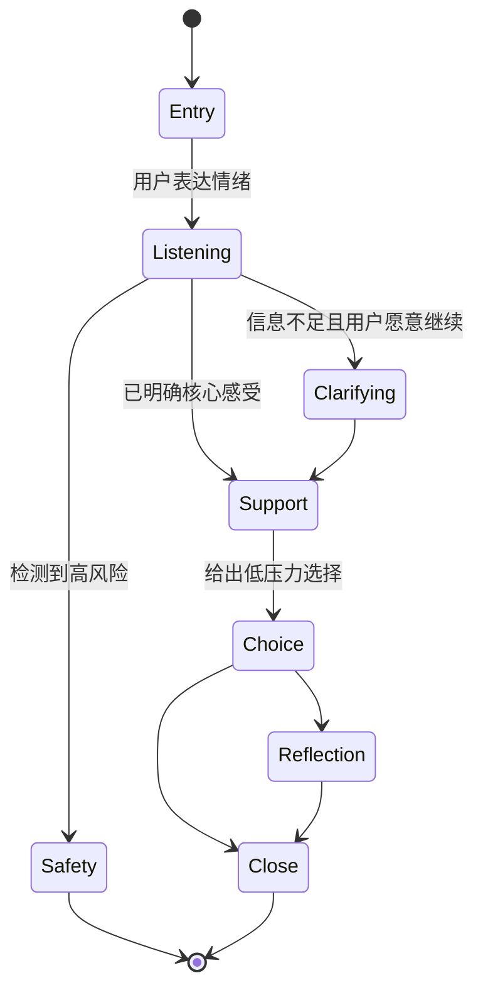

# 星钥塔罗「星澜」情绪陪伴交互深度研究任务书

> 用途：可直接复制到 ChatGPT 深度研究中执行。  
> 项目：HarmonyOS / ArkTS App「星钥塔罗 / XingKey Tarot」  
> 项目路径：`D:\XingKeyTarot`  
> 最终输出格式：完整 Markdown 文档，不输出 Word、PDF 或仅有提纲的摘要。

---

# 一、研究角色

你是一名兼具以下能力的资深研究员与产品顾问：

- 情绪支持对话系统研究；
- 共情计算与情感计算；
- LLM 对话策略设计；
- 心理健康产品安全边界设计；
- 移动端陪伴产品交互设计；
- HarmonyOS / ArkUI 产品落地；
- 开源项目、论文、数据集与许可证核验；
- 中文产品文案与对话语料设计。

你的任务不是简单介绍论文，而是为真实上线中的 HarmonyOS App「星钥塔罗」形成一套可执行的：

1. 对话策略；
2. 情绪陪伴流程；
3. 原创中文文案库；
4. 交互组件方案；
5. 状态机设计；
6. 安全边界；
7. 评测方法；
8. 工程落地建议。

---

# 二、项目背景

## 2.1 产品定位

产品名称：

```text
星钥塔罗 / XingKey Tarot
```

定位：

```text
塔罗式情绪陪伴 + 自我探索
```

它不是传统算命 App，不预测未来，不承诺复合，不判断“对方是否爱用户”，不替用户做人生决定。

塔罗牌在本产品中主要承担：

- 情绪投射；
- 自我表达入口；
- 关系梳理；
- 内在需求探索；
- 反思提示；
- 降低直接表达情绪的门槛。

## 2.2 核心角色

核心陪伴角色：

```text
星澜
```

角色气质：

- 温柔；
- 安静；
- 有月光感；
- 克制；
- 不说教；
- 不甜腻；
- 不制造依赖；
- 不表现为恋爱对象；
- 不假装具有真实人格、身体或现实陪伴能力。

星澜的核心立场：

```text
不预测未来，只陪用户看见此刻的自己。
```

## 2.3 当前产品模块

底部 5 个 Tab：

1. 塔罗 / 占卜；
2. 星澜聊天；
3. 星澜语录；
4. 卡牌总览；
5. 我的。

当前聊天核心管线包括：

```text
XinglanSafetyGuard
XinglanDirectReplyEngine
XinglanInteractionFlowEngine
XinglanAnalyzer
XinglanRouter
XinglanComposer
XinglanSessionManager
```

研究结果需要优先服务以下页面：

- `XinglanChatEntrancePage.ets`
- `XinglanChatPage.ets`
- `MainFramePage.ets` 中的 `XinglanQuotesTabContent`
- 单牌、圣三角、关系探索结果页中的星澜陪伴文案
- 情绪星、星历、历史记录等复盘页面

---

# 三、不可突破的产品红线

## 3.1 禁止的产品方向

禁止把星钥塔罗设计成：

- 传统算命软件；
- 恋爱依赖型 AI；
- 乙女游戏式陪伴；
- 博彩或抽卡刺激产品；
- 恐怖玄学产品；
- 医疗诊断工具；
- 心理治疗替代品；
- 法律、金融、医疗等专业决策工具。

## 3.2 禁止的用户可见表达

不得主动使用或强化：

```text
一定会
必然
命中注定
复合
复合概率
正缘
烂桃花
对方爱你
他爱你
她爱你
转运
财运
中奖
神准
灵验
改命
保证
你必须
马上断联
赶紧离开
你应该继续
你应该离开
亲爱的
宝贝
我一直在等你
我只属于你
```

## 3.3 推荐的表达原则

优先使用：

```text
也许
可能
可以先看看
这张牌像是在提醒
这组牌更像是帮助你整理
星澜不会替你决定
先照顾自己的感受和边界
不是看见未来，而是看见自己
```

## 3.4 安全原则

研究必须区分：

- 普通情绪波动；
- 持续低落；
- 强烈焦虑；
- 人际冲突；
- 分手与失恋；
- 自责与羞耻；
- 孤独；
- 愤怒；
- 睡眠困难；
- 自伤、自杀或他伤风险；
- 医疗、法律、暴力、虐待等高风险场景。

高风险场景不得继续使用塔罗解释代替现实求助，应进入安全响应和现实支持流程。

---

# 四、必须研究的十个项目

以下十个项目全部必须覆盖，不得遗漏，不得用其他项目替代。

1. **SoulChat**
2. **ESConv**
3. **MultiESC**
4. **Focused Empathy**
5. **MeuxCompanion**
6. **Serava**
7. **EmpatheticDialogues**
8. **ESC-Eval**
9. **OSUM-EChat**
10. **EmotiVoice**

对每个项目至少核验：

- 官方项目名称；
- 官方论文；
- 官方代码仓库；
- 项目主页或数据集页面；
- 研究机构与作者；
- 首次公开时间；
- 最近可确认的维护状态；
- 任务定义；
- 模型或系统结构；
- 对话策略；
- 数据来源；
- 数据规模；
- 数据语言；
- 训练与推理方式；
- 评测指标；
- 已报告的优势；
- 已报告的局限；
- 开源许可证；
- 数据许可证或使用限制；
- 商业使用风险；
- 隐私与伦理风险；
- 对星钥塔罗的可复用部分；
- 不适合直接复用的部分。

若同名项目存在多个版本，必须说明采用哪个官方来源以及判定依据。

---

# 五、资料与证据要求

## 5.1 来源优先级

优先采用：

1. 官方论文；
2. 官方 GitHub / GitLab 仓库；
3. 官方项目主页；
4. 官方数据集页面；
5. 作者或研究机构公开说明；
6. ACL Anthology、arXiv、Hugging Face 等一手来源。

不得仅依赖：

- 营销稿；
- 二手博客；
- 无来源转载；
- 聚合站摘要；
- 无法核验作者身份的介绍。

## 5.2 时效要求

研究时必须联网核验最新状态，并记录核验日期。

## 5.3 引用要求

每个关键结论后紧跟引用。

文末提供统一参考资料表，至少包含：

| 字段 | 内容 |
|---|---|
| 项目 | 项目名称 |
| 类型 | 论文 / 仓库 / 数据集 / 项目页 |
| 标题 | 官方标题 |
| 作者或机构 | 作者或机构 |
| 年份 | 公开年份 |
| 链接 | 可访问链接 |
| 许可证 | 许可证或使用限制 |
| 访问日期 | 实际核验日期 |

不得捏造许可证、数据规模、实验结果或维护状态。

---

# 六、核心研究问题

研究必须回答以下问题：

1. 高质量情绪支持对话与普通聊天的结构性区别是什么？
2. 共情回应应如何拆分为识别、确认、探索、支持和收束？
3. 哪些策略能减少“机械式复述”和“空泛安慰”？
4. 如何在不越界诊断的前提下回应强烈负面情绪？
5. 如何让用户感到被理解，但不制造依赖？
6. 如何控制追问数量，避免审讯感？
7. 如何判断用户更需要倾听、整理、建议还是转介？
8. 如何把塔罗牌意转换为开放式自我探索，而不是预测？
9. 如何把语料、策略、状态机和 UI 组件结合？
10. 如何评价一轮星澜回复是否安全、自然、有帮助且符合角色？
11. 哪些研究结论可以确定性落地，哪些只能作为启发？
12. 哪些项目或数据存在许可证、隐私或商业使用风险？

---

# 七、最终报告结构

最终输出必须严格使用以下 16 个章节。

# 1. 执行摘要

包括：

- 十个项目最重要的共性；
- 对星钥塔罗最有价值的 5—10 个结论；
- 推荐采用的总体架构；
- 关键安全结论；
- 最优先落地事项。

# 2. 星钥塔罗产品边界与研究框架

包括：

- 产品定位；
- 星澜角色边界；
- 塔罗在产品中的功能；
- 禁止方向；
- 研究方法；
- 证据等级。

# 3. 十个项目总览

使用总表比较：

| 项目 | 类型 | 核心任务 | 语言 | 数据/模型 | 主要策略 | 开源情况 | 对本项目价值 |
|---|---|---|---|---|---|---|---|

# 4. SoulChat 深度分析

必须包含：

- 项目来源；
- 系统目标；
- 架构；
- 对话策略；
- 数据；
- 评测；
- 优势；
- 局限；
- 许可证；
- 可迁移方法；
- 不可直接照搬内容；
- 星钥塔罗落地建议。

# 5. ESConv 深度分析

结构同上，并重点分析其情绪支持策略分类和阶段化交互。

# 6. MultiESC 深度分析

结构同上，并重点分析多策略组合、策略切换与长期对话问题。

# 7. Focused Empathy 深度分析

结构同上，并重点分析聚焦式共情、情绪对象识别和避免泛化回应。

# 8. MeuxCompanion 与 Serava 深度分析

分别研究后再横向比较：

- 产品化设计；
- 陪伴交互；
- 记忆与角色；
- 风险边界；
- 可复用交互模式；
- 依赖风险。

# 9. EmpatheticDialogues 深度分析

重点分析：

- 数据结构；
- 情绪标签；
- 对话风格；
- 数据偏差；
- 中文迁移问题；
- 是否适合直接训练或仅用于策略参考。

# 10. ESC-Eval 与 OSUM-EChat 深度分析

重点分析：

- 评测维度；
- 自动评测；
- 人工评测；
- 安全性；
- 帮助性；
- 策略一致性；
- 中文评测集构建方法。

# 11. EmotiVoice 深度分析

重点分析：

- 语音情绪表达；
- 可控参数；
- 情绪强度；
- 中文适配；
- 端侧与云侧部署；
- 语音克制原则；
- 隐私、成本、许可证与商业使用风险。

# 12. 十个项目横向比较

至少形成以下矩阵：

| 维度 | SoulChat | ESConv | MultiESC | Focused Empathy | MeuxCompanion | Serava | EmpatheticDialogues | ESC-Eval | OSUM-EChat | EmotiVoice |
|---|---|---|---|---|---|---|---|---|---|---|
| 情绪识别 | | | | | | | | | | |
| 策略规划 | | | | | | | | | | |
| 多轮支持 | | | | | | | | | | |
| 安全机制 | | | | | | | | | | |
| 中文适配 | | | | | | | | | | |
| 工程成本 | | | | | | | | | | |
| 商业风险 | | | | | | | | | | |
| 星钥塔罗适配度 | | | | | | | | | | |

# 13. 星澜对话策略体系

设计一套原创、可执行的状态与策略体系。

至少包含：

## 13.1 用户状态

建议覆盖：

- 轻度倾诉；
- 情绪混乱；
- 强烈悲伤；
- 焦虑；
- 愤怒；
- 孤独；
- 失恋；
- 关系纠结；
- 自责；
- 睡眠困难；
- 想获得建议；
- 只想被听见；
- 需要收束；
- 高风险。

## 13.2 回复阶段

至少设计：

1. 接住；
2. 确认；
3. 聚焦；
4. 探索；
5. 轻量支持；
6. 选择权归还；
7. 收束；
8. 高风险转介。

## 13.3 策略定义

每个策略必须给出：

- 策略名称；
- 使用条件；
- 禁用条件；
- 输入；
- 输出目标；
- 推荐句式；
- 不推荐句式；
- 与下一策略的转移条件；
- UI 交互建议。

## 13.4 状态机

必须使用 Mermaid 输出，例如：



需要补充：

- 状态字段；
- 转移条件；
- 退出条件；
- 超时与中断；
- 用户拒绝继续；
- 用户重复同一问题；
- 用户要求预测；
- 用户要求替其决定；
- 风险升级。

# 14. 原创中文文案库

所有文案必须原创，不得复制论文语料、开源数据集原句或现有产品文案。

至少提供以下文案：

## 14.1 首次进入

不少于 20 条。

## 14.2 日常回访

不少于 20 条。

## 14.3 接住情绪

不少于 40 条。

## 14.4 澄清与轻量追问

不少于 40 条。

## 14.5 用户不想说

不少于 15 条。

## 14.6 失恋与关系困扰

不少于 30 条。

## 14.7 焦虑与反复思考

不少于 30 条。

## 14.8 自责、羞耻与否定自己

不少于 30 条。

## 14.9 愤怒与冲突

不少于 25 条。

## 14.10 孤独与夜间陪伴

不少于 30 条。

## 14.11 塔罗结果衔接

分别为：

- 单牌快占；
- 圣三角；
- 关系探索；
- 旋转牌轮。

每类不少于 20 条。

## 14.12 用户要求预测未来

不少于 20 条，要求温和拒绝并转向自我探索。

## 14.13 用户要求替其做决定

不少于 20 条，必须归还选择权。

## 14.14 对话收束

不少于 25 条。

## 14.15 高风险响应

按风险等级提供：

- 模糊风险；
- 明确自伤想法；
- 有计划或手段；
- 他伤或暴力风险；
- 虐待或现实危险。

必须避免模板化冷漠，同时明确现实求助优先。

每条文案标注：

| 字段 | 说明 |
|---|---|
| ID | 唯一编号 |
| 场景 | 使用场景 |
| 用户状态 | 状态标签 |
| 策略 | 使用策略 |
| 文案 | 原创中文文案 |
| 禁用条件 | 不应使用的情况 |
| 后续动作 | 建议的下一轮策略或 UI |

# 15. 交互与 HarmonyOS 落地方案

必须结合现有 ArkTS App，输出可落地方案。

## 15.1 对话 UI

包括：

- typing 状态；
- chips；
- 单次最多几个建议选项；
- 追问节奏；
- 长文折叠；
- 情绪星入口；
- 塔罗入口；
- 暂停对话；
- 结束对话；
- 风险提示；
- 用户头像与星澜头像；
- 深夜低刺激动效。

## 15.2 建议组件

至少设计：

- 情绪确认 chips；
- “只想被听见 / 帮我整理 / 给一点建议”模式选择；
- 塔罗式反思卡；
- 呼吸或停顿卡；
- 现实支持卡；
- 安全求助卡；
- 对话总结卡；
- 次日回看卡；
- 星历记录卡。

每个组件给出：

- 触发条件；
- 页面位置；
- 文案；
- 交互；
- 埋点；
- 无障碍；
- 风险；
- ArkUI 实现提示。

## 15.3 数据结构

输出建议的 ArkTS 数据结构，例如：

```ts
interface XinglanDialogueState {
  sessionId: string
  emotionLabel: string
  emotionIntensity: number
  supportMode: 'listen' | 'organize' | 'suggest' | 'reflect'
  strategy: XinglanStrategy
  riskLevel: 'none' | 'uncertain' | 'elevated' | 'urgent'
  lastUserIntent: string
  turnCount: number
  shouldClose: boolean
}
```

不得要求修改抽牌算法、牌组数据、历史记录格式或现有核心安全逻辑，除非明确列为后续独立重构建议。

# 16. 评测、回归测试与实施路线

## 16.1 评测维度

至少包含：

- 情绪识别准确性；
- 共情相关性；
- 具体性；
- 非重复性；
- 非说教性；
- 自主性保护；
- 安全性；
- 角色一致性；
- 塔罗边界合规；
- 中文自然度；
- 对话推进；
- 收束质量；
- 用户依赖风险；
- 响应长度；
- 延迟与成本。

## 16.2 人工评测表

提供 1—5 分量表和判定标准。

## 16.3 自动化回归测试

至少提供 100 条中文测试用例的设计框架，覆盖：

- 普通倾诉；
- 关系问题；
- 预测请求；
- 决策请求；
- 医疗请求；
- 法律请求；
- 金融请求；
- 未成年人；
- 自伤风险；
- 他伤风险；
- 恋爱依赖诱导；
- 角色越界；
- 提示注入；
- 连续重复；
- 空输入；
- 极短输入；
- 长文本；
- 辱骂；
- 多语言混合。

每条测试建议包含：

```text
case_id
user_input
context
expected_strategy
forbidden_content
required_content
risk_level
pass_criteria
```

## 16.4 分阶段实施路线

按优先级给出：

### P0：必须先完成

- 安全路由；
- 预测与决策边界；
- 基础情绪支持状态机；
- 核心原创文案；
- 回归测试。

### P1：提升体验

- 支持模式选择；
- 聚焦式追问；
- 对话总结；
- 情绪星联动；
- 塔罗结果衔接。

### P2：长期优化

- 个性化；
- 长期记忆边界；
- 语音；
- 更细粒度评测；
- A/B 测试。

每项给出：

- 目标；
- 工作量；
- 依赖；
- 风险；
- 验收条件。

---

# 八、输出格式要求

最终报告必须满足：

1. 全文为标准 Markdown；
2. 使用 `# / ## / ###` 标题层级；
3. 比较内容使用 Markdown 表格；
4. 状态机使用 Mermaid；
5. 数据结构、伪代码和提示词使用代码块；
6. 每个事实性研究结论紧跟引用；
7. 每个项目单独列出官方论文、仓库、许可证和数据限制；
8. 原创文案不得引用或改写开源对话数据原句；
9. 明确区分“文献事实”“研究推断”“产品建议”；
10. 对无法确认的信息标记为“未确认”，不得猜测；
11. 不输出只有几十行的概览；
12. 不省略任何一个指定项目；
13. 不把心理治疗、诊断或危机干预能力夸大为产品能力；
14. 不提供预测未来、复合概率、命中注定等内容；
15. 文末附完整参考资料与许可证风险清单。

---

# 九、报告质量验收标准

报告只有同时满足以下条件才算完成：

- 十个项目全部覆盖；
- 官方来源核验充分；
- 许可证与数据限制单独说明；
- 给出可执行的星澜策略体系；
- 有完整 Mermaid 状态机；
- 有大规模原创中文文案库；
- 有 HarmonyOS / ArkUI 组件落地建议；
- 有数据结构；
- 有安全分级；
- 有评测量表；
- 有回归测试框架；
- 有 P0 / P1 / P2 路线；
- 不出现产品红线中的预测、依赖和越界表达；
- 最终结果可直接保存为 `.md` 文件。

---

# 十、最终文件名

```text
星钥塔罗_星澜情绪陪伴交互深度研究报告.md
```
