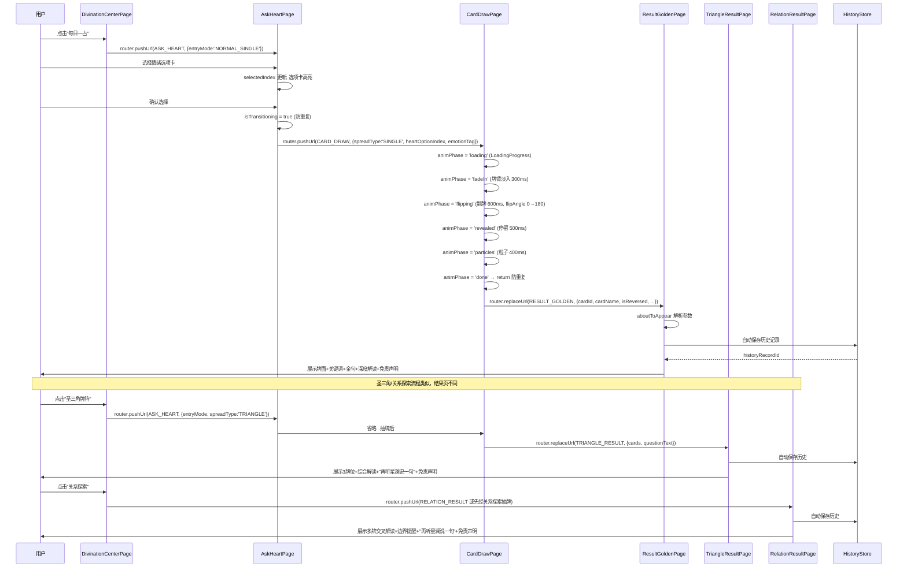
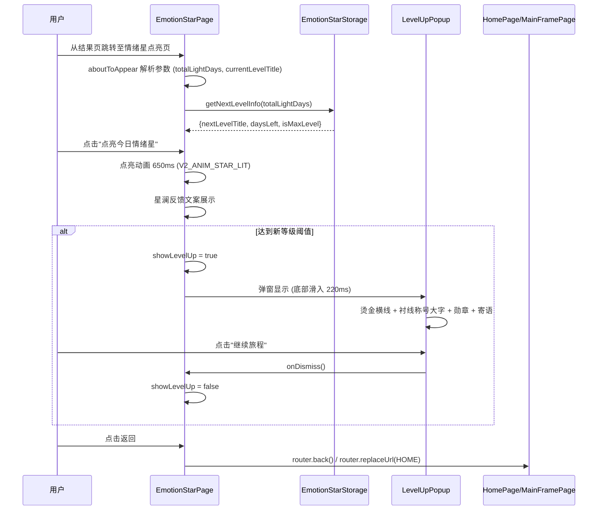
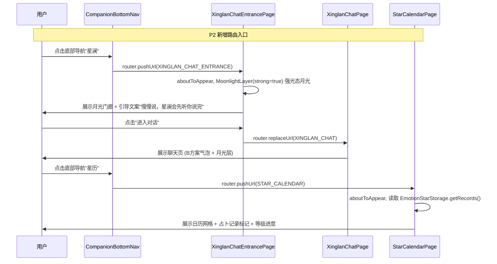
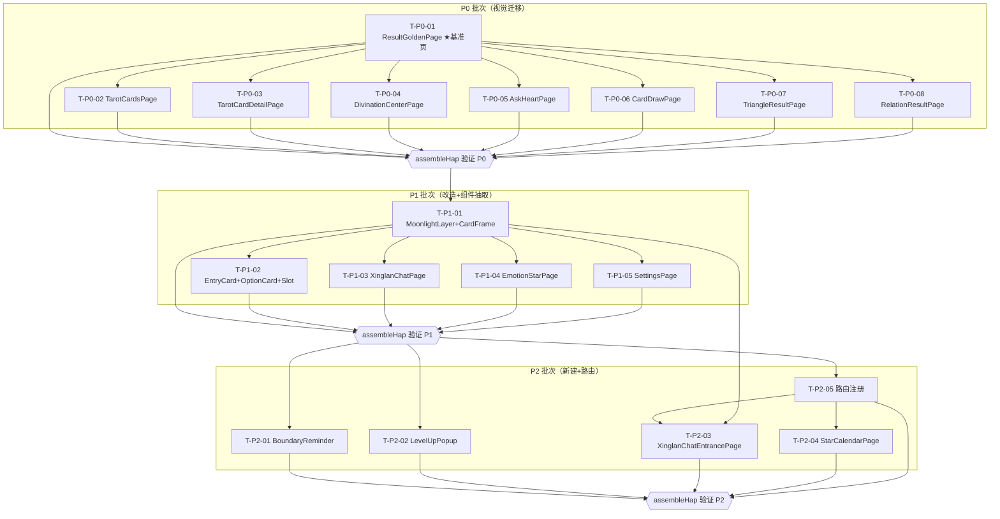

# 星钥塔罗 Phase 5 — 系统架构设计 + 任务分解

> **文档版本**：v1.0
> **日期**：2026-07
> **编写人**：架构师 Bob（高见远）
> **输入**：Phase 5 增量 PRD + 设计稿开发交接说明 + 项目永久记忆
> **范围**：将 14 个高保真 HTML 原型落地为 ArkTS 页面（增量开发，不改变整体架构）

---

## 1. 实现方案 + 框架选型

### 1.1 技术栈确认

| 维度 | 现状 | 本次变更 |
|------|------|---------|
| **平台** | HarmonyOS / ArkTS / DevEco Studio | 不变 |
| **架构模式** | 单 entry 模块 + 页面路由（router.pushUrl） | 不变 |
| **UI 框架** | ArkUI 声明式（@Entry/@Component/@State/@Prop） | 不变 |
| **设计 Token** | Theme.ets 已含 V2A/V2B/V2C 完整体系 | 不变（仅消费） |
| **依赖管理** | oh-package.json5（仅 @ohos/hypium 测试依赖） | 不变（无新增依赖） |

**结论**：本次为纯增量开发，不改变整体架构、不新增框架、不新增 ohpm 依赖。

### 1.2 核心技术挑战

| # | 挑战 | 应对策略 |
|---|------|---------|
| 1 | V2 Token 迁移：14 个页面需将旧 Token（Theme.BG_DEEP / Theme.GOLD 等）替换为 V2 系列（V2C_/V2B_/V2A_） | 以 #04 卡牌结果页为令牌基准页，建立 C 方案实现模式后批量复用 |
| 2 | 月光呼吸动画：多页面需 `iterations: -1` 无限循环，存在性能风险 | 抽取 MoonlightLayer 公共组件；页面 `aboutToDisappear` 停止动画；降级版静态光斑 |
| 3 | 翻牌动画：`.rotate({ y: flipAngle })` 在低版本 ArkUI 可能无 3D 透视 | 先编译验证，若无效降级为 opacity 翻转 |
| 4 | 78 张牌图加载性能：TarotCardsPage 一次渲染 78 张图 | 使用 LazyForEach + 异步加载（已有 displayedCards 筛选逻辑可复用） |
| 5 | 新增路由注册：XINGLAN_CHAT_ENTRANCE + STAR_CALENDAR 需同步 Routes.ets 和 main_pages.json | 统一在 P2 阶段路由注册任务中完成 |

### 1.3 三批次实现策略

```
P0（视觉迁移 · 8 页）  ────→ assembleHap 验证 ────→
P1（已有页改造 · 3 页 + 公共组件抽取）  ────→ assembleHap 验证 ────→
P2（新建页面 · 2 页 + 1 组件 + 路由注册）  ────→ assembleHap 验证
```

- **P0 批次**：8 个已有页面，功能完整，仅视觉迁移（旧 Token → V2 Token + 布局/字体/圆角对齐原型）。风险最低，可快速验证 V2 Token 体系可用性。
- **P1 批次**：3 个已有页面改造（改造量较大）+ 抽取 MoonlightLayer/CardFrame 等公共组件。P0 完成后可复用 C 方案实现模式。
- **P2 批次**：2 个新建页面 + LevelUpPopup 组件 + 路由注册。依赖 P1 完成的公共组件。

---

## 2. 文件清单及相对路径

### 2.1 P0 批次（8 个视觉迁移页面 — 只改样式，不动结构）

| # | 相对路径 | 改动类型 | 改动要点 |
|---|---------|---------|---------|
| P0-1 | `entry/src/main/ets/pages/ResultGoldenPage.ets` | 修改 | ★令牌基准页。旧 Token → V2C/V2B 系列；C 方案完整色彩 + B 月光光晕 + 烫金线装饰；ComplianceFooter 已引入（保持） |
| P0-2 | `entry/src/main/ets/pages/TarotCardsPage.ets` | 修改 | 旧 Token → V2C 系列；78 张牌网格布局 + LazyForEach + 烫金书脊线分隔 |
| P0-3 | `entry/src/main/ets/pages/TarotCardDetailPage.ets` | 修改 | 旧 Token → V2C 系列；衬线标题 + 大牌面图 + 正逆位切换；ComplianceFooter 已引入（保持） |
| P0-4 | `entry/src/main/ets/pages/DivinationCenterPage.ets` | 修改 | 旧 Token → V2C+V2B 系列；月光光晕 + 3 个占卜入口卡 |
| P0-5 | `entry/src/main/ets/pages/AskHeartPage.ets` | 修改 | 旧 Token → V2C 系列；6 选项卡双模式 + 选中态金色边框 + 按压 scale(0.97) |
| P0-6 | `entry/src/main/ets/pages/CardDrawPage.ets` | 修改 | 旧 Token → V2C+V2B 系列；月光光晕 + 6 阶段状态机动画 |
| P0-7 | `entry/src/main/ets/pages/TriangleResultPage.ets` | 修改 | 旧 Token → V2C 系列；3 牌位 + 综合解读展开 + "再听星澜说一句" + ComplianceFooter |
| P0-8 | `entry/src/main/ets/pages/RelationResultPage.ets` | 修改 | 旧 Token → V2C 系列；多牌交叉解读 + 边界提醒文案 + "再听星澜说一句" + ComplianceFooter |

### 2.2 P1 批次（3 个改造页面 + 公共组件抽取）

| # | 相对路径 | 改动类型 | 改动要点 |
|---|---------|---------|---------|
| P1-1 | `entry/src/main/ets/pages/XinglanChatPage.ets` | 修改 | 旧 Token → V2B 系列；月光呼吸层 + 星澜气泡圆润 20px + 气泡淡入 180ms |
| P1-2 | `entry/src/main/ets/pages/EmotionStarPage.ets` | 修改 | 旧 Token → V2B+V2A 系列；星点点亮动画 650ms + LevelUpPopup 触发逻辑 |
| P1-3 | `entry/src/main/ets/pages/SettingsPage.ets` | 修改 | 旧 Token → V2A+V2B 系列；等级称号展示 + 使用统计 + 设置入口（不重命名） |
| P1-4 | `entry/src/main/ets/components/MoonlightLayer.ets` | 新建 | 月光呼吸层公共组件（strong 参数 + 降级静态光斑） |
| P1-5 | `entry/src/main/ets/components/CardFrame.ets` | 新建 | 标准牌面框公共组件（烫金细线 + 装饰星 + 多尺寸） |
| P1-6 | `entry/src/main/ets/components/DivinationEntryCard.ets` | 新建 | 占卜入口卡组件（图标 + 标题 + 副标题 + 按压态） |
| P1-7 | `entry/src/main/ets/components/HeartOptionCard.ets` | 新建 | 问心选项卡组件（选中态 + 按压态） |
| P1-8 | `entry/src/main/ets/components/ResultCardSlot.ets` | 新建 | 结果页牌位卡组件（位置标题 + 牌面 + 牌名 + 关键词 + 金句） |

### 2.3 P2 批次（2 个新建页面 + 1 个组件 + 路由注册）

| # | 相对路径 | 改动类型 | 改动要点 |
|---|---------|---------|---------|
| P2-1 | `entry/src/main/ets/components/BoundaryReminder.ets` | 新建 | 边界提醒卡组件（浮层底色 + 烫金竖线 + 温柔文案） |
| P2-2 | `entry/src/main/ets/components/LevelUpPopup.ets` | 新建 | 等级升级弹窗组件（底部滑入 + 烫金横线 + 衬线称号 + 勋章 + 寄语 + 按钮） |
| P2-3 | `entry/src/main/ets/pages/XinglanChatEntrancePage.ets` | 新建 | B 方案聊天入口页（月光门廊强光态 + 引导文案 + 进入聊天按钮） |
| P2-4 | `entry/src/main/ets/pages/StarCalendarPage.ets` | 新建 | A 方案星历页（日历网格 + 占卜记录标记 + 等级进度） |
| P2-5 | `entry/src/main/ets/common/Routes.ets` | 修改 | 新增 `XINGLAN_CHAT_ENTRANCE` + `STAR_CALENDAR` 路由常量 |
| P2-6 | `entry/src/main/resources/base/profile/main_pages.json` | 修改 | 注册 `pages/XinglanChatEntrancePage` + `pages/StarCalendarPage` |

---

## 3. 数据结构和接口（类图）

### 3.1 Mermaid classDiagram

```mermaid
classDiagram
    direction TB

    %% ════════ 现有数据模型 ════════
    class TarotCard {
        +id: string
        +index: number
        +nameZh: string
        +nameEn: string
        +arcana: ArcanaType
        +suit: TarotSuit
        +image: string
        +keywords: string[]
    }

    class HeartOption {
        +index: number
        +emoji: string
        +label: string
        +emotionTag: EmotionTag
    }

    class DrawnCardRecord {
        +positionKey: string
        +positionTitle: string
        +cardId: string
        +cardName: string
        +isReversed: boolean
        +keyword: string
        +goldenSentence: string
        +brief: string
        +action: string
    }

    class DivinationHistoryRecord {
        +id: string
        +timestamp: number
        +spreadType: SpreadType
        +modeTitle: string
        +questionText: string
        +scenarioTag: string
        +cards: DrawnCardRecord[]
        +summaryTitle: string
        +summaryText: string
        +adviceText: string
        +shareText: string
    }

    class StarKeyLevel {
        +title: string
        +threshold: number
        +description: string
    }

    class EmotionStarRecord {
        +date: string
        +starName: string
        +sourceType: string
        +cardName: string
        +createdAt: number
    }

    %% ════════ 现有组件 ════════
    class ComplianceFooter {
        +fontSize: number
        +textColor: string
        +showDivider: boolean
    }

    class TarotCardImage {
        +cardId: string
        +cardWidth: number
        +cardHeight: number
        -getCardImageResource(cardId: string): Resource
    }

    class AppBackButton {
        +fallbackUrl: string
    }

    %% ════════ 新增公共组件 Props ════════
    class MoonlightLayer {
        +strong: boolean
    }

    class CardFrame {
        +cardWidth: number
        +cardHeight: number
        +showDecorStar: boolean
    }

    class DivinationEntryCard {
        +icon: string
        +title: string
        +subtitle: string
        +pressedIndex: number
        +index: number
        +onClick: () => void
    }

    class HeartOptionCard {
        +emoji: string
        +label: string
        +isSelected: boolean
        +pressedIndex: number
        +index: number
        +onClick: () => void
    }

    class ResultCardSlot {
        +positionTitle: string
        +cardId: string
        +cardName: string
        +keywords: string
        +goldenLine: string
        +cardWidth: number
        +cardHeight: number
    }

    class BoundaryReminder {
        +text: string
    }

    class LevelUpPopup {
        +show: boolean
        +levelTitle: string
        +levelDays: number
        +levelDescription: string
        +onDismiss: () => void
    }

    %% ════════ 新增页面参数接口 ════════
    class XinglanChatEntrancePage {
        @@Entry @Component
    }

    class StarCalendarPage {
        @@Entry @Component
    }

    %% ════════ 关系 ════════
    TarotCard "1" --> "78" TarotCardImage : cardId 映射
    HeartOption "1" --> HeartOptionCard : 数据绑定
    DrawnCardRecord "1" --> ResultCardSlot : 数据绑定
    DivinationHistoryRecord "1" --> "*" DrawnCardRecord : cards 数组
    StarKeyLevel "1" --> LevelUpPopup : 称号数据
    EmotionStarRecord "*" --> StarCalendarPage : 日历标记数据源
    ComplianceFooter "1" --> ResultCardSlot : 结果页复用
    MoonlightLayer "1" --> XinglanChatEntrancePage : 强光态
    MoonlightLayer "1" --> XinglanChatPage : 普通态
    BoundaryReminder "1" --> RelationResultPage : 嵌入
    LevelUpPopup "1" --> EmotionStarPage : 嵌入触发
```



### 3.2 新增组件 Props 接口定义

以下为 7 个新增组件的 ArkTS Props 接口规范（工程师实现时参考）：

```arkts
// ── MoonlightLayer.ets ──
@Component
export struct MoonlightLayer {
  @Prop strong: boolean = false;  // true=入口页强光态0.08, false=普通页0.04
}

// ── CardFrame.ets ──
@Component
export struct CardFrame {
  @Prop cardWidth: number = 140;
  @Prop cardHeight: number = 224;
  @Prop showDecorStar: boolean = true;  // 是否显示装饰星
}

// ── DivinationEntryCard.ets ──
@Component
export struct DivinationEntryCard {
  @Prop icon: string;         // 几何符号 ◇ △ ○
  @Prop title: string;
  @Prop subtitle: string;
  @Prop pressedIndex: number;  // 父页面按压索引
  @Prop index: number;         // 本卡索引
  onClick: () => void = () => {};
}

// ── HeartOptionCard.ets ──
@Component
export struct HeartOptionCard {
  @Prop emoji: string;
  @Prop label: string;
  @Prop isSelected: boolean;
  @Prop pressedIndex: number;
  @Prop index: number;
  onClick: () => void = () => {};
}

// ── ResultCardSlot.ets ──
@Component
export struct ResultCardSlot {
  @Prop positionTitle: string;
  @Prop cardId: string;
  @Prop cardName: string;
  @Prop keywords: string;
  @Prop goldenLine: string;
  @Prop cardWidth: number = 90;
  @Prop cardHeight: number = 144;
}

// ── BoundaryReminder.ets ──
@Component
export struct BoundaryReminder {
  @Prop text: string = '关系探索不判断对方心意，只陪你看清自己的感受';
}

// ── LevelUpPopup.ets ──
@Component
export struct LevelUpPopup {
  @Prop show: boolean;
  @Prop levelTitle: string;
  @Prop levelDays: number;
  @Prop levelDescription: string;
  onDismiss: () => void = () => {};
}
```

---

## 4. 程序调用流程（时序图）

### 4.1 占卜流程链路：占卜中心 → 问心 → 抽牌 → 结果



### 4.2 等级升级流程：EmotionStarPage 点亮 → LevelUpPopup 触发



### 4.3 新建页面入口：XinglanChatEntrancePage → XinglanChatPage / StarCalendarPage



---

## 5. 任务列表（核心章节）

> 任务按三批次组织，每批次末尾设编译验证节点。每个任务自包含、可独立分派。

### 5.1 P0 批次任务（8 个视觉迁移页面）

#### T-P0-01：ResultGoldenPage 视觉迁移（★令牌基准页）

| 属性 | 值 |
|------|-----|
| **批次** | P0 |
| **目标文件** | `entry/src/main/ets/pages/ResultGoldenPage.ets` |
| **依赖** | 无（首个任务，建立 C 方案实现模式） |
| **优先级** | P0 |

**改动描述**：
1. 将所有旧 Token（Theme.BG_DEEP / Theme.GOLD / Theme.TEXT_PRIMARY 等）替换为 V2C 系列（Theme.V2C_BG_BASE / Theme.V2C_GOLD_GILT / Theme.V2C_TEXT_PRIMARY 等）
2. 添加 B 方案月光光晕：使用 `Theme.v2bMoonlightGlow()` 作为页面中上区域径向渐变背景，叠加 `animateTo({duration:6000, iterations:-1, curve:Curve.EaseInOut})` 呼吸动画
3. 卡牌框添加烫金细线装饰（`Theme.V2C_GOLD_GILT` 边框 + `Theme.V2C_SPINE_LINE` 书脊线）
4. 标题字体切换为衬线（HarmonyOS Serif），正文用无衬线
5. 保持 ComplianceFooter 组件引入（已有，不删除）
6. 保持 COMPANION_RESULT_LINES 接入逻辑（已有，不修改）
7. 间距使用 V2 系列（V2_SPACE_SM / V2_SPACE_MD / V2_SPACE_LG 等）
8. 圆角使用 V2C 系列（V2C_RADIUS_CARD = 12, V2C_RADIUS_BTN = 8）

**验收标准**：
- V2C/V2B Token 使用率 100%（无硬编码颜色值，无旧 Token 引用）
- ComplianceFooter 组件已引入且正常显示
- 月光光晕呼吸动画正常（6s 循环）
- assembleHap ERROR=0

---

#### T-P0-02：TarotCardsPage 视觉迁移

| 属性 | 值 |
|------|-----|
| **批次** | P0 |
| **目标文件** | `entry/src/main/ets/pages/TarotCardsPage.ets` |
| **依赖** | T-P0-01（复用 C 方案实现模式） |
| **优先级** | P0 |

**改动描述**：
1. 旧 Token → V2C 系列（V2C_BG_BASE / V2C_BG_CARD / V2C_TEXT_PRIMARY / V2C_GOLD_GILT 等）
2. 78 张牌网格布局：确保使用 LazyForEach 异步加载（若现有用 ForEach，改为 LazyForEach + IDataSource）
3. 添加烫金书脊线分隔（`Theme.v2cSpineCenterLine()` 或 `Theme.V2C_SPINE_LINE` 线条）
4. 筛选项样式：V2C_RADIUS_CHIP = 6 圆角 + 选中态 `Theme.V2_STATE_SELECTED` 边框
5. 间距/圆角统一为 V2 系列

**验收标准**：
- V2C Token 使用率 100%
- LazyForEach 已用（78 张牌滚动无卡顿）
- assembleHap ERROR=0

---

#### T-P0-03：TarotCardDetailPage 视觉迁移

| 属性 | 值 |
|------|-----|
| **批次** | P0 |
| **目标文件** | `entry/src/main/ets/pages/TarotCardDetailPage.ets` |
| **依赖** | T-P0-01 |
| **优先级** | P0 |

**改动描述**：
1. 旧 Token → V2C 系列
2. 衬线标题（HarmonyOS Serif）+ 无衬线正文
3. 大牌面图使用 TarotCardImage 组件（已有，保持）
4. 正逆位切换按钮样式：V2C_RADIUS_BTN = 8
5. 保持 ComplianceFooter 引入
6. 全屏预览功能保持（showImagePreview 状态机不动）

**验收标准**：
- V2C Token 使用率 100%
- TarotCardImage 组件已用
- 正逆位可切换
- ComplianceFooter 已引入
- assembleHap ERROR=0

---

#### T-P0-04：DivinationCenterPage 视觉迁移

| 属性 | 值 |
|------|-----|
| **批次** | P0 |
| **目标文件** | `entry/src/main/ets/pages/DivinationCenterPage.ets` |
| **依赖** | T-P0-01 |
| **优先级** | P0 |

**改动描述**：
1. 旧 Token → V2C+V2B 混合系列（C 方案为主 + B 月光氛围）
2. 添加月光光晕（`Theme.v2bMoonlightGlow()` + 呼吸动画）
3. 3 个占卜入口卡样式：V2C_RADIUS_CARD = 12 + 烫金边框 + 按压 scale(0.97)
4. 入口卡图标用几何符号 + `Theme.V2C_GOLD_GILT` 烫金色
5. 间距/圆角统一为 V2 系列

**验收标准**：
- V2C+V2B Token 使用率 100%
- 月光动画正常
- 3 个入口卡可点击跳转（每日一占→AskHeart, 圣三角→TriangleIntro, 关系探索→RelationIntro）
- assembleHap ERROR=0

---

#### T-P0-05：AskHeartPage 视觉迁移

| 属性 | 值 |
|------|-----|
| **批次** | P0 |
| **目标文件** | `entry/src/main/ets/pages/AskHeartPage.ets` |
| **依赖** | T-P0-01 |
| **优先级** | P0 |

**改动描述**：
1. 旧 Token → V2C 系列（纯 C 方案，无月光）
2. 6 选项卡样式：V2C_RADIUS_CARD = 12 + 选中态金色边框（`Theme.V2_STATE_SELECTED` / `Theme.V2_STATE_FOCUS_RING`）
3. 按压态：`pressedIndex` 状态 + scale(0.97) + `Theme.ANIM_PRESS_DURATION` = 140ms
4. 双模式切换（被接住/看见光）按钮样式：V2C_RADIUS_BTN = 8
5. 保持现有状态机（selectedIndex / isTransitioning / isPositiveMode / showFirstGuide / entryMode）不动

**验收标准**：
- V2C Token 使用率 100%
- 双模式可切换
- 按压态动画正常
- 选中后跳转 CardDrawPage
- isTransitioning 防重复跳转有效
- assembleHap ERROR=0

---

#### T-P0-06：CardDrawPage 视觉迁移

| 属性 | 值 |
|------|-----|
| **批次** | P0 |
| **目标文件** | `entry/src/main/ets/pages/CardDrawPage.ets` |
| **依赖** | T-P0-01 |
| **优先级** | P0 |

**改动描述**：
1. 旧 Token → V2C+V2B 混合系列
2. 添加月光光晕（`Theme.v2bMoonlightGlow()` + 呼吸动画）
3. 翻牌动画：`.rotate({ y: flipAngle, centerX: '50%' })` + animateTo
4. 6 阶段状态机时序（loading→fadeIn→flipping→revealed→particles→done）保持不动
5. `animPhase === 'done'` 时 return 防重复跳转（保持现有逻辑）
6. LoadingProgress 样式：`Theme.V2C_GOLD_GILT` 颜色

**验收标准**：
- V2C+V2B Token 使用率 100%
- 6 阶段动画时序正确（300ms+600ms+500ms+400ms）
- 翻牌 `.rotate({ y: flipAngle })` 正常
- animPhase==='done' 防重复有效
- assembleHap ERROR=0

---

#### T-P0-07：TriangleResultPage 视觉迁移

| 属性 | 值 |
|------|-----|
| **批次** | P0 |
| **目标文件** | `entry/src/main/ets/pages/TriangleResultPage.ets` |
| **依赖** | T-P0-01 |
| **优先级** | P0 |

**改动描述**：
1. 旧 Token → V2C 系列
2. 3 牌位垂直/水平堆叠：每个牌位用位置标题 + TarotCardImage + 牌名 + 关键词 + 金句
3. 综合解读展开态（isSummaryExpanded）样式：V2C_RADIUS_CARD + 烫金边框
4. "再听星澜说一句"按钮：`hasHeardCompanionResult` 限 1 次，按完后置灰（`Theme.V2_STATE_DISABLED`）
5. 保持 COMPANION_RESULT_LINES 接入 + 自动保存历史逻辑
6. 保持 ComplianceFooter 引入

**验收标准**：
- V2C Token 使用率 100%
- CompanionResultLines 已接入
- hasHeardCompanionResult 限 1 次
- ComplianceFooter 已引入
- 自动保存历史正常
- assembleHap ERROR=0

---

#### T-P0-08：RelationResultPage 视觉迁移

| 属性 | 值 |
|------|-----|
| **批次** | P0 |
| **目标文件** | `entry/src/main/ets/pages/RelationResultPage.ets` |
| **依赖** | T-P0-01 |
| **优先级** | P0 |

**改动描述**：
1. 旧 Token → V2C 系列
2. 多牌交叉解读布局：V2C_RADIUS_CARD 牌位卡
3. **边界提醒文案**：P0 阶段先在页面内直接实现（浮层底色 + 烫金竖线 + 温柔文案"关系探索不判断对方心意，只陪你看清自己的感受"），P2 阶段抽取为 BoundaryReminder 组件后替换
4. "再听星澜说一句"按钮逻辑同 T-P0-07
5. 保持 COMPANION_RESULT_LINES 接入 + 自动保存历史逻辑
6. 保持 ComplianceFooter 引入

**验收标准**：
- V2C Token 使用率 100%
- 边界提醒文案符合铁律（不判断对方心意）
- CompanionResultLines 已接入
- hasHeardCompanionResult 限 1 次
- ComplianceFooter 已引入
- assembleHap ERROR=0

---

**P0 批次编译验证节点**：T-P0-01 ~ T-P0-08 全部完成后，执行 `assembleHap` 验证 ERROR=0。

---

### 5.2 P1 批次任务（3 个改造页面 + 公共组件抽取）

#### T-P1-01：MoonlightLayer + CardFrame 公共组件抽取

| 属性 | 值 |
|------|-----|
| **批次** | P1 |
| **目标文件** | `entry/src/main/ets/components/MoonlightLayer.ets`（新建）, `entry/src/main/ets/components/CardFrame.ets`（新建） |
| **依赖** | T-P0-01 ~ T-P0-08（P0 完成后验证 V2 Token 可用性） |
| **优先级** | P1 |

**改动描述**：
1. **MoonlightLayer.ets**：
   - Props: `@Prop strong: boolean = false`
   - 功能：页面中上区域月光光晕，使用 `Theme.v2bMoonlightGlow(strong)` 径向渐变
   - 动画：`animateTo({duration:6000, iterations:-1, curve:Curve.EaseInOut})` opacity 0.6→1.0→0.6 呼吸
   - 降级：静态光斑 `Theme.v2bMoonlightGlowDim()`，无动画
   - `aboutToDisappear` 停止动画
2. **CardFrame.ets**：
   - Props: `@Prop cardWidth: number = 140`, `@Prop cardHeight: number = 224`, `@Prop showDecorStar: boolean = true`
   - 功能：标准牌面框（烫金细线 `Theme.V2C_GOLD_GILT` 边框 + 装饰星 + `Theme.V2C_RADIUS_CARD` 圆角）
   - 使用 slot 接收 TarotCardImage 子组件

**验收标准**：
- MoonlightLayer 强光态/普通态均可正常渲染
- 月光呼吸动画 6s 循环正常
- CardFrame 烫金细线 + 圆角正常
- assembleHap ERROR=0

---

#### T-P1-02：DivinationEntryCard + HeartOptionCard + ResultCardSlot 公共组件抽取

| 属性 | 值 |
|------|-----|
| **批次** | P1 |
| **目标文件** | `entry/src/main/ets/components/DivinationEntryCard.ets`（新建）, `entry/src/main/ets/components/HeartOptionCard.ets`（新建）, `entry/src/main/ets/components/ResultCardSlot.ets`（新建） |
| **依赖** | T-P1-01 |
| **优先级** | P1 |

**改动描述**：
1. **DivinationEntryCard.ets**：图标 + 标题 + 副标题 + 按压态 scale(0.97)，Props 见 3.2 节
2. **HeartOptionCard.ets**：emoji + label + 选中态金色边框 + 按压态，Props 见 3.2 节
3. **ResultCardSlot.ets**：位置标题 + TarotCardImage + 牌名 + 关键词 + 金句，垂直堆叠，Props 见 3.2 节

**验收标准**：
- 3 个组件均可独立渲染
- DivinationEntryCard 按压态动画正常
- HeartOptionCard 选中态金色边框正常
- ResultCardSlot 牌面+牌名+关键词+金句垂直堆叠正常
- assembleHap ERROR=0

---

#### T-P1-03：XinglanChatPage 改造

| 属性 | 值 |
|------|-----|
| **批次** | P1 |
| **目标文件** | `entry/src/main/ets/pages/XinglanChatPage.ets` |
| **依赖** | T-P1-01（MoonlightLayer） |
| **优先级** | P1 |

**改动描述**：
1. 旧 Token → V2B 系列（B 方案月湖映心）
2. 引入 MoonlightLayer 组件（strong=false 普通态）
3. 星澜气泡样式：V2B_RADIUS_BUBBLE_LARGE = 20 圆角 + V2B_BG_CARD 底色 + `Theme.v2bBubbleGlow()` 左侧暖金光晕
4. 用户气泡样式：V2B_RADIUS_BUBBLE_SMALL = 6（右下角小圆角）
5. 气泡淡入动画：`Theme.V2_ANIM_BUBBLE_ENTER` = 400ms（或 ANIM_BUBBLE_FADE = 180ms）
6. 打字动画：`Theme.V2_ANIM_TYPING_DOT` = 1200ms 三点循环
7. `aboutToDisappear` 停止月光动画

**验收标准**：
- V2B Token 使用率 100%
- 月光动画 6s 循环正常
- 气泡淡入动画正常
- aboutToDisappear 停止动画
- assembleHap ERROR=0

---

#### T-P1-04：EmotionStarPage 改造

| 属性 | 值 |
|------|-----|
| **批次** | P1 |
| **目标文件** | `entry/src/main/ets/pages/EmotionStarPage.ets` |
| **依赖** | T-P1-01（MoonlightLayer）, T-P2-02（LevelUpPopup）→ 见依赖说明 |
| **优先级** | P1 |

> **依赖说明**：LevelUpPopup 在 P2 批次才新建。P1 阶段 EmotionStarPage 先预留 `@State showLevelUp: boolean = false` 和触发逻辑框架，用条件渲染占位（`if (this.showLevelUp) { Text('升级弹窗占位') }`），P2 阶段 LevelUpPopup 完成后替换为真实组件。

**改动描述**：
1. 旧 Token → V2B+V2A 混合系列（B 月湖氛围 + A 星图标记感）
2. 引入 MoonlightLayer 组件（strong=false）
3. 星点点亮动画：`Theme.V2_ANIM_STAR_LIT` = 650ms，星光从 `Theme.V2_STATE_STAR_UNLIT` → `Theme.V2_STATE_STAR_LIT`
4. 星澜反馈文案展示区样式
5. 新增 `@State showLevelUp: boolean = false` 状态，点亮情绪星后检查是否达到新等级阈值，若达到则 `showLevelUp = true`
6. P1 阶段用占位条件渲染，P2 阶段替换为 LevelUpPopup 组件

**验收标准**：
- V2B+V2A Token 使用率 100%
- 星点点亮动画 650ms 正常
- showLevelUp 状态逻辑正确（达到阈值时触发）
- assembleHap ERROR=0

---

#### T-P1-05：SettingsPage 改造

| 属性 | 值 |
|------|-----|
| **批次** | P1 |
| **目标文件** | `entry/src/main/ets/pages/SettingsPage.ets` |
| **依赖** | T-P1-01（MoonlightLayer） |
| **优先级** | P1 |

**改动描述**：
1. 旧 Token → V2A+V2B 混合系列（A 星图档案布局 + B 月光底色）
2. 引入 MoonlightLayer 组件（strong=false）
3. 等级称号展示区：V2A_GOLD_ACCENT 金色 + V2A_FONT_RANK_TITLE / V2A_FONT_RANK_DAYS 字号
4. 使用统计卡片：V2A_RADIUS_CARD = 16 + V2A_BG_CARD 底色
5. 设置入口列表：V2A_RADIUS_CARD 行卡片 + 烫金箭头
6. **文件名保持 SettingsPage.ets，不重命名**

**验收标准**：
- V2A+V2B Token 使用率 100%
- 文件名保持 SettingsPage.ets
- 等级称号显示正确
- assembleHap ERROR=0

---

**P1 批次编译验证节点**：T-P1-01 ~ T-P1-05 全部完成后，执行 `assembleHap` 验证 ERROR=0。

---

### 5.3 P2 批次任务（新建页面 + 组件 + 路由注册）

#### T-P2-01：BoundaryReminder 组件新建

| 属性 | 值 |
|------|-----|
| **批次** | P2 |
| **目标文件** | `entry/src/main/ets/components/BoundaryReminder.ets`（新建） |
| **依赖** | 无 |
| **优先级** | P2 |

**改动描述**：
1. Props: `@Prop text: string = '关系探索不判断对方心意，只陪你看清自己的感受'`
2. 布局：浮层底色（V2C_BG_FLOATING）+ 烫金竖线（V2C_GOLD_GILT，2px 宽）+ 温柔文案
3. 圆角：V2C_RADIUS_CARD = 12
4. 不需注册路由（组件级）

**验收标准**：
- 新组件已创建
- 文案符合铁律
- assembleHap ERROR=0

---

#### T-P2-02：LevelUpPopup 组件新建

| 属性 | 值 |
|------|-----|
| **批次** | P2 |
| **目标文件** | `entry/src/main/ets/components/LevelUpPopup.ets`（新建） |
| **依赖** | 无 |
| **优先级** | P2 |

**改动描述**：
1. Props: `@Prop show: boolean`, `@Prop levelTitle: string`, `@Prop levelDays: number`, `@Prop levelDescription: string`, `onDismiss: () => void`
2. 弹窗动画：`animateTo({duration:220, curve:Curve.EaseOut})` 从底部滑入 + 轻微 overshoot
3. 布局：底部弹窗 + 遮罩层（V2_OVERLAY_SCRIM）+ 烫金横线（V2C_GOLD_GILT）+ 衬线称号大字（V2C_FONT_GILT_TITLE = 24）+ 勋章图标 + 寄语文案 + "继续旅程"按钮
4. 称号数据按 EmotionStarStorage.LEVELS 表（8 级：0/1/7/21/30/90/180/365 天）
5. 不需注册路由（组件级）

**验收标准**：
- 新组件已创建
- 底部滑入动画 220ms 正常
- 称号数据按 5.4 表格（8 级）
- assembleHap ERROR=0

---

#### T-P2-03：XinglanChatEntrancePage 新建

| 属性 | 值 |
|------|-----|
| **批次** | P2 |
| **目标文件** | `entry/src/main/ets/pages/XinglanChatEntrancePage.ets`（新建） |
| **依赖** | T-P1-01（MoonlightLayer）, T-P2-05（路由注册） |
| **优先级** | P2 |

**改动描述**：
1. `@Entry @Component struct XinglanChatEntrancePage`
2. 引入 MoonlightLayer 组件（strong=true 强光态 0.08）
3. B 方案完整色彩体系（V2B 系列）
4. 星澜引导文案："慢慢说，星澜会先听你说完"（硬编码占位，后续替换为 CopywritingService）
5. "进入对话"按钮：V2B_RADIUS_BTN = 14，点击跳转 `Routes.XINGLAN_CHAT`
6. 路由跳转：先声明 params 变量，再声明 RouterOptions，try/catch

**验收标准**：
- 新文件已创建，含 @Entry @Component
- Routes.XINGLAN_CHAT_ENTRANCE 已添加
- main_pages.json 已注册
- V2B Token 使用率 100%
- 路由可跳转到 XinglanChatPage
- assembleHap ERROR=0

---

#### T-P2-04：StarCalendarPage 新建

| 属性 | 值 |
|------|-----|
| **批次** | P2 |
| **目标文件** | `entry/src/main/ets/pages/StarCalendarPage.ets`（新建） |
| **依赖** | T-P2-05（路由注册） |
| **优先级** | P2 |

**改动描述**：
1. `@Entry @Component struct StarCalendarPage`
2. A 方案完整色彩体系（V2A 系列）
3. 日历网格：当月日期格子，每个格子标记占卜记录（已查看/未查看圆点）
   - 已查看：`Theme.V2_STATE_VIEWED_DOT`
   - 未查看：`Theme.V2_STATE_UNVIEWED_DOT`
   - 未来日期：`Theme.V2_STATE_FUTURE_TEXT`
4. 数据源：`EmotionStarStorage.getRecords(context)` 获取情绪星点亮记录
5. 等级进度展示区：当前称号 + 天数 + 下一等级进度条
6. 日期数字用等宽字体（V2A_FONT_DATE_NUM），时间戳用 V2A_FONT_TIMESTAMP
7. AppBackButton 返回按钮

**验收标准**：
- 新文件已创建，含 @Entry @Component
- Routes.STAR_CALENDAR 已添加
- main_pages.json 已注册
- V2A Token 使用率 100%
- 日历网格可展示
- 路由可跳转
- assembleHap ERROR=0

---

#### T-P2-05：路由注册（Routes.ets + main_pages.json）

| 属性 | 值 |
|------|-----|
| **批次** | P2 |
| **目标文件** | `entry/src/main/ets/common/Routes.ets`（修改）, `entry/src/main/resources/base/profile/main_pages.json`（修改） |
| **依赖** | 无（应最先执行，为 T-P2-03/T-P2-04 提供路由常量） |
| **优先级** | P2 |

**改动描述**：
1. 在 `Routes.ets` 末尾（`AVATAR_CROP` 之后）新增：
```arkts
  // ── Phase 5 新增路由 ──
  static readonly XINGLAN_CHAT_ENTRANCE: string = 'pages/XinglanChatEntrancePage';
  static readonly STAR_CALENDAR: string = 'pages/StarCalendarPage';
```
2. 在 `main_pages.json` 的 `"src"` 数组末尾（`"pages/AvatarCropPage"` 之后）新增：
```json
    "pages/XinglanChatEntrancePage",
    "pages/StarCalendarPage"
```

**验收标准**：
- Routes.ets 新增 2 个常量
- main_pages.json 新增 2 个页面注册
- assembleHap ERROR=0

---

**P2 批次编译验证节点**：T-P2-01 ~ T-P2-05 全部完成后，执行 `assembleHap` 验证 ERROR=0。

---

### 5.4 任务依赖关系总表

| 任务ID | 任务名称 | 依赖任务 |
|--------|---------|---------|
| T-P0-01 | ResultGoldenPage 视觉迁移 | 无 |
| T-P0-02 | TarotCardsPage 视觉迁移 | T-P0-01 |
| T-P0-03 | TarotCardDetailPage 视觉迁移 | T-P0-01 |
| T-P0-04 | DivinationCenterPage 视觉迁移 | T-P0-01 |
| T-P0-05 | AskHeartPage 视觉迁移 | T-P0-01 |
| T-P0-06 | CardDrawPage 视觉迁移 | T-P0-01 |
| T-P0-07 | TriangleResultPage 视觉迁移 | T-P0-01 |
| T-P0-08 | RelationResultPage 视觉迁移 | T-P0-01 |
| T-P1-01 | MoonlightLayer + CardFrame 抽取 | P0 全部完成 |
| T-P1-02 | DivinationEntryCard + HeartOptionCard + ResultCardSlot 抽取 | T-P1-01 |
| T-P1-03 | XinglanChatPage 改造 | T-P1-01 |
| T-P1-04 | EmotionStarPage 改造 | T-P1-01 |
| T-P1-05 | SettingsPage 改造 | T-P1-01 |
| T-P2-01 | BoundaryReminder 组件新建 | 无 |
| T-P2-02 | LevelUpPopup 组件新建 | 无 |
| T-P2-05 | 路由注册 | 无 |
| T-P2-03 | XinglanChatEntrancePage 新建 | T-P1-01, T-P2-05 |
| T-P2-04 | StarCalendarPage 新建 | T-P2-05 |

### 5.5 任务依赖图



---

## 6. 依赖包列表

本次为纯 ArkTS 开发，**无新增 npm/ohpm 依赖**。

现有 `oh-package.json5` 依赖确认：

| 文件 | 依赖 | 状态 |
|------|------|------|
| `oh-package.json5`（项目根） | `@ohos/hypium@1.0.15`（devDependency） | 已有，不变 |
| `entry/oh-package.json5` | `@ohos/hypium@1.0.15`（devDependency） | 已有，不变 |

所有 V2 Token 已在 `Theme.ets` 中定义完毕，所有数据模型已在 `model/` 和 `data/` 目录中存在，无需引入新库。

---

## 7. 共享知识（跨文件约定）

### 7.1 V2 Token 使用规范

| 规则 | 说明 |
|------|------|
| **优先级** | V2C > V2B > V2A（按页面所属方案选择） |
| **禁止硬编码颜色** | 禁止 `#0A0D1A` 直接写色值，必须用 `Theme.V2C_BG_BASE` |
| **禁止混用旧 Token** | 新/视觉迁移页面禁止使用 `Theme.BG_DEEP` / `Theme.GOLD` 等旧 Token |
| **间距统一** | 使用 `Theme.V2_SPACE_xxx` 系列（4px 基准） |
| **圆角按方案区分** | B 方案用 V2B_RADIUS_xxx，C 方案用 V2C_RADIUS_xxx，A 方案用 V2A_RADIUS_xxx |
| **字号按方案区分** | B 方案用 V2B_FONT_xxx，C 方案用 V2C_FONT_xxx，A 方案用 V2A_FONT_xxx |
| **状态色跨方案统一** | 选中/禁用/星点亮等用 `Theme.V2_STATE_xxx` 系列 |

### 7.2 公共组件复用约定

| 组件 | 使用页面 | 备注 |
|------|---------|------|
| MoonlightLayer | #01, #02, #03, #04, #09, #10, #12 | strong=true 仅入口页；其余 strong=false |
| CardFrame | #04, #06, #07, #12, #13, #14 | 多尺寸：140x224 / 90x144 / 200x320 |
| DivinationEntryCard | #10 | 占卜中心 3 个入口卡 |
| HeartOptionCard | #11 | 问心 6 选项卡 |
| ResultCardSlot | #04, #13, #14 | 结果页牌位卡 |
| BoundaryReminder | #14 | 关系探索边界提醒 |
| LevelUpPopup | #03 | 情绪星点亮后触发 |
| ComplianceFooter | #04, #07, #10, #13, #14 | 免责声明（已有，保持引入） |
| TarotCardImage | 所有含牌面图的页面 | 统一牌面图组件（已有，保持） |
| AppBackButton | 所有页面 | 统一返回按钮（已有，保持） |

### 7.3 路由跳转安全规范

```arkts
// ✅ 正确写法（先声明 params 变量，再声明 RouterOptions，try/catch）
let params: Record<string, string> = { cardId: cardId };
let options: router.RouterOptions = { url: Routes.TAROT_CARD_DETAIL, params: params };
try {
  router.pushUrl(options);
} catch (e) {
  console.error('路由跳转失败: ' + e);
}

// ❌ 禁止写法（内联匿名参数）
router.pushUrl({ url: Routes.TAROT_CARD_DETAIL, params: { cardId: cardId } });
```

### 7.4 状态机命名规范

| 状态字段 | 类型 | 使用页面 | 说明 |
|---------|------|---------|------|
| `animPhase` | string | CardDrawPage | 'loading'→'fadeIn'→'flipping'→'revealed'→'particles'→'done' |
| `flipAngle` | number | CardDrawPage | 0→180 翻牌角度 |
| `cardOpacity` | number | CardDrawPage | 0→1 牌面淡入 |
| `selectedIndex` | number | AskHeartPage | -1 未选 / 0-5 选中 |
| `isPositiveMode` | boolean | AskHeartPage | false=被接住 / true=看见光 |
| `isTransitioning` | boolean | AskHeartPage | 防重复跳转 |
| `showFirstGuide` | boolean | AskHeartPage | 首次引导 |
| `entryMode` | string | AskHeartPage / CardDrawPage | 'FIRST_EXPERIENCE' / 'NORMAL_SINGLE' |
| `hasHeardCompanionResult` | boolean | TriangleResult / RelationResult | "再听星澜说一句"限 1 次 |
| `companionResultLine` | string | TriangleResult / RelationResult | 随机抽取的补充文案 |
| `isSummaryExpanded` | boolean | TriangleResultPage | 综合解读展开态 |
| `showLevelUp` | boolean | EmotionStarPage | 等级弹窗显示/隐藏 |
| `pressedIndex` | number | DivinationCenter / AskHeart | 按压态索引 |
| `showImagePreview` | boolean | TarotCardDetailPage | 全屏预览 |

### 7.5 免责声明引入规范

以下页面**必须**引入 ComplianceFooter 组件：
- `ResultGoldenPage.ets`（#04 卡牌结果）
- `TarotCardDetailPage.ets`（#07 卡牌详情）
- `DivinationCenterPage.ets`（#10 占卜中心）
- `TriangleResultPage.ets`（#13 圣三角结果）
- `RelationResultPage.ets`（#14 关系探索结果）

---

## 8. 待明确事项

### 8.1 核查中发现的问题

| # | 问题 | 影响 | 建议 |
|---|------|------|------|
| 1 | **78 张牌图命名不一致**：大阿尔卡纳 22 张以 `tarot_major_` 为前缀，小阿尔卡纳 56 张以 `minor_` 为前缀（无 `tarot_` 前缀）。TarotCardImage.ets 已适配两种命名，但命名不统一可能造成混淆 | 低 | 已有 TarotCardImage 组件适配了两种命名，不影响功能。建议后续统一命名但本次不改 |
| 2 | **PRD 假设的 `resources/media/` 路径**：实际路径为 `resources/base/media/`（HarmonyOS 标准目录结构） | 低 | 不影响开发，`$r('app.media.xxx')` 会自动解析到 `base/media/` |
| 3 | **ComplianceFooter 使用旧 Token**：当前 ComplianceFooter.ets 内部使用 `Theme.TEXT_MUTED` / `Theme.SPACE_SM` 等旧 Token | 中 | 本次不修改 ComplianceFooter（避免扩散改动）。若需 V2 化，建议单独任务处理 |
| 4 | **EmotionStarPage 已有等级数据**：EmotionStarStorage.LEVELS 已实现 8 级称号表（0/1/7/21/30/90/180/365 天），与 PRD 5.4 节一致。PRD 10.3 节问题 8 中的 0/1/7/14/30/60/90/180 为笔误 | 低 | 以 EmotionStarStorage.LEVELS 为准，LevelUpPopup 直接复用 |
| 5 | **DivinationCenterPage 已有 4 个入口**：现有代码包含"每日一占/圣三角牌阵/关系探索/历史查看"4 个入口，PRD 原型为 3 个（单牌/圣三角/关系探索） | 中 | 视觉迁移时保留现有 4 个入口，不删减历史查看入口。原型仅供参考视觉样式 |
| 6 | **TarotCardsPage 未使用 LazyForEach**：现有代码使用 `displayedCards: TarotCard[]` + ForEach，78 张牌全量渲染 | 中 | T-P0-02 任务中需改为 LazyForEach + IDataSource，需新建 DataSource 类 |
| 7 | **XinglanChatEntrancePage 和 StarCalendarPage 的入口**：需确认从哪里跳转。当前 CompanionBottomNav 有 4 项导航（星澜/卡牌/星历/我的），但路由注册中无 STAR_CALENDAR 和 XINGLAN_CHAT_ENTRANCE | 中 | P2 阶段路由注册后，需在 CompanionBottomNav 或 HomePage 中添加跳转入口。本次架构设计不修改 CompanionBottomNav，由工程师在 P2 集成时处理 |

### 8.2 需要工程师注意的风险点

1. **C 方案衬线字体**：HarmonyOS Serif 在部分设备上可能无中文衬线字形。若编译后运行时衬线标题显示异常，需评估是否打包 Noto Serif SC（约 4MB）。
2. **月光呼吸性能**：多个页面同时运行 `iterations: -1` 动画可能影响性能。MoonlightLayer 组件必须在 `aboutToDisappear` 时停止动画。
3. **翻牌动画兼容性**：`.rotate({ y: angle })` 在低版本 ArkUI 可能无 3D 透视效果。若编译后翻牌无立体感，可降级为 opacity 翻转（牌背 opacity 1→0 + 牌面 opacity 0→1）。
4. **78 张牌 LazyForEach 改造**：TarotCardsPage 从 ForEach 改为 LazyForEach 需新建 IDataSource 实现类，注意 ArkTS 严格类型规则（禁止匿名对象）。
5. **文案占位**：本次所有文案先用原型 HTML 中的占位文案硬编码。后续替换为 CopywritingService 时需新建 `XinglanCopywritingData.ets` 和 `CopywritingService.ets`，不在本次范围内。

---

## 9. 78 张牌图核查结果

### 9.1 核查方法

```bash
# 大阿尔卡纳
ls resources/base/media/ | grep "^tarot_major_" | wc -l
# 小阿尔卡纳
ls resources/base/media/ | grep "^minor_" | wc -l
# 牌背
ls resources/base/media/ | grep "card_back"
```

### 9.2 核查结果

| 类别 | 期望数量 | 实际数量 | 状态 |
|------|---------|---------|------|
| 大阿尔卡纳（tarot_major_00_fool ~ tarot_major_21_world） | 22 | 22 | ✅ 齐全 |
| 小阿尔卡纳-权杖（minor_wands_01_ace ~ minor_wands_king） | 14 | 14 | ✅ 齐全 |
| 小阿尔卡纳-圣杯（minor_cups_01_ace ~ minor_cups_king） | 14 | 14 | ✅ 齐全 |
| 小阿尔卡纳-宝剑（minor_swords_01_ace ~ minor_swords_king） | 14 | 14 | ✅ 齐全 |
| 小阿尔卡纳-星币（minor_pentacles_01_ace ~ minor_pentacles_king） | 14 | 14 | ✅ 齐全 |
| 牌背图（card_back.png） | 1 | 1 | ✅ 齐全 |
| 占位图（placeholder_card.png） | 1 | 1 | ✅ 齐全 |
| **合计牌面图** | **78** | **78** | **✅ 全部齐全** |

### 9.3 结论

78 张牌面图 + 1 张牌背图 + 1 张占位图全部齐全，**无需占位方案**。

TarotCardImage.ets 组件已适配两种命名前缀（`tarot_major_` 和 `minor_`），可直接使用。

---

## 10. Routes.ets 核查结果

### 10.1 现有路由常量

`Routes.ets` 当前共定义 **26 个路由常量**。核查确认：

| 路由常量 | 是否存在 | 状态 |
|---------|---------|------|
| `XINGLAN_CHAT_ENTRANCE` | ❌ 不存在 | 需新增（T-P2-05） |
| `STAR_CALENDAR` | ❌ 不存在 | 需新增（T-P2-05） |
| 其余 26 个常量 | ✅ 存在 | 不变 |

### 10.2 main_pages.json 核查

当前注册 **40 个页面**。核查确认：

- `pages/XinglanChatEntrancePage` ❌ 未注册 → 需新增
- `pages/StarCalendarPage` ❌ 未注册 → 需新增
- PRD 涉及的其余 11 个已有页面均已在 main_pages.json 中注册 ✅

---

## 11. Theme.ets V2 Token 核查结果

核查确认 `Theme.ets` 中 V2A/V2B/V2C 系列 Token **全部存在且与原型 :root 变量完全一致**：

| Token 系列 | 数量 | 核查结果 |
|-----------|------|---------|
| V2 共享基础（V2_BG_BASE / V2_TEXT_PRIMARY 等） | 8 | ✅ 存在 |
| V2B 方案色板（V2B_BG_BASE / V2B_GOLD_CORE 等） | 10 | ✅ 存在 |
| V2C 方案色板（V2C_BG_BASE / V2C_GOLD_GILT 等） | 10 | ✅ 存在 |
| V2A 方案色板（V2A_BG_BASE / V2A_GOLD_ACCENT 等） | 10 | ✅ 存在 |
| V2 状态色（V2_STATE_xxx） | 10 | ✅ 存在 |
| V2 间距（V2_SPACE_xxx） | 9 | ✅ 存在 |
| V2 圆角（V2_RADIUS_xxx + V2B/V2C/V2A 专属） | 15 | ✅ 存在 |
| V2 字号（V2B/V2C/V2A 专属） | 25 | ✅ 存在 |
| V2 阴影（V2B/V2C/V2A + 头像光环） | 6 | ✅ 存在 |
| V2 动效时长（V2_ANIM_xxx） | 9 | ✅ 存在 |
| V2 工具方法（v2bMoonlightGlow / v2bMoonlightGlowDim / v2cSpineCenterLine / v2bBubbleGlow） | 4 | ✅ 存在 |

**结论**：所有 V2 Token 齐全，无需新增。PRD 假设全部验证通过。

---

## 12. 现有组件核查结果

| 组件文件 | 状态 | 备注 |
|---------|------|------|
| AppBackButton.ets | ✅ 已有 | 直接复用 |
| ComplianceFooter.ets | ✅ 已有 | 直接复用（注意：内部用旧 Token，本次不改） |
| TarotCardImage.ets | ✅ 已有 | 直接复用，已适配 78 张牌图 |
| TarotCardView.ets | ✅ 已有 | 直接复用 |
| PrimaryButton.ets | ✅ 已有 | 直接复用 |
| StarBackground.ets | ✅ 已有 | 直接复用 |
| CompanionBottomNav.ets | ✅ 已有 | 直接复用（P2 集成时可能需添加新入口） |
| InterpretationPanel.ets | ✅ 已有 | 直接复用 |
| SharePreview.ets | ✅ 已有 | 直接复用 |

**需新建组件**（7 个）：MoonlightLayer / CardFrame / DivinationEntryCard / HeartOptionCard / ResultCardSlot / BoundaryReminder / LevelUpPopup

---

## 13. 现有数据层核查结果

| 数据文件 | 状态 | 备注 |
|---------|------|------|
| TarotCardData.ets | ✅ 78 张牌数据 | 直接复用 |
| HeartOptionsData.ets | ✅ 6 选项 + HeartOption 接口 | 直接复用 |
| PositiveHeartOptions.ets | ✅ 6 选项（看见光模式） | 直接复用 |
| MVP8CardsData.ets | ✅ 8 张 MVP 牌数据 | 直接复用 |
| CompanionResultLines.ets | ✅ 12 条文案 | 直接复用 |
| TarotCardRepository.ets | ✅ 牌数据仓库 | 直接复用 |
| PreferenceStore.ets | ✅ 本地存储 | 直接复用 |
| InterpretationData.ets | ✅ 解读数据 | 直接复用 |
| TarotDataLoader.ets | ✅ 数据加载 | 直接复用 |
| XinglanTypes.ets | ✅ 类型定义 | 直接复用 |

**服务层**：

| 服务文件 | 状态 | 备注 |
|---------|------|------|
| DivinationHistoryService.ets | ✅ 已有 | 直接复用 |
| DivinationService.ets | ✅ 已有 | 直接复用 |
| UserStateService.ets | ✅ 已有 | 直接复用 |
| TarotDataService.ets | ✅ 已有 | 直接复用 |
| ShareService.ets | ✅ 已有 | 直接复用 |
| ShareImageService.ets | ✅ 已有 | 直接复用 |
| DailyFortuneService.ets | ✅ 已有 | 直接复用 |

---

> **文档结束**
> 本架构设计基于 Phase 5 增量 PRD + 设计稿开发交接说明 + 项目永久记忆，已核查全部现有文件真实状态。任务列表可直接分派给工程师执行。