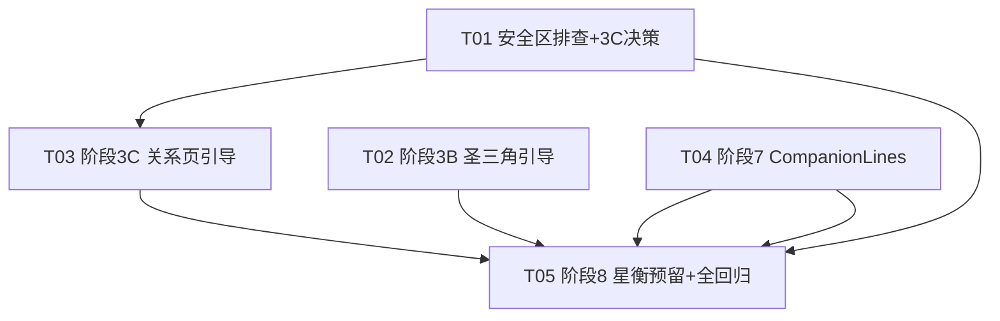

# 星钥塔罗 v1.4 技术评估与任务分解

> 架构师：高见远 | 基准日：2026-06-29 | 基于 v1.4 路线图

## 1. 实现方案与文件清单

### 1.1 关系页安全区排查（P0）

**改动文件**：`entry/src/main/ets/pages/RelationIntroPage.ets`（仅排查，视结果决定是否改）

**根因排查路径**：
1. `RelationIntroPage` 无 `Scroll` 包裹，6 个关系标签 Flex 换行后 + 问题输入 + 按钮，总高度可能溢出小屏设备
2. `Theme.SAFE_TOP=44` 硬编码，未用 `expandSafeArea`，刘海屏/不同 API 设备实际安全区不一致
3. `.height('100%')` 固定高度 + `bottom: Theme.SAFE_BOTTOM` padding，内容超出时无滚动兜底

**3C 决策点**：若根因为布局溢出 → go（加 Scroll）；若为 expandSafeArea 缺失 → go（补避让）；若为系统级 bug → no-go（记录并降级 3C 优先级）

### 1.2 阶段3B：圣三角入口首次引导（P0）

**改动文件**：`entry/src/main/ets/pages/TriangleIntroPage.ets`

**实现要点**（复用 3A 模式）：
- 顶部 const `TRIANGLE_FIRST_GUIDE: string` 轻引导文案
- `@State showFirstGuide: boolean = false`
- `aboutToAppear` → `prepareFirstGuide()` 私有异步方法
- `PreferenceStore.getBoolean('hasSeenTriangleGuide')` / `putBoolean`
- UI 闭包内仅 `if (this.showFirstGuide) { Text(...) }`，不写 const/let
- 文案避禁用词

### 1.3 阶段3C：关系探索入口首次引导（P1，依赖排查通过）

**改动文件**：`entry/src/main/ets/pages/RelationIntroPage.ets`

**实现要点**：同 3B 模式，pref key 为 `hasSeenRelationGuide`。若安全区排查需加 Scroll，引导与 Scroll 同任务处理。

### 1.4 阶段7：CompanionLines 文案结构化（P1）

**新增文件**：`entry/src/main/ets/data/CompanionLines.ets`

**实现要点**：
- 定义 `CompanionLine` interface + `CompanionScene`/`CompanionSpeaker`/`CompanionTone` 枚举
- 导出 `COMPANION_LINES: CompanionLine[]`（约 50 条）
- 导出 `pickLineByScene(scene: CompanionScene): string` 函数
- 1018 条 HomePage 文案**不迁移**，保留 `XINGLAN_QUOTES` 原位
- 从现有 `COMPANION_RESULT_LINES` 12 条中选取适配的迁入新结构，旧文件保留不删

### 1.5 阶段8：星衡预留（P2，依赖阶段7）

**改动文件**：`entry/src/main/ets/data/CompanionLines.ets`（追加）

**实现要点**：`speaker` 字段已在阶段7定义，此处仅追加 5 个星衡场景枚举值（已在阶段7定义时一并写入），不实现 UI、不接入业务逻辑。

---

## 2. 数据结构与接口设计

```typescript
/** 陪伴文案场景枚举（9个） */
export enum CompanionScene {
  SINGLE_RESULT,       // 单牌结果页
  TRIANGLE_RESULT,     // 圣三角结果页
  RELATION_RESULT,     // 关系探索结果页
  HOME,                // 首页星澜
  // ── 以下 5 个为星衡预留（阶段8）──
  XINGHENG_DAILY,      // 星衡·日常陪伴
  XINGHENG_EMOTION,    // 星衡·情绪觉察
  XINGHENG_GROWTH,     // 星衡·成长复盘
  XINGHENG_RELATION,   // 星衡·关系深度
  XINGHENG_DECISION    // 星衡·抉择梳理
}

/** 说话人枚举（2个） */
export enum CompanionSpeaker {
  XINGLAN,             // 星澜（现有人格）
  XINGHENG             // 星衡（预留人格）
}

/** 语气枚举（5个） */
export enum CompanionTone {
  GENTLE,              // 温柔
  CALM,                // 平静
  WARM,                // 温暖
  CURIOUS,             // 好奇
  STEADY               // 沉稳
}

/** 陪伴文案数据结构 */
export interface CompanionLine {
  id: number;
  scene: CompanionScene;
  speaker: CompanionSpeaker;
  tone: CompanionTone;
  text: string;
}

/**
 * 按场景随机选取一条文案
 * @param scene 目标场景
 * @returns 匹配的文案文本；无匹配时返回兜底空串
 */
export function pickLineByScene(scene: CompanionScene): string;
```

**设计说明**：speaker 默认 `XINGLAN`，星衡场景的文案本次不填充，仅枚举可用。现有 `COMPANION_RESULT_LINES` 保持不变，新结构独立并存，零侵入。

---

## 3. 任务依赖图



---

## 4. 有序任务列表

| 序号 | 任务 | 负责人 | 工时 | 依赖 | 改动文件 | 验收点 |
|------|------|--------|------|------|----------|--------|
| T01 | 关系页安全区排查+3C决策 | 寇豆码 | 1d | 无 | RelationIntroPage.ets（排查） | 根因报告+go/no-go决策 |
| T02 | 阶段3B 圣三角入口引导 | 寇豆码 | 1.5d | 无 | TriangleIntroPage.ets | 首次显示引导，二次不显，assembleHap ERROR=0 |
| T03 | 阶段3C 关系入口引导 | 寇豆码 | 1.5d | T01通过 | RelationIntroPage.ets | 同上+安全区修复验证 |
| T04 | 阶段7 CompanionLines结构化 | 高见远/寇豆码 | 3d | 无 | CompanionLines.ets（新建） | 50条+interface+pickLineByScene，assembleHap ERROR=0 |
| T05 | 阶段8星衡预留+全链路回归 | 高见远/严过关 | 1.5d | T02,T03,T04 | CompanionLines.ets+全局 | 5枚举已定义，禁用词0命中，真机无bug |

---

## 5. 资源需求

| 资源 | 说明 |
|------|------|
| 人力 | 寇豆码(排查+3B/3C)、高见远(阶段7/8设计)、严过关(回归) |
| 编译环境 | DevEco Studio + HarmonyOS NEXT API 12 SDK |
| 测试设备 | 至少 2 台真机（不同屏幕尺寸，含刘海屏）验证安全区 |
| 编译命令 | `hvigor assembleHap`，每阶段 ERROR=0 |

---

## 6. 潜在风险登记册

| 风险 | 影响 | 概率 | 应对措施 | 负责人 |
|------|------|------|----------|--------|
| 1018条文案不全量迁移，后续扩展需双源维护 | 中 | 中 | 1018条留 HomePage 原位不迁移；CompanionLines 仅管 50 条核心场景，文档注明边界 | 高见远 |
| 关系页安全区根因为系统级避让 bug | 高 | 低 | 排查若确认系统级，3C 降级 P2，记录缺陷并跳过引导 | 寇豆码 |
| speaker 字段引入影响现有星澜逻辑 | 低 | 低 | speaker 默认 XINGLAN，新结构独立文件，不改动现有 COMPANION_RESULT_LINES | 高见远 |
| 3B/3C 引导文案与现有页面文案语义冲突 | 中 | 中 | 引导文案独立 const，不引用 XINGLAN_QUOTES；文案评审过禁用词 | 许清楚 |
| 50 条文案工作量大导致 Sprint B 延期 | 中 | 中 | 分批交付：先 20 条跑通结构，再补 30 条 | 高见远 |

---

## 7. 编译/验收检查节点

| 任务 | assembleHap 检查点 | 功能验收点 |
|------|-------------------|------------|
| T01 | 排查不改代码则无需编译；若加 Scroll 则需编译 | 真机验证"家人"标签+按钮均可见 |
| T02 | TriangleIntroPage 改后 assembleHap ERROR=0 | 首次进入显示引导，杀进程再进不显示 |
| T03 | RelationIntroPage 改后 assembleHap ERROR=0 | 同上 + 安全区无溢出 |
| T04 | CompanionLines.ets 新增后 assembleHap ERROR=0 | import 无报错，pickLineByScene 返回非空 |
| T05 | 全链路 assembleHap ERROR=0 | 禁用词 grep 0 命中，全功能真机回归通过 |

---

## 8. 待明确事项

1. **50 条文案来源**：由许清楚产出文案内容，还是高见远基于现有 12 条扩写？需确认文案负责人。
2. **星衡 5 枚举命名确认**：当前定名 `XINGHENG_DAILY/EMOTION/GROWTH/RELATION/DECISION`，需许清楚确认是否与产品规划对齐。
3. **3C 前置条件**：若 T01 排查结果为 no-go，3C 是否跳过或降级？需主理人决策。
4. **CompanionLines.ets 与 COMPANION_RESULTLines.ets 并存策略**：现有 12 条是否最终废弃？还是长期并存？影响后续维护成本。
