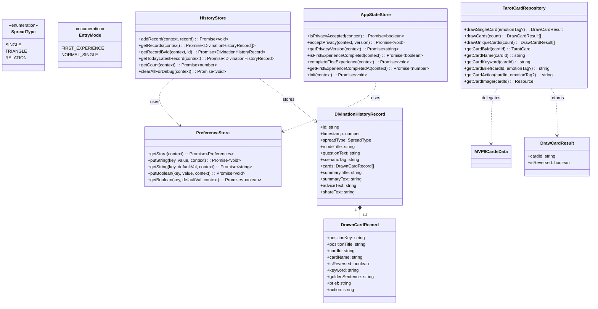
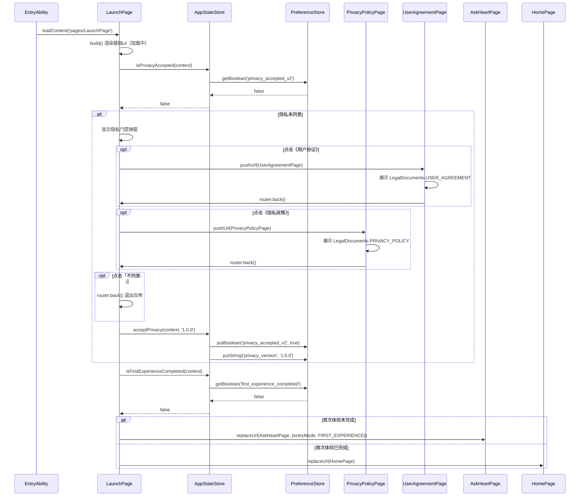
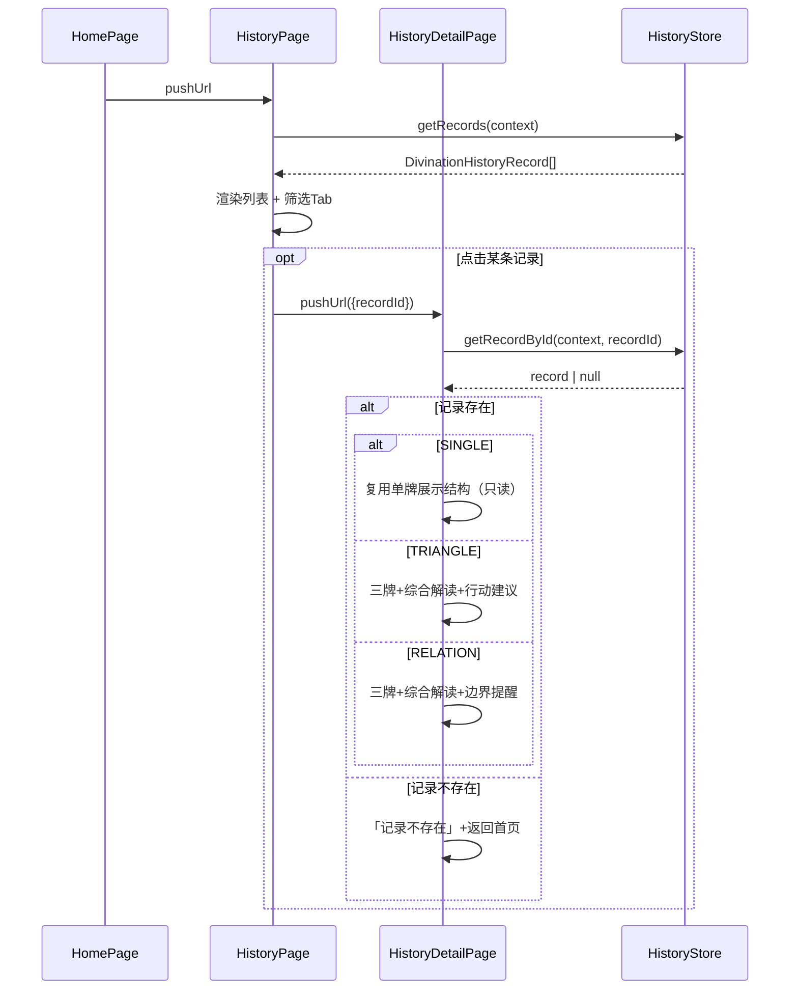
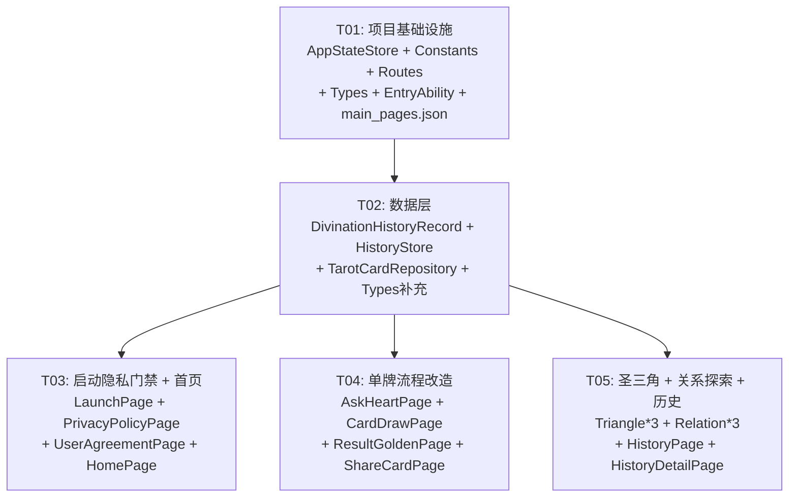

# 星钥塔罗 P0.2 — 系统架构设计 & 任务分解

> **作者**: Bob (Architect)
> **版本**: v1.0
> **日期**: 2026-01-22

---

## Part A: 系统设计

### 1. 实现方案

#### 1.1 核心技术栈

| 维度 | 选型 | 说明 |
|------|------|------|
| 平台 | HarmonyOS ArkTS | 已确定，沿用现有技术栈 |
| UI 框架 | ArkUI (@Component + @Entry) | 声明式 UI |
| 持久化 | Preferences (@kit.ArkData) | 沿用 PreferenceStore 封装 |
| 路由 | router (@kit.ArkUI) | pushUrl / replaceUrl |
| 图片 | image (@kit.ImageKit) | ShareImageService 已有完整封装 |
| 相册 | photoAccessHelper (@kit.MediaLibraryKit) | 已有权限申请 + 保存流程 |
| 动画 | ArkUI animateTo / animation | 翻牌动画、粒子效果 |

#### 1.2 架构模式

```
┌─────────────────────────────────────────────────────┐
│                   Pages (UI Layer)                   │
│  LaunchPage  HomePage  AskHeartPage  CardDrawPage   │
│  ResultGoldenPage  Triangle*Page  Relation*Page     │
│  HistoryPage  HistoryDetailPage  ShareCardPage ...  │
├─────────────────────────────────────────────────────┤
│               Common / Service Layer                 │
│  AppStateStore  HistoryStore  TarotCardRepository   │
│  UserStateService  ShareImageService                │
│  PreferenceStore (底层封装)                          │
├─────────────────────────────────────────────────────┤
│                  Model / Data Layer                  │
│  TarotCard  DivinationHistoryRecord  Spread         │
│  MVP8CardsData  HeartOptionsData  TarotCardData     │
└─────────────────────────────────────────────────────┘
```

**关键设计决策：**
- **页面间传参**: 所有路由参数先声明显式 `interface`，再构造 `router.RouterOptions`
- **数据持久化**: 统一通过 `PreferenceStore` 底层，`AppStateStore`/`HistoryStore` 做语义封装
- **牌库访问**: 新增 `TarotCardRepository` 作为统一入口，内部优先使用 MVP8CardsData，预留78张扩展
- **历史记录**: 新 `DivinationHistoryRecord` 独立于旧 `DivinationRecord`，使用新 `HistoryStore`

#### 1.3 核心难点及解决方案

| 难点 | 方案 |
|------|------|
| 启动流程隐私判断 | LaunchPage 先渲染 UI，在 aboutToAppear 中异步读取 AppStateStore，按分支 replaceUrl |
| 首次体验标记 | AppStateStore 用 Preferences 存 boolean + timestamp，ResultGoldenPage 结束时标记 |
| 历史 FIFO 淘汰 | HistoryStore 每次 addRecord 后 slice(0,50)，反序存储 |
| 三牌不重复抽 | TarotCardRepository.drawUniqueCards 用 Fisher-Yates 洗牌 + slice(0,3) |
| 分享卡真实保存 | 复用 ShareImageService.savePixelMapToGallery，组件层截图 → PixelMap |

---

### 2. 文件清单

#### 2.1 新增文件（16个）

| # | 相对路径 | 说明 |
|---|---------|------|
| 1 | `entry/src/main/ets/common/AppStateStore.ets` | 应用全局状态管理（隐私、首次体验） |
| 2 | `entry/src/main/ets/model/DivinationHistoryRecord.ets` | 新版占卜历史记录模型 |
| 3 | `entry/src/main/ets/common/HistoryStore.ets` | 历史记录存储服务（FIFO、最多50条） |
| 4 | `entry/src/main/ets/data/TarotCardRepository.ets` | 牌库统一访问仓库 |
| 5 | `entry/src/main/ets/pages/LaunchPage.ets` | 启动页（隐私门禁判断） |
| 6 | `entry/src/main/ets/pages/PrivacyPolicyPage.ets` | 隐私政策全文展示页 |
| 7 | `entry/src/main/ets/pages/UserAgreementPage.ets` | 用户协议全文展示页 |
| 8 | `entry/src/main/ets/pages/HomePage.ets` | 首页（今日一占 + 功能入口） |
| 9 | `entry/src/main/ets/pages/TriangleIntroPage.ets` | 圣三角 — 问题输入页 |
| 10 | `entry/src/main/ets/pages/TriangleDrawPage.ets` | 圣三角 — 三牌抽牌动画页 |
| 11 | `entry/src/main/ets/pages/TriangleResultPage.ets` | 圣三角 — 三牌结果页 |
| 12 | `entry/src/main/ets/pages/RelationIntroPage.ets` | 关系探索 — 类型选择页 |
| 13 | `entry/src/main/ets/pages/RelationDrawPage.ets` | 关系探索 — 三牌抽牌动画页 |
| 14 | `entry/src/main/ets/pages/RelationResultPage.ets` | 关系探索 — 三牌结果页 |
| 15 | `entry/src/main/ets/pages/HistoryPage.ets` | 历史记录列表页 |
| 16 | `entry/src/main/ets/pages/HistoryDetailPage.ets` | 历史记录详情页 |

#### 2.2 修改文件（9个）

| # | 相对路径 | 修改内容 |
|---|---------|---------|
| 17 | `entry/src/main/ets/common/Routes.ets` | 新增 12 个路由常量 |
| 18 | `entry/src/main/ets/common/Constants.ets` | 新增隐私门禁、历史相关常量 |
| 19 | `entry/src/main/ets/common/Types.ets` | 新增 SpreadType、EntryMode 导出 |
| 20 | `entry/src/main/ets/pages/AskHeartPage.ets` | 新增 entryMode 参数，两套文案 |
| 21 | `entry/src/main/ets/pages/CardDrawPage.ets` | 接收 entryMode/spreadType，传参改造 |
| 22 | `entry/src/main/ets/pages/ResultGoldenPage.ets` | 自动保存历史、FIRST_EXPERIENCE 按钮 |
| 23 | `entry/src/main/ets/pages/ShareCardPage.ets` | 接收 sourceRecordId/spreadType，三种布局 |
| 24 | `entry/src/main/ets/entryability/EntryAbility.ets` | loadContent 改为 LaunchPage |
| 25 | `entry/src/main/resources/base/profile/main_pages.json` | 注册 16 个新页面 |

---

### 3. 数据结构与接口

#### 3.1 类图



---

### 4. 程序调用流程

#### 4.1 启动流程



#### 4.2 单牌快占流程（NORMAL_SINGLE）

```mermaid
sequenceDiagram
    participant HP as HomePage
    participant AHP as AskHeartPage
    participant CDP as CardDrawPage
    participant RGP as ResultGoldenPage
    participant TR as TarotCardRepository
    participant HS as HistoryStore
    participant AS as AppStateStore

    HP->>AHP: pushUrl(AskHeartPage, {entryMode: NORMAL_SINGLE})
    AHP->>AHP: 用户选择问心选项 (0-5)
    AHP->>CDP: pushUrl(CardDrawPage, {entryMode, spreadType, heartOptionIndex, emotionTag, questionText})

    CDP->>TR: drawSingleCard(emotionTag)
    TR-->>CDP: {cardId, isReversed: false}
    CDP->>CDP: 播放翻牌动画 (1.8s)
    CDP->>RGP: replaceUrl(ResultGoldenPage, {entryMode, recordId, cardId, ...})

    RGP->>RGP: loadData() 加载场景化解读

    rect rgb(40, 40, 80)
        Note over RGP,HS: 自动保存历史
        RGP->>RGP: 构造 DivinationHistoryRecord
        RGP->>HS: addRecord(context, record)
        HS->>HS: FIFO 淘汰 (最多50条)
    end

    alt NORMAL_SINGLE
        RGP->>RGP: 底部：追问/分享卡/情绪星点/回首页
    end
    alt FIRST_EXPERIENCE
        RGP->>AS: completeFirstExperience(context)
        RGP->>RGP: 底部多「进入首页」按钮
    end
```



#### 4.3 圣三角占卜流程

```mermaid
sequenceDiagram
    participant HP as HomePage
    participant TIP as TriangleIntroPage
    participant TDP as TriangleDrawPage
    participant TRP as TriangleResultPage
    participant TR as TarotCardRepository
    participant HS as HistoryStore

    HP->>TIP: pushUrl
    TIP->>TIP: 用户输入问题+选择场景
    TIP->>TDP: pushUrl({questionText, scenarioTag})
    TDP->>TR: drawUniqueCards(3)
    TR-->>TDP: [{cardId} × 3]
    TDP->>TDP: 三牌依次翻开动画
    TDP->>TRP: replaceUrl({questionText, scenarioTag, cards})

    TRP->>TRP: 加载三牌解读+综合解读+行动建议

    rect rgb(40, 40, 80)
        Note over TRP,HS: 自动保存 (spreadType=TRIANGLE)
        TRP->>HS: addRecord(context, record)
    end
```



#### 4.4 关系探索流程

```mermaid
sequenceDiagram
    participant HP as HomePage
    participant RIP as RelationIntroPage
    participant RDP as RelationDrawPage
    participant RRP as RelationResultPage
    participant TR as TarotCardRepository
    participant HS as HistoryStore

    HP->>RIP: pushUrl
    RIP->>RIP: 用户选择关系类型+输入问题
    RIP->>RDP: pushUrl({questionText, relationType})
    RDP->>TR: drawUniqueCards(3)
    TR-->>RDP: [{cardId} × 3]
    RDP->>RDP: 三牌依次翻开动画
    RDP->>RRP: replaceUrl({questionText, relationType, cards})

    RRP->>RRP: 加载三牌解读+综合解读+边界提醒+今日行动

    rect rgb(40, 40, 80)
        Note over RRP,HS: 自动保存 (spreadType=RELATION)
        RRP->>HS: addRecord(context, record)
    end
```



#### 4.5 历史查看流程



---

### 5. 待明确事项

| # | 事项 | 假设 |
|---|------|------|
| 1 | 隐私门禁「不同意」后行为 | `router.back()` — LaunchPage是栈底，back后回到系统桌面/退出 |
| 2 | 圣三角/关系探索 scenarioTag 是否影响权重 | P0.2 三牌阵统一均匀随机抽取，暂不使用情绪权重 |
| 3 | 圣三角/关系探索的综合解读文案 | 使用需求原文第十三节/第十六节的模板，硬编码在 ResultPage 中 |
| 4 | ShareCardPage 三种布局设计 | SINGLE保持现有布局；TRIANGLE三列牌面+下方金句；RELATION同上 |
| 5 | HomePage「今日一占」当天无记录 | 显示引导卡片：「今日尚未占卜，开启一次单牌快占」→ 跳转 AskHeartPage |
| 6 | drawUniqueCards 未指定 emotionTag 时牌库范围 | 全部 MVP8 张牌均匀随机 |
| 7 | PrivacyPolicyPage/UserAgreementPage路由方式 | pushUrl，用户阅读后 router.back() 回到 LaunchPage 弹窗 |
| 8 | Routes 中旧 HOME 与新首页冲突 | 新建 `Routes.NEW_HOME = 'pages/HomePage'`，旧 `HOME = 'pages/Index'` 保留不动 |

---

## Part B: 任务分解

### 6. 依赖包

本项目为 HarmonyOS ArkTS 原生开发，所有依赖来自系统 SDK：

```
- @kit.ArkUI: UI 框架（router, promptAction, animateTo）
- @kit.ArkData: Preferences 持久化
- @kit.AbilityKit: UIAbility, abilityAccessCtrl
- @kit.MediaLibraryKit: photoAccessHelper（相册保存）
- @kit.ImageKit: image.PixelMap, ImagePacker（图片编码）
- @kit.CoreFileKit: fileIo（文件写入）
- @kit.PerformanceAnalysisKit: hilog（日志）
```

无新增第三方依赖。

---

### 7. 任务列表

#### T01: 项目基础设施

| 属性 | 值 |
|------|-----|
| **Task ID** | T01 |
| **优先级** | P0 |
| **依赖** | 无 |

**源文件：**

| 操作 | 文件 |
|------|------|
| 新增 | `entry/src/main/ets/common/AppStateStore.ets` |
| 修改 | `entry/src/main/ets/common/Constants.ets` |
| 修改 | `entry/src/main/ets/common/Routes.ets` |
| 修改 | `entry/src/main/ets/common/Types.ets` |
| 修改 | `entry/src/main/ets/entryability/EntryAbility.ets` |
| 修改 | `entry/src/main/resources/base/profile/main_pages.json` |

**工作内容：**

1. **AppStateStore.ets** — 应用全局状态管理（Preferences 语义封装）
   - Key: `privacy_accepted_v2`, `privacy_version`, `first_experience_completed`, `first_experience_completed_at`
   - `isPrivacyAccepted(context)`: read boolean, default false
   - `acceptPrivacy(context, version)`: write boolean=true + string=version
   - `getPrivacyVersion(context)`: read string, default ''
   - `isFirstExperienceCompleted(context)`: read boolean, default false
   - `completeFirstExperience(context)`: write boolean=true + number=Date.now()
   - `getFirstExperienceCompletedAt(context)`: read number, default 0
   - `init(context)`: no-op placeholder，后续按需扩展
   - **全部 try/catch，异常返回安全默认值**

2. **Constants.ets** — 新增常量
   ```typescript
   static readonly PREF_KEY_PRIVACY_ACCEPTED_V2: string = 'privacy_accepted_v2';
   static readonly PREF_KEY_PRIVACY_VERSION: string = 'privacy_version';
   static readonly PREF_KEY_FIRST_EXPERIENCE_COMPLETED: string = 'first_experience_completed';
   static readonly PREF_KEY_FIRST_EXPERIENCE_COMPLETED_AT: string = 'first_experience_completed_at';
   static readonly PREF_KEY_DIVINATION_HISTORY_V2: string = 'divination_history_v2';
   static readonly PRIVACY_CURRENT_VERSION: string = '1.0.0';
   static readonly HISTORY_MAX_RECORDS: number = 50;
   static readonly PRIVACY_GATE_TITLE: string = '欢迎使用星钥塔罗';
   static readonly PRIVACY_GATE_BODY: string = '在你开始使用前，请先阅读并同意...';
   ```

3. **Routes.ets** — 新增路由常量
   ```typescript
   static readonly LAUNCH: string = 'pages/LaunchPage';
   static readonly NEW_HOME: string = 'pages/HomePage';
   static readonly TRIANGLE_INTRO: string = 'pages/TriangleIntroPage';
   static readonly TRIANGLE_DRAW: string = 'pages/TriangleDrawPage';
   static readonly TRIANGLE_RESULT: string = 'pages/TriangleResultPage';
   static readonly RELATION_INTRO: string = 'pages/RelationIntroPage';
   static readonly RELATION_DRAW: string = 'pages/RelationDrawPage';
   static readonly RELATION_RESULT: string = 'pages/RelationResultPage';
   static readonly HISTORY: string = 'pages/HistoryPage';
   static readonly HISTORY_DETAIL: string = 'pages/HistoryDetailPage';
   static readonly PRIVACY_POLICY: string = 'pages/PrivacyPolicyPage';
   static readonly USER_AGREEMENT: string = 'pages/UserAgreementPage';
   ```
   - 保留旧 `HOME = 'pages/Index'`、`ASK_HEART` 等不变

4. **Types.ets** — 预留 T02 模型导出
   ```typescript
   // Note: 以下类型定义在 model/DivinationHistoryRecord.ets（T02 实现）
   // export { SpreadType, EntryMode } from '../model/DivinationHistoryRecord';
   // export type { DrawnCardRecord, DivinationHistoryRecord } from '../model/DivinationHistoryRecord';
   ```
   待 T02 完成后取消注释

5. **EntryAbility.ets** — 改启动入口
   - `loadContent('pages/AskHeartPage')` → `loadContent('pages/LaunchPage')`

6. **main_pages.json** — 注册所有新页面
   ```json
   "pages/LaunchPage",
   "pages/HomePage",
   "pages/PrivacyPolicyPage",
   "pages/UserAgreementPage",
   "pages/TriangleIntroPage",
   "pages/TriangleDrawPage",
   "pages/TriangleResultPage",
   "pages/RelationIntroPage",
   "pages/RelationDrawPage",
   "pages/RelationResultPage",
   "pages/HistoryPage",
   "pages/HistoryDetailPage"
   ```

---

#### T02: 数据层

| 属性 | 值 |
|------|-----|
| **Task ID** | T02 |
| **优先级** | P0 |
| **依赖** | T01 |

**源文件：**

| 操作 | 文件 |
|------|------|
| 新增 | `entry/src/main/ets/model/DivinationHistoryRecord.ets` |
| 新增 | `entry/src/main/ets/common/HistoryStore.ets` |
| 新增 | `entry/src/main/ets/data/TarotCardRepository.ets` |
| 修改 | `entry/src/main/ets/common/Types.ets` |

**工作内容：**

1. **DivinationHistoryRecord.ets** — 模型定义
   ```typescript
   export enum SpreadType {
     SINGLE = 'SINGLE',
     TRIANGLE = 'TRIANGLE',
     RELATION = 'RELATION'
   }

   export enum EntryMode {
     FIRST_EXPERIENCE = 'FIRST_EXPERIENCE',
     NORMAL_SINGLE = 'NORMAL_SINGLE'
   }

   export interface DrawnCardRecord {
     positionKey: string;    // 'guidance'|'past'|'present'|'future'|'self'|'other'|'trend'
     positionTitle: string;  // '指引'|'过去'|'现在'|'未来'|'我'|'对方'|'走向'
     cardId: string;
     cardName: string;
     isReversed: boolean;
     keyword: string;
     goldenSentence: string;
     brief: string;
     action: string;
   }

   export interface DivinationHistoryRecord {
     id: string;
     timestamp: number;
     spreadType: SpreadType;
     modeTitle: string;
     questionText: string;
     scenarioTag: string;
     cards: DrawnCardRecord[];
     summaryTitle: string;
     summaryText: string;
     adviceText: string;
     shareText: string;
   }

   export function generateHistoryRecordId(): string {
     // 复用 MvpDivinationRecord 中 generateRecordId 逻辑
     return `rec_${Date.now()}_${Math.random().toString(36).substring(2, 8)}`;
   }
   ```

2. **HistoryStore.ets** — 存储服务
   - Storage key: `Constants.PREF_KEY_DIVINATION_HISTORY_V2`
   - `addRecord(context, record)`: getRecords → unshift → dedup by id → slice(0,50) → JSON.stringify → putString
   - `getRecords(context)`: getString → JSON.parse → 校验 array + 每项有 id → 异常则 reset 为空数组
   - `getRecordById(context, id)`: getRecords → .find() → null if not found
   - `getTodayLatestRecord(context)`: getRecords → filter(isToday by timestamp) → sort desc → [0] || null
   - `getCount(context)`: getRecords → .length
   - `clearAllForDebug(context)`: putString('[]')
   - 所有方法 try/catch，异常返回安全默认值

3. **TarotCardRepository.ets** — 牌库仓库
   - `drawSingleCard(emotionTag?: EmotionTag): DrawCardResult`
     - 有 emotionTag → 委托 `drawCardByWeight(emotionTag)`
     - 无 → 从 `MVP8_CARD_IDS` 用 `Math.random()` 均匀随机
   - `drawUniqueCards(count: number): DrawCardResult[]`
     - Fisher-Yates 洗牌 `MVP8_CARD_IDS` → slice(0, count)
     - 返回 `{cardId, isReversed: false}[]`
   - `getCardById(cardId: string): TarotCard | undefined`
     - 从 `TAROT_CARDS` 查找
   - `getCardName(cardId: string): string`
     - `MVP8_CARD_NAMES[cardId]` ?? `getCardById(cardId)?.name` ?? ''
   - `getCardKeyword(cardId: string): string`
     - `getMVP8CardData(cardId)?.emotionKeywords?.[0]` ?? ''
   - `getCardBrief(cardId: string, emotionTag?: EmotionTag): string`
     - `getScenarioContent(cardId, emotionTag)?.brief` ?? `getMVP8CardData(cardId)?.cardMeaningBrief` ?? ''
   - `getCardAction(cardId: string, emotionTag?: EmotionTag): string`
     - `getScenarioContent(cardId, emotionTag)?.todayAction` ?? ''
   - `getCardImage(cardId: string): Resource`
     - `MVP8_CARD_IMAGES[cardId]` ?? `$r('app.media.tarot_major_18_moon')`

4. **Types.ets** — 补充导出（取消 T01 注释）
   ```typescript
   export { SpreadType, EntryMode } from '../model/DivinationHistoryRecord';
   export type { DrawnCardRecord, DivinationHistoryRecord } from '../model/DivinationHistoryRecord';
   ```

---

#### T03: 启动隐私门禁 + 首页

| 属性 | 值 |
|------|-----|
| **Task ID** | T03 |
| **优先级** | P0 |
| **依赖** | T02 |

**源文件：**

| 操作 | 文件 |
|------|------|
| 新增 | `entry/src/main/ets/pages/LaunchPage.ets` |
| 新增 | `entry/src/main/ets/pages/PrivacyPolicyPage.ets` |
| 新增 | `entry/src/main/ets/pages/UserAgreementPage.ets` |
| 新增 | `entry/src/main/ets/pages/HomePage.ets` |

**工作内容：**

1. **LaunchPage.ets** — `@Entry @Component`
   - `@State isPrivacyChecked: boolean = false`
   - `@State showPrivacyGate: boolean = false`
   - `aboutToAppear()`: async 调用 `AppStateStore.isPrivacyAccepted` → 未同意显示弹窗
   - **隐私门禁弹窗** (CustomDialog 或内联条件渲染)：
     - 标题：「欢迎使用星钥塔罗」
     - 正文：「在你开始使用前，请先阅读并同意《用户协议》和《隐私政策》。星钥塔罗是一款塔罗式情绪陪伴产品，内容仅供娱乐、情绪记录与自我探索参考，不构成医疗、心理咨询、法律、投资等专业建议。」
     - 《用户协议》可点击 → `router.pushUrl({url: Routes.USER_AGREEMENT})`
     - 《隐私政策》可点击 → `router.pushUrl({url: Routes.PRIVACY_POLICY})`
     - 按钮：「不同意」(router.back/exist) / 「同意并继续」
   - 同意后：`AppStateStore.acceptPrivacy(context, '1.0.0')` → 检查 `isFirstExperienceCompleted`
     - false → `router.replaceUrl({url: Routes.ASK_HEART, params: {entryMode: 'FIRST_EXPERIENCE'}})`
     - true → `router.replaceUrl({url: Routes.NEW_HOME})`

2. **PrivacyPolicyPage.ets** — `@Entry @Component`
   - 从 `LegalDocuments.PRIVACY_POLICY` 读取全文
   - Scroll + Text，白色/浅金文字，深色背景，顶部有返回箭头
   - 风格与现有 OnboardingPage/ShareCardPage 一致

3. **UserAgreementPage.ets** — `@Entry @Component`
   - 同上，使用 `LegalDocuments.USER_AGREEMENT`

4. **HomePage.ets** — `@Entry @Component`
   - 标题：「星钥塔罗，探索内心，点亮星光」
   - **今日一占卡片**：
     - `aboutToAppear()` 调用 `HistoryStore.getTodayLatestRecord(context)`
     - 有记录：显示牌名 + 金句摘要 + 时间
     - 无记录：显示引导文案「今日尚未占卜，开启一次单牌快占」
   - **四个功能卡片**：
     - 单牌快占（副标题：快速获得此刻指引）→ `router.pushUrl(Routes.ASK_HEART, {entryMode: 'NORMAL_SINGLE'})`
     - 圣三角（副标题：过去·现在·未来）→ `router.pushUrl(Routes.TRIANGLE_INTRO)`
     - 关系探索（副标题：我·对方·走向）→ `router.pushUrl(Routes.RELATION_INTRO)`
     - 决策牌阵（副标题：即将上线）→ disabled，灰色，无点击
   - **历史查询入口**：显示 `获取 count → "查看最近 N/50 条占卜记录"` → `router.pushUrl(Routes.HISTORY)`
   - 底部 `ComplianceFooter`
   - 整体可滚动，配色 `Theme.BG_DEEP_INDIGO` 背景

---

#### T04: 单牌流程改造

| 属性 | 值 |
|------|-----|
| **Task ID** | T04 |
| **优先级** | P0 |
| **依赖** | T02 |

**源文件：**

| 操作 | 文件 |
|------|------|
| 修改 | `entry/src/main/ets/pages/AskHeartPage.ets` |
| 修改 | `entry/src/main/ets/pages/CardDrawPage.ets` |
| 修改 | `entry/src/main/ets/pages/ResultGoldenPage.ets` |
| 修改 | `entry/src/main/ets/pages/ShareCardPage.ets` |

**工作内容：**

1. **AskHeartPage.ets** — 新增 entryMode
   - 新增路由参数接口：
     ```typescript
     interface AskHeartRouteParams { entryMode: string }
     ```
   - `aboutToAppear()` 读取 entryMode（默认 NORMAL_SINGLE）
   - FIRST_EXPERIENCE: 标题「此刻，你的心是什么颜色？」副标题「第一次见面，月见想先为你抽一张牌。」
   - NORMAL_SINGLE: 标题「你现在，最想被哪件事接住？」副标题「不用想太久，选最像你此刻的那一句。」
   - 选完 → pushUrl CardDrawPage，参数新增：
     ```typescript
     interface CardDrawRouteParams {
       entryMode: string
       spreadType: string  // 'SINGLE'
       heartOptionIndex: number
       emotionTag: string
       questionText: string  // 新增
     }
     ```
   - 6个问心选项数据不动

2. **CardDrawPage.ets** — 接收新参数并透传
   - 新 `CardDrawRouteParams` 接口（如上）
   - 抽牌后传给 ResultGoldenPage：
     ```typescript
     interface ResultGoldenRouteParams {
       entryMode: string
       recordId: string
       cardId: string
       cardName: string
       isReversed: boolean
       heartOptionIndex: number
       emotionTag: string
       goldenSentence: string
       questionText: string     // 新增
     }
     ```

3. **ResultGoldenPage.ets** — 自动保存历史 + FIRST_EXPERIENCE 分支
   - 新 `ResultGoldenRouteParams` 接口（新增 entryMode, questionText）
   - `aboutToAppear()` 后异步保存历史：
     - 构造 `DrawnCardRecord` (positionKey='guidance', positionTitle='指引', ...)
     - 构造 `DivinationHistoryRecord` (spreadType=SINGLE, modeTitle=entryMode判断, ...)
     - `HistoryStore.addRecord(context, record)`
   - FIRST_EXPERIENCE 模式：
     - 底部增加「进入首页」按钮（金色实心按钮，放在最上方）
     - 点击 → `AppStateStore.completeFirstExperience(context)` → `router.replaceUrl(Routes.NEW_HOME)`
   - NORMAL_SINGLE 模式：保持现有四个按钮（追问月见 → FollowUpPage / 生成分享卡 → ShareCardPage / 情绪星点 → EmotionStarPage / 回到首页 → HomePage）
     - "回到首页" → `router.replaceUrl(Routes.NEW_HOME)`
   - 生成分享卡按钮传参改为：
     ```typescript
     interface ShareCardRouteParams {
       sourceRecordId: string
       spreadType: string
     }
     ```

4. **ShareCardPage.ets** — 支持三种布局 + 真实保存
   - 新路由参数：`{sourceRecordId, spreadType}`
   - `aboutToAppear()`: 从 `HistoryStore.getRecordById(context, sourceRecordId)` 读取完整记录
   - 如果记录不存在 → Toast "记录不存在" → router.back()
   - **三种布局**：
     - SINGLE: 保持现有效果（单牌+金句+关键词+水印）
     - TRIANGLE: 三列牌面（past/present/future）+ 下方综合解读金句 + 水印
     - RELATION: 三列牌面（self/other/trend）+ 下方综合解读金句 + 水印
   - 保存图片：复用 `ShareImageService.savePixelMapToGallery`，组件截图 → PixelMap → 保存
   - 保存按钮必须用 try/catch，失败显示 Toast 错误信息

---

#### T05: 圣三角 + 关系探索 + 历史页

| 属性 | 值 |
|------|-----|
| **Task ID** | T05 |
| **优先级** | P0 |
| **依赖** | T02 |

**源文件：**

| 操作 | 文件 |
|------|------|
| 新增 | `entry/src/main/ets/pages/TriangleIntroPage.ets` |
| 新增 | `entry/src/main/ets/pages/TriangleDrawPage.ets` |
| 新增 | `entry/src/main/ets/pages/TriangleResultPage.ets` |
| 新增 | `entry/src/main/ets/pages/RelationIntroPage.ets` |
| 新增 | `entry/src/main/ets/pages/RelationDrawPage.ets` |
| 新增 | `entry/src/main/ets/pages/RelationResultPage.ets` |
| 新增 | `entry/src/main/ets/pages/HistoryPage.ets` |
| 新增 | `entry/src/main/ets/pages/HistoryDetailPage.ets` |

**工作内容：**

1. **TriangleIntroPage.ets** — `@Entry @Component`
   - 标题：「圣三角占卜」
   - 副标题：「过去·现在·未来，三张牌为你揭示时间脉络」
   - 说明卡片：简要介绍圣三角牌阵的含义
   - 问题输入：TextInput 组件（placeholder: "写下你想探索的问题..."）
   - 场景选择：Row 单选组（感情/工作/学业/财富/综合）
   - 「开始抽牌」按钮 → 校验问题非空 → pushUrl TriangleDrawPage
   - 路由参数：`interface TriangleDrawRouteParams { questionText: string; scenarioTag: string }`

2. **TriangleDrawPage.ets** — `@Entry @Component`
   - `@State cards: DrawnCardRecord[] = []`
   - `aboutToAppear()`: 调用 `TarotCardRepository.drawUniqueCards(3)` 获取三张牌
   - 为每张牌构造 DrawnCardRecord（position 分别为 past/present/future）
   - 渲染三张牌背（卡背图），依次翻牌动画（animateTo，每张间隔 0.8s）
   - 位置标签：过去/现在/未来
   - 全部翻完后 1s → `router.replaceUrl(Routes.TRIANGLE_RESULT, {questionText, scenarioTag, cards})`

3. **TriangleResultPage.ets** — `@Entry @Component`
   - 路由参数：`interface TriangleResultRouteParams { questionText: string; scenarioTag: string; cards: DrawnCardRecord[] }`
   - 展示三张牌（牌面图+牌名+正位标签+金句）+ 位置标签（过去/现在/未来）
   - 综合解读区域：使用模板文案填充 summaryTitle/summaryText/adviceText
   - **自动保存历史** (spreadType=TRIANGLE)
   - 底部按钮：「📤 生成分享卡」→ pushUrl ShareCardPage / 「💾 保存到历史」→ Toast("已保存") / 「🏠 回到首页」

4. **RelationIntroPage.ets** — `@Entry @Component`
   - 标题：「关系探索」
   - 副标题：「我·对方·走向，探索关系中的能量流动」
   - 关系类型选择：Row/Chip 组（暧昧/恋人/前任/朋友/同事/家人）
   - 问题输入 TextInput
   - 「开始抽牌」按钮 → pushUrl RelationDrawPage
   - 路由参数：`interface RelationDrawRouteParams { questionText: string; relationType: string }`

5. **RelationDrawPage.ets** — `@Entry @Component`
   - 与 TriangleDrawPage 结构一致
   - 牌位分别为 self/other/trend
   - 完成后 replaceUrl 到 RelationResultPage

6. **RelationResultPage.ets** — `@Entry @Component`
   - 路由参数：`interface RelationResultRouteParams { questionText: string; relationType: string; cards: DrawnCardRecord[] }`
   - 三牌展示 + 综合解读 + **边界提醒**（硬编码模板） + **今日行动**
   - **自动保存历史** (spreadType=RELATION)
   - 底部：生成分享卡 / 保存到历史(Toast) / 回到首页

7. **HistoryPage.ets** — `@Entry @Component`
   - 标题：「占卜记录」
   - `@State records: DivinationHistoryRecord[] = []`
   - `@State filterTab: string = '全部'`
   - `aboutToAppear()`: `HistoryStore.getRecords(context)` → 设 records
   - 筛选 Tab：Row（全部/单牌/圣三角/关系），按 spreadType 过滤
   - 列表：Scroll + ForEach
     - 每条卡片：日期（格式化 YYYY-MM-DD）+ modeTitle + questionText + 牌名摘要（cards.map.name.join('、')）
     - 点击 → pushUrl HistoryDetailPage({recordId})
   - 空状态：显示插画 + 「暂无占卜记录」+ 「开启第一次占卜」按钮

8. **HistoryDetailPage.ets** — `@Entry @Component`
   - 路由参数：`interface HistoryDetailRouteParams { recordId: string }`
   - `aboutToAppear()`: `HistoryStore.getRecordById(context, recordId)`
   - 记录不存在 → 「记录不存在」+ 「这条记录可能已被清理，或暂时无法读取」+ 「返回首页」按钮
   - SINGLE: 复用 ResultGoldenPage 的 buildHeader/buildGoldenSentence/buildActionSection/buildDeepInterpretation 展示结构（只读，无按钮）
   - TRIANGLE: 三张牌卡片 + 综合解读(summaryText) + 行动建议(adviceText)
   - RELATION: 三张牌卡片 + 综合解读 + 边界提醒 + 今日行动
   - 底部：「📤 生成分享卡」→ pushUrl ShareCardPage({sourceRecordId, spreadType}) / 「🏠 回到首页」

---

### 8. 共享知识

以下约定适用于所有任务的实现：

```
1. 所有路由参数必须先声明 interface，再构造 router.RouterOptions
   ✅ const params: AskHeartRouteParams = { entryMode: 'FIRST_EXPERIENCE' };
      router.pushUrl({ url: Routes.ASK_HEART, params: params });

2. JSON.parse 后必须安全校验
   ✅ const parsed = JSON.parse(raw) as DivinationHistoryRecord[];
      if (!Array.isArray(parsed)) { return []; }

3. 所有 Preferences 读写必须 try/catch
   ✅ try { ... } catch (err) { hilog.warn(...); return defaultValue; }

4. 颜色/尺寸/圆角 统一使用 Theme 常量
   ✅ Theme.BG_DEEP_INDIGO, Theme.GOLD_AMBER, Theme.FONT_BODY, Theme.RADIUS_MD, etc.

5. 底部免责声明 统一使用 ComplianceFooter 组件
   ✅ ComplianceFooter({ fontSize: Theme.FONT_CAPTION, textColor: Theme.MOON_MUTED, showDivider: true })

6. 不修改旧 DivinationRecord 和 DivinationHistoryService

7. 新页面全部 @Entry + @Component + 注册 main_pages.json

8. 时间戳统一使用 Date.now()（毫秒），存储为 number

9. 文件名规范：
   - model: PascalCase + Record/Model 后缀
   - common: PascalCase + Store/Service 后缀
   - data: PascalCase + Data/Repository 后缀
   - pages: PascalCase + Page 后缀

10. 圣三角文案模板（硬编码）：
    综合解读：过去{cardName}的能量表明，{brief}。现在{cardName}告诉你，{brief}。未来{cardName}预示着，{brief}。
    行动建议：{cardName}建议你{action}。综合来看，{adviceText}。

11. 关系探索文案模板（硬编码）：
    综合解读：你的状态——{cardName}(self)：{brief}。对方模式——{cardName}(other)：{brief}。关系走向——{cardName}(trend)：{brief}。
    边界提醒：关系的解读是为了理解，不是控制。塔罗提供的是一种视角，请以尊重与善意对待每一段关系。
    今日行动：{cardName}启发你{action}。
```

---

### 9. 任务依赖图



**执行策略**：T01 必须先完成（提供路由和常量基础）。T02 可紧随 T01。T03、T04、T05 可并行开发，但共用的基础设施（T01+T02）必须先行。

</parameter>
