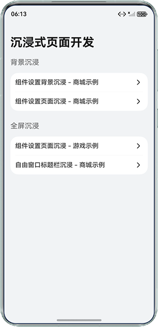
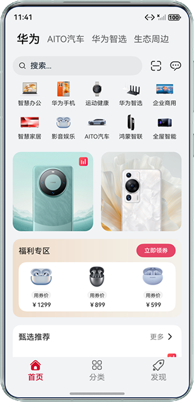
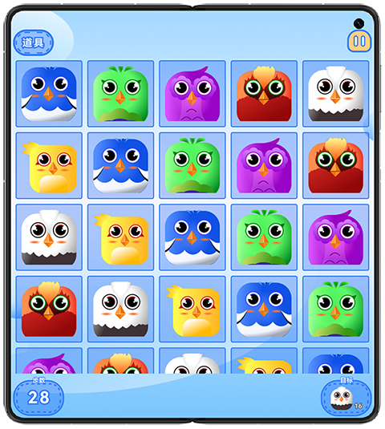
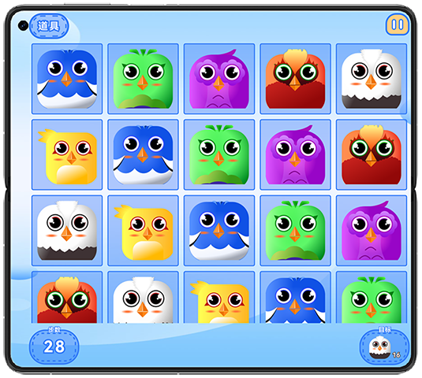
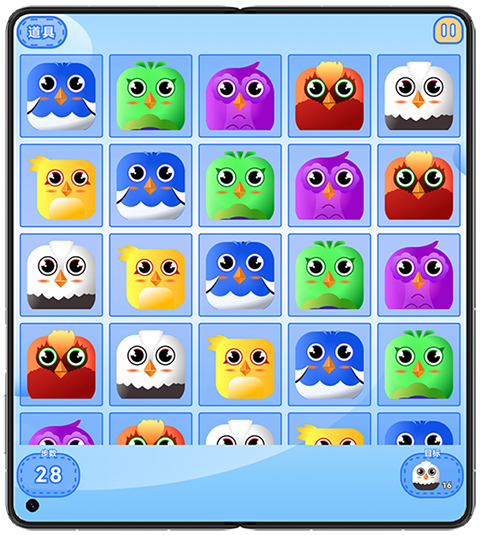
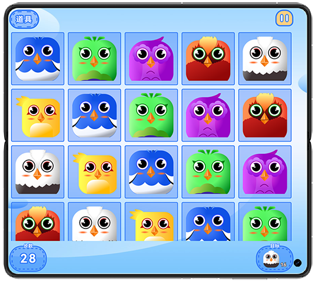
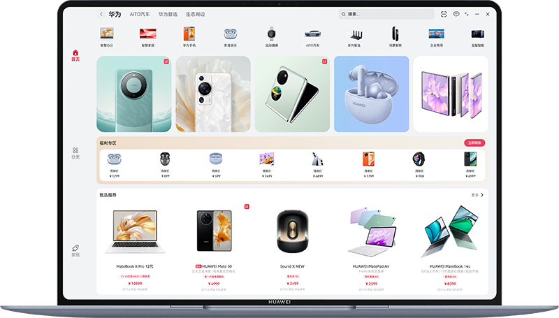

## 实现沉浸式页面效果

### 介绍

本示例介绍了背景沉浸及全屏沉浸两种沉浸式体验，提供多种实现方案。并根据不同的场景对状态栏、导航栏、挖孔区域进行适配，为用户提供更优的视觉体验。

### 效果预览

| 首页                                  | 背景沉浸                                         | 全屏沉浸                                    |
|-------------------------------------|----------------------------------------------|-----------------------------------------|
|  |  |  |

| 避让挖孔（竖屏-挖孔在顶部）                          | 避让挖孔（横屏-挖孔在左侧）                           | 避让挖孔（反向竖屏-挖孔在底部）                           | 避让挖孔（反向横屏-挖孔在右侧）                          |
|-----------------------------------------|------------------------------------------|--------------------------------------------|-------------------------------------------|
|  |  |  |  |

| 自由窗口标题栏沉浸                                    |
|----------------------------------------------|
|  |

使用说明：

1. 首页列出了沉浸式页面的实现方式和常见场景，点击对应的菜单项进入即可。
2. 避让挖孔的小游戏页面可通过切换不同挖孔位置的机型或旋转屏幕观察避让挖孔功能。
3. 平板/电脑/Mate XTs设备的自由窗口模式下，可查看自由窗口标题栏沉浸效果。

### 工程目录

```
 
├──AppScope 
│  ├──resources 
│  └──app.json5
├──commons 
│  └──commons 
│     ├──src 
│     │  └──main 
│     │     ├──ets 
│     │     │  ├──constants                                             // 公共常量
│     │     │  └──utils                                                 
│     │     │     ├──Breakpoint.ets                                     // 断点处理类   
│     │     │     └──WindowUtil.ets                                     // 窗口控制工具类
│     │     └──resources                                                // 应用静态资源目录
│     └──Index.ets
├──features 
│  ├──minigame                                                          // 小游戏示例
│  │  ├──src 
│  │  │  └──main 
│  │  │     ├──ets 
│  │  │     │  └──view                                                  // 小游戏示例视图组件
│  │  │     └──resources                                                // 应用静态资源目录
│  │  └──Index.ets
│  └──shopping                                                          // 商城示例
│     ├──src 
│     │  └──main 
│     │     ├──ets 
│     │     │  ├──constants                                             // 商城常量资源
│     │     │  ├──model                                                 
│     │     │  ├──viewmodel 
│     │     │  └──view                                                  // 商城示例视图组件
│     │     └──resources                                                // 静态资源目录
│     └──Index.ets
└──products 
   └──default 
      └──src 
         └──main 
            ├──ets 
            │  ├──constants   
            │  │  └──Constants.ets                                      
            │  ├──entryability 
            │  │  └──EntryAbility.ets                                   // 程序入口类
            │  ├──entrybackupability 
            │  │  └──EntryBackupAbility.ets
            │  └──pages 
            │     ├──backgroundImmersive                                // 背景沉浸
            │     │  ├──componentBackgroundImmersive                    // 组件设置背景沉浸
            │     │  │  └──Shopping.ets                                 // 商城示例
            │     │  └──componentPageImmersive                          // 组件设置页面沉浸
            │     │     └──ShoppingAvoid.ets                            // 商城示例
            │     ├──fullScreenImmersive                                // 全屏沉浸
            │     │  ├──componentPageImmersive                          // 组件设置页面沉浸
            │     │  │  └──MiniGame.ets                                 // 小游戏示例
            │     │  └──freeformWindowImmersive                         // 自由窗口标题栏沉浸
            │     │     └──ShoppingFullScreen.ets                       // 商城示例
            │     └──Index.ets
            └──resources                                                // 应用静态资源目录

```

### 具体实现

1. 使用[background()](https://developer.huawei.com/consumer/cn/doc/harmonyos-references/ts-universal-attributes-background#background10)接口设置组件背景沉浸。

2. 使用[ignoreLayoutSafeArea()](https://developer.huawei.com/consumer/cn/doc/harmonyos-references/ts-universal-attributes-expand-safe-area#ignorelayoutsafearea20)并设置高度为LayoutPolicy.matchParent为组件设置页面沉浸。

3. 使用[setWindowDecorVisible(false)](https://developer.huawei.com/consumer/cn/doc/harmonyos-references/arkts-apis-window-window#setwindowdecorvisible11)设置标题栏隐藏，使应用拓展至标题栏区域。

4. 常见沉浸式效果中的具体适配详见代码。

### 相关权限

不涉及。

### 依赖

不涉及。

### 约束与限制

1.本示例仅支持标准系统上运行，支持设备：华为手机、平板、电脑。

2.HarmonyOS系统：HarmonyOS 6.0.0 Release及以上。

3.DevEco Studio版本：DevEco Studio 6.0.0 Release及以上。

4.HarmonyOS SDK版本：HarmonyOS 6.0.0 Release SDK及以上。

