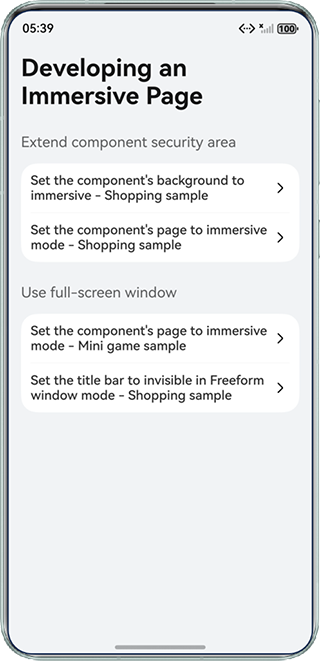
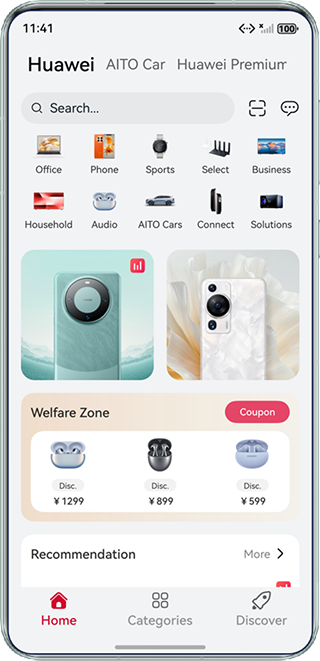
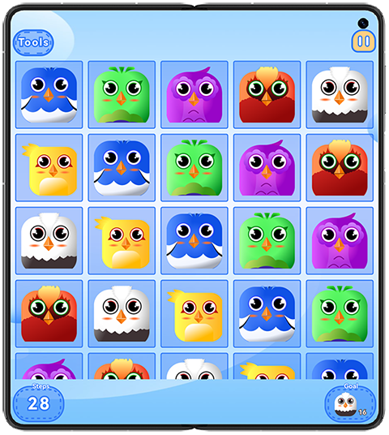
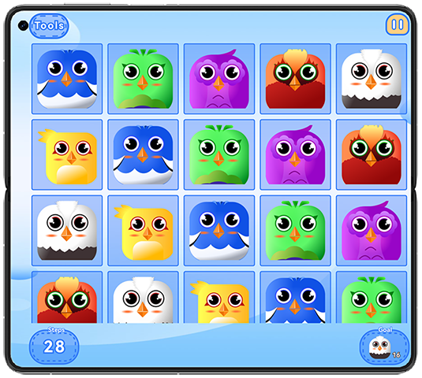
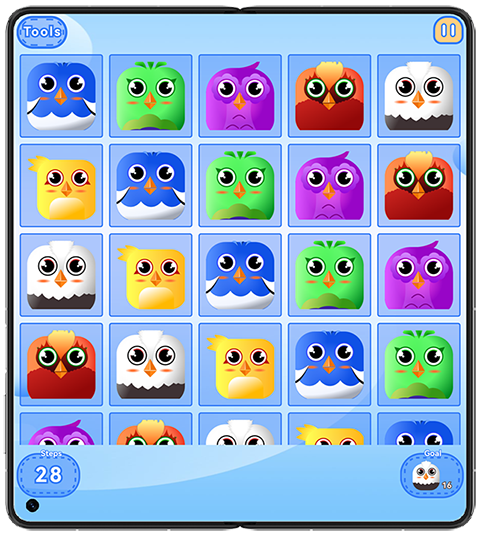
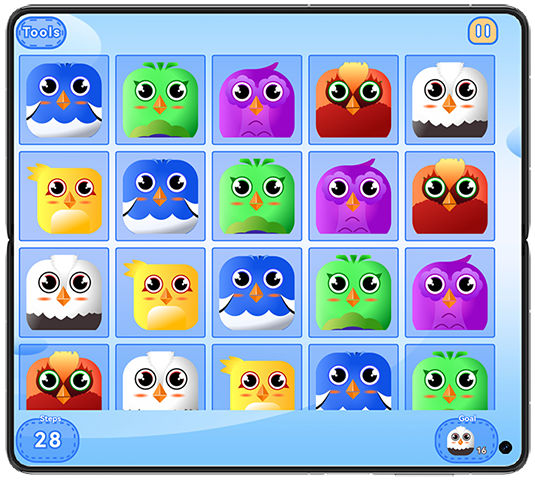
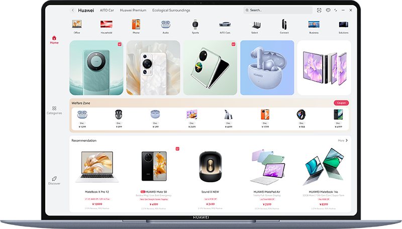

## Immersive Effect

### Overview

This sample demonstrates two immersive experiences: background immersion and full-screen immersion, along with multiple
implementation solutions.
It adapts the status bar, navigation bar, and cutout area to different scenarios, better enhancing users' visual
experience.

### Preview

| Homepage                               | Background immersive                            | Full screen immersive                      |
|----------------------------------------|-------------------------------------------------|--------------------------------------------|
|  |  |  |

| Notch display (portrait mode)              | Notch display (landscape mode)              | Notch display (reverse portrait mode)         | Notch display (reverse landscape mode)       |
|--------------------------------------------|---------------------------------------------|-----------------------------------------------|----------------------------------------------|
|  |  |  |  |

| Free from window mode                           |
|-------------------------------------------------|
|  |

Instructions:

1. The home page lists the implementation modes and common scenarios of immersive pages. You can tap the menu items to
   see the effects.
2. Navigate between the mini-game screens to check the display adaptation of different notches on different models.
3. View the free window title bar's immersive effect in free window mode on tablets, computers, or Mate XTs devices.

### Project Directory

```
 
├──AppScope 
│  ├──resources 
│  └──app.json5
├──commons 
│  └──commons 
│     ├──src 
│     │  └──main 
│     │     ├──ets 
│     │     │  ├──constants                                             // Common constants
│     │     │  └──utils                                                 
│     │     │     ├──Breakpoint.ets                                     // Breakpoint type   
│     │     │     └──WindowUtil.ets                                     // Window Utility Class
│     │     └──resources                                                // Application resources
│     └──Index.ets
├──features 
│  ├──minigame                                                          // Mini game sample
│  │  ├──src 
│  │  │  └──main 
│  │  │     ├──ets 
│  │  │     │  └──view                                                  // Mini game views
│  │  │     └──resources                                                // Application resources
│  │  └──Index.ets
│  └──shopping                                                          // Shopping sample
│     ├──src 
│     │  └──main 
│     │     ├──ets 
│     │     │  ├──constants                                             // Shopping constants
│     │     │  ├──model                                                 
│     │     │  ├──viewmodel 
│     │     │  └──view                                                  // Shopping views
│     │     └──resources                                                // Application resources
│     └──Index.ets
└──products 
   └──default 
      └──src 
         └──main 
            ├──ets 
            │  ├──constants   
            │  │  └──Constants.ets                                      
            │  ├──entryability 
            │  │  └──EntryAbility.ets                                   // Program Entry Class
            │  ├──entrybackupability 
            │  │  └──EntryBackupAbility.ets
            │  └──pages 
            │     ├──backgroundImmersive                                // Background immersive  
            │     │  ├──componentBackgroundImmersive                    // Set component background immersion                   
            │     │  │  └──Shopping.ets                                 // Shopping sample
            │     │  └──componentPageImmersive                          // Set component page immersion  
            │     │     └──ShoppingAvoid.ets                            // Shopping sample
            │     ├──fullScreenImmersive                                // Full screen immersive
            │     │  ├──componentPageImmersive                          // Set component page immersion
            │     │  │  └──MiniGame.ets                                 // Mini game sample
            │     │  └──freeformWindowImmersive                         // Free form window immersive
            │     │     └──ShoppingFullScreen.ets                       // Shopping sample
            │     └──Index.ets
            └──resources                                                // Application resources

```

### How to Implement

1. Use
   the [background()](https://developer.huawei.com/consumer/cn/doc/harmonyos-references/ts-universal-attributes-background#background10)
   attribute to set component background immersion.
2. Use
   the [ignoreLayoutSafeArea()](https://developer.huawei.com/consumer/cn/doc/harmonyos-references/ts-universal-attributes-expand-safe-area#ignorelayoutsafearea20)
   method and set the height to LayoutPolicy.matchParent to set component page immersion.
3. Use
   the [setWindowDecorVisible(false)](https://developer.huawei.com/consumer/cn/doc/harmonyos-references/arkts-apis-window-window#setwindowdecorvisible11)
   method to hide the title bar and display only the three buttons in the upper right corner. In this case, the
   application page is extended to the title bar area.
4. For details about the adaptation of common immersive effects, see the code.

### Required Permissions

N/A.

### Dependency

N/A.

### Constraints

1. The sample is only supported on Huawei phones, tablets and PCs with standard systems.

2. The HarmonyOS version must be HarmonyOS 6.0.0 Release or later.

3. The DevEco Studio version must be DevEco Studio 6.0.0 Release or later.

4. The HarmonyOS SDK version must be HarmonyOS 6.0.0 Release SDK or later.
